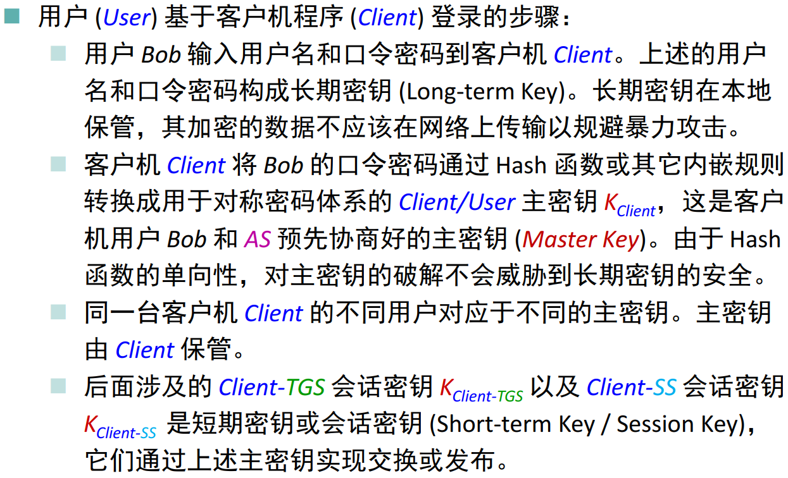
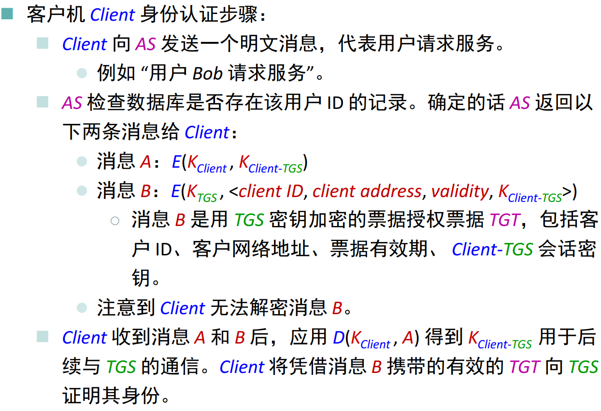
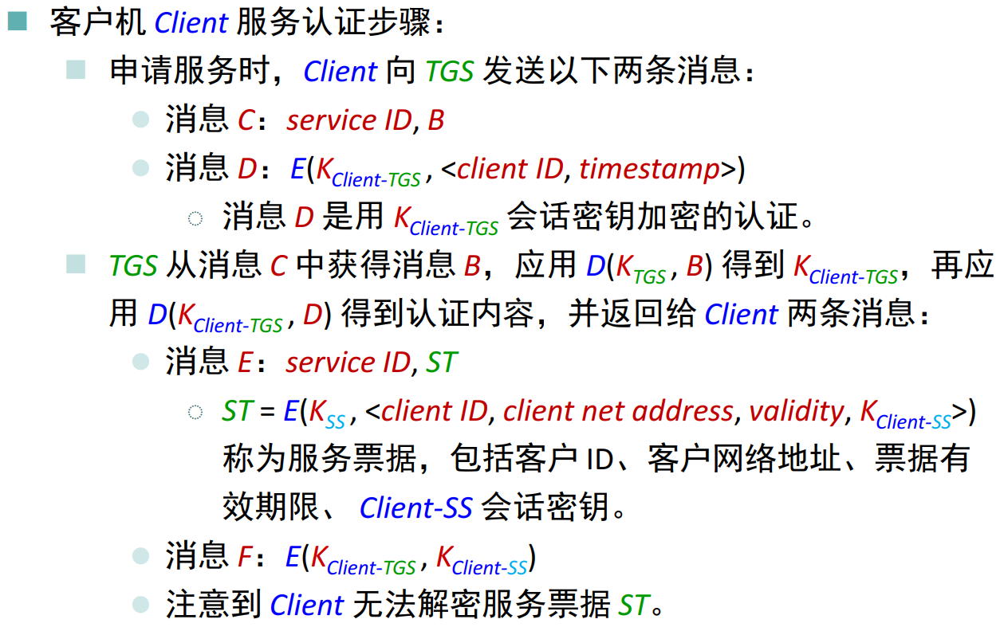
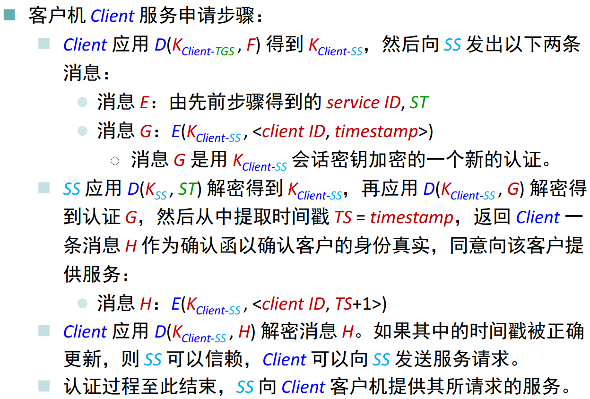

# C语言实现Kerberos算法

[TOC]


## 使用方法
### 编译
```sh
cd hw4_Kerberos && make
```
### 使用Kerberos
```sh
mpirun -n 4 ./bin/kerberos
#-n表示进程数量，最少为4个进程（AS+TGS+SS+Client）
#如果进程数超过CPU核数，需加上-oversubscribe
```

## 原理概述

- Kerberos基于Needham＆Schroeder的协议，并且是MIT Athena项目的一部分。
- Kerberos基于对称密钥加密技术，并且需要受信任的第三方，并且可以选择在身份验证的某些阶段通过使用非对称密钥加密技术来使用公共密钥加密技术。

### Kerberos流程










## 总体结构设计

Kerberos 的实现需要使用哈希和对称加密算法。由于前三次作业已经完成过 DES 算法与 MD5 算法。因此本次项目需要依赖于之前所编写的文件。

### 文件结构

```
hw3_HMAC-MD5
    |
    --- README.md
    |
    --- include
    |   |
    |   --- md5.h
    |   |
    |   --- des.h
    |   |
    |   --- bits_operation.c       
    |	|     
    |	--- kerberos.c
    --- src
    |   |
    |   --- md5.c
    |   |
    |   --- kerberos.c
    |   |
    |   --- main.c    
    |   |     
    |   --- bits_operation.c  
    |	|
    |	--- des.c
    |
    --- bin
        |
        --- kerberos


```

### 架构设计

#### 通信协议

多进程及进程间通信有多种方法

1. 直接使用原生的 `fork` 和 `<sys/shm.h>`。
2. 使用套接字。
3. 使用 `MPI` 高性能计算框架。

我选择了 `MPI` 作为本次项目的主要框架，原因有下：

1. 性能好，是高性能计算的主流框架。
2. 使用简单，在本次项目中主要使用 `MPI_Send` 和 `MPI_Recv` 两个函数。
3. 最近自己有学习高性能计算的需求和想法，借此来熟练使用 `MPI` 的使用。

#### 本次实现的约定

- `Client ID`、`Password`、`Service ID `的值是相同的。
- 0号进程为`AS`，1号进程为`TGS`，2号进程为`SS`，其余进程为`client`。
- 进程的时间是同步的。

#### 产生一开始的 $K_{Client}$ 的哈希函数

1. 使用第三次作业所实现的 `MD5` 算法生成16个字节的摘要，取前八个字节。
2. 将上一步所得到的前八个字节的每个字节进行奇偶校验的验证或修改，最多更改一个位。
3. 得到 $K_{Client}$

#### 对称加密算法的选择

使用第一次作业所实现的 `DES` 算法

## 模块分解

由于 Kerberos 并不复杂，整个实现集中在进程间通信，因此代码直接根据过程实现即可。

### `AS` 的实现

`AS` 需要进行的步骤如下：

1. 生成一个 $K_{TGS}$ 并发送给 `TGS`
2. 接收 `client` 的请求
3. 根据 `client password(rank)` 的 MD5 生成 $K_{client}$
4. 生成一个 $K_{client-TGS}$
5. 使用  $K_{client}$ 加密 $K_{client-TGS}$
6. 将加密的 $K_{client-TGS}$ 发送给 `client`
7. 创建 `message b`
8. 使用 $K_{TGS}$ 加密 `message b` 的原始数据
9. 发送 `message  b` 的密文

```c
if (my_rank == 0) {
    // 生成一个 key tgs 并发送给 tgs
    generate_key(key_tgs);
    printf("AS: send key-tgs to TGS: ");
    print_message(key_tgs, 8);
    MPI_Send(key_tgs, 8, MPI_UNSIGNED_CHAR, 1, 0, MPI_COMM_WORLD);

    for (int i = 3; i < comm_sz; ++i) {
        int request_client_id, password;
        MPI_Status recv_status;
        MPI_Recv(&request_client_id, 1, MPI_INT, MPI_ANY_SOURCE, 0, MPI_COMM_WORLD, &recv_status);
        printf("AS: recv request from client %d\n", request_client_id);
        password = request_client_id;
        // 根据 password(rank) 的 MD5 生成 key client
        printf("AS: ");
        kerberos_generate_key_client(password, key_client);
        // 生成一个 key client-tgs
        generate_key(key_client_tgs);
        printf("AS: key-client-tgs origin text of client %d: ", recv_status.MPI_SOURCE);
        print_key(key_client_tgs);
        // 使用 key client 加密 key client-tgs
        int cipher_size = des_encrypt(key_client_tgs, 8, buffer, key_client);
        printf("AS: send key-client-tgs ciphertext after encrypt to client %d: ", recv_status.MPI_SOURCE);
        print_message(buffer, cipher_size);      
        // 将加密的 key client-tgs 发送给client
        MPI_Send(buffer, cipher_size, MPI_UNSIGNED_CHAR, recv_status.MPI_SOURCE, 0, MPI_COMM_WORLD);

        // 创建 message b
        Ticket message_b = {recv_status.MPI_SOURCE, recv_status.MPI_SOURCE, 600};
        memcpy(message_b.key, key_client_tgs, 8);
        printf("AS: message b(TGT) origin text of client %d: client id: %d, address: %d, validity: %d, key_client_tgs: ", recv_status.MPI_SOURCE, message_b.id, message_b.client_address, message_b.validity);
        print_key(message_b.key);

        // 使用 key tgs 加密 message b 的原始数据
        cipher_size = des_encrypt(&message_b, sizeof(Ticket), buffer, key_tgs);
        printf("AS: send message b(TGT) ciphertext of client %d to client %d: ", recv_status.MPI_SOURCE, recv_status.MPI_SOURCE);
        print_message(buffer, cipher_size);
        MPI_Send(buffer, cipher_size, MPI_UNSIGNED_CHAR, recv_status.MPI_SOURCE, 0, MPI_COMM_WORLD);
    }
}
```


### `TGS` 的实现

`TGS` 需要进行的步骤如下：

1. 接收来自 `AS` 的 $K_{TGS}$ 
2. 生成一个 $K_{SS}$ 并发送给 `SS`
3. 接受 `message c`
4. 接受 `service_ID`
5. 从 `message c` 中解密 `message b` 得到 $K_{Client-TGS}$
6. 接受 `message d` 并使用$K_{Client-TGS}$解密
7. 判断接收的信息是否合法
8. 创建 `message e` 
9. 生成 `message f` 并使用$K_{Client-TGS}$加密发送

```c
// TGS 进程
else if (my_rank == 1) {
    long *client_record = malloc(sizeof(long) * comm_sz);
    for (int i = 0; i < comm_sz; ++i) {
        client_record[i] = 0;
    }
    MPI_Recv(key_tgs, 8, MPI_UNSIGNED_CHAR, 0, 0, MPI_COMM_WORLD, MPI_STATUS_IGNORE);
    printf("TGS: TGS recv key-tgs from AS: ");
    print_message(key_tgs, 8);
    srand((unsigned)time(NULL) + my_rank);
    generate_key(key_ss);
    printf("TGS: TGS send key-ss to SS: ");
    print_message(key_ss, 8);
    // 发送给 tgs
    MPI_Send(key_ss, 8, MPI_UNSIGNED_CHAR, 2, 0, MPI_COMM_WORLD);
    for (int i = 3; i < comm_sz; ++i) {
        // 接受 message c
        // 接受 service_ID
        int service_ID;
        MPI_Status service_ID_status;
        MPI_Recv(&service_ID, 1, MPI_INT, MPI_ANY_SOURCE, 0, MPI_COMM_WORLD, &service_ID_status);
        printf("TGS: recv service ID: %d from client %d\n", service_ID, service_ID_status.MPI_SOURCE);
        // 接受 message b 并解密
        Ticket message_b;
        MPI_Status cipher_message_b_status;
        MPI_Recv(buffer, BUF_SIZE, MPI_UNSIGNED_CHAR, service_ID_status.MPI_SOURCE, 0, MPI_COMM_WORLD, &cipher_message_b_status);
        int cipher_message_b_size;
        MPI_Get_count(&cipher_message_b_status, MPI_UNSIGNED_CHAR, &cipher_message_b_size);
        printf("TGS: recv message b(TGT) ciphertext from client %d: ", cipher_message_b_status.MPI_SOURCE);
        print_message(buffer, cipher_message_b_size);
        des_decrypt(buffer, cipher_message_b_size, &message_b, key_tgs);
        memcpy(key_client_tgs, message_b.key, 8);
        printf("TGS: message b(TGT) origin text after decrypt from client %d: client id: %d, address: %d, validity: %d, key_client_tgs: ", cipher_message_b_status.MPI_SOURCE, message_b.id, message_b.client_address, message_b.validity);
        print_key(message_b.key);
        // 接受 message d 并解密
        Auth message_d;
        MPI_Status cipher_message_d_status;
        MPI_Recv(buffer, BUF_SIZE, MPI_UNSIGNED_CHAR, service_ID_status.MPI_SOURCE, 0, MPI_COMM_WORLD, &cipher_message_d_status);
        int cipher_message_d_size;
        MPI_Get_count(&cipher_message_d_status, MPI_UNSIGNED_CHAR, &cipher_message_d_size);
        printf("TGS: recv message d ciphertext from client %d: ", cipher_message_d_status.MPI_SOURCE);
        print_message(buffer, cipher_message_d_size);
        des_decrypt(buffer, cipher_message_d_size, &message_d, message_b.key);
        printf("TGS: message d origin text from client %d: client id: %d, time: %ld\n",cipher_message_d_status.MPI_SOURCE, message_d.id, message_d.timestamp);

        printf("TGS: send service ID: %d to client %d\n", service_ID, cipher_message_d_status.MPI_SOURCE);
        // 判断正确性
        int error_code;
        if (time(NULL) - message_d.timestamp > message_b.validity) {
            error_code = 1;
            MPI_Send(&error_code, 1, MPI_INT, cipher_message_d_status.MPI_SOURCE, 0, MPI_COMM_WORLD);
            printf("TGS: timeout error!\n");
        }
        else if (message_b.id != message_d.id) {
            error_code = 2;
            MPI_Send(&error_code, 1, MPI_INT, cipher_message_d_status.MPI_SOURCE, 0, MPI_COMM_WORLD);
            printf("TGS: id error!\n");
        }
        else if (client_record[cipher_message_d_status.MPI_SOURCE] >= message_d.timestamp) {
            error_code = 3;
            MPI_Send(&error_code, 1, MPI_INT, cipher_message_d_status.MPI_SOURCE, 0, MPI_COMM_WORLD);
            printf("TGS: timestamp error!\n");
        }
        else {
            error_code = 0;
            MPI_Send(&error_code, 1, MPI_INT, cipher_message_d_status.MPI_SOURCE, 0, MPI_COMM_WORLD);
            // 发送 service ID (消息E之一)
            MPI_Send(&service_ID, 1, MPI_INT, cipher_message_d_status.MPI_SOURCE, 0, MPI_COMM_WORLD);
            // 发送 ST (消息E之一)
            generate_key(key_client_ss);
            Ticket st = {cipher_message_d_status.MPI_SOURCE, cipher_message_d_status.MPI_SOURCE, 600};
            memcpy(st.key, key_client_ss, 8);
            int st_ciphertext_size = des_encrypt(&st, sizeof(Ticket), buffer, key_ss);
            printf("TGS: message e(ST) origin text of client %d: client id: %d, address: %d, validity: %d, key_client_ss: ", cipher_message_d_status.MPI_SOURCE, st.id, st.client_address, st.validity);
            print_key(st.key);
            printf("TGS: send message e(ST) ciphertext to client %d: ", cipher_message_d_status.MPI_SOURCE);
            print_message(buffer, st_ciphertext_size);
            MPI_Send(buffer, st_ciphertext_size, MPI_UNSIGNED_CHAR, cipher_message_d_status.MPI_SOURCE, 0, MPI_COMM_WORLD);

            // 发送 message f
            printf("TGS: key-client-ss origin text of client %d: ", cipher_message_d_status.MPI_SOURCE);
            print_key(key_client_ss);
            int key_client_ss_size = des_encrypt(key_client_ss, 8, buffer, key_client_tgs);
            printf("TGS: send key-client-ss ciphertext after encrypt to client %d: ", cipher_message_d_status.MPI_SOURCE);
            print_message(buffer, key_client_ss_size);  
            MPI_Send(buffer, key_client_ss_size, MPI_UNSIGNED_CHAR, cipher_message_d_status.MPI_SOURCE, 0, MPI_COMM_WORLD);
        }
    }
    free(client_record);
}
```


### `SS` 的实现

`SS` 需要进行的步骤如下：

1. 接收来自 `TGS` 的 $K_{SS}$ 
2. 接收 `message e`
3. 使用 $K_{SS}$ 解密  `message e` 中的 `ST` 得到 $K_{Client-SS}$
4. 接收 `message g` 并使用 $K_{Client-SS}$ 解密
5. 进行消息正确性的验证
6. 生成 `message h` 并使用 $K_{Client-SS}$ 加密发送

```c
// SS 进程
else if (my_rank == 2) {
    long *client_record = malloc(sizeof(long) * comm_sz);
    for (int i = 0; i < comm_sz; ++i) {
        client_record[i] = 0;
    }
    MPI_Recv(key_ss, 8, MPI_UNSIGNED_CHAR, 1, 0, MPI_COMM_WORLD, MPI_STATUS_IGNORE);
    printf("SS: recv key-ss from TGS: ");
    print_message(key_ss, 8);

    for (int i = 3; i < comm_sz; ++i) {
        int error_code;
        MPI_Status error_code_status;
        MPI_Recv(&error_code, 1, MPI_INT, MPI_ANY_SOURCE, 0, MPI_COMM_WORLD, &error_code_status);
        if (error_code == 0) {
            // 接收 message e(servive ID)
            int service_ID;
            MPI_Status service_ID_status;
            MPI_Recv(&service_ID, 1, MPI_INT, error_code_status.MPI_SOURCE, 0, MPI_COMM_WORLD, &service_ID_status);
            printf("SS: recv service ID: %d from client %d\n", service_ID, service_ID_status.MPI_SOURCE);
            // 接受 message e(ST)
            MPI_Status st_ciphertext_status;
            MPI_Recv(buffer, BUF_SIZE, MPI_UNSIGNED_CHAR, error_code_status.MPI_SOURCE, 0, MPI_COMM_WORLD, &st_ciphertext_status);
            int st_ciphertext_size;
            MPI_Get_count(&st_ciphertext_status, MPI_UNSIGNED_CHAR, &st_ciphertext_size);
            printf("SS: recv ST ciphertext from client %d: ", st_ciphertext_status.MPI_SOURCE);
            print_message(buffer, st_ciphertext_size);
            Ticket st;
            des_decrypt(buffer, st_ciphertext_size, &st, key_ss);
            printf("SS: message e(ST) origin text from client %d: client id: %d, address: %d, validity: %d, key_client_ss: ", st_ciphertext_status.MPI_SOURCE, st.id, st.client_address, st.validity);
            print_key(st.key);
            memcpy(key_client_ss, st.key, 8);
            // 接收 message g
            MPI_Status message_g_ciphertext_status;
            MPI_Recv(buffer, BUF_SIZE, MPI_UNSIGNED_CHAR, error_code_status.MPI_SOURCE, 0, MPI_COMM_WORLD, &message_g_ciphertext_status);
            int message_g_ciphertext_size;
            MPI_Get_count(&message_g_ciphertext_status, MPI_UNSIGNED_CHAR, &message_g_ciphertext_size);
            printf("SS: recv message g ciphertext from client %d: ", message_g_ciphertext_status.MPI_SOURCE);
            print_message(buffer, message_g_ciphertext_size);
            Auth message_g;
            des_decrypt(buffer, message_g_ciphertext_size, &message_g, st.key);
            printf("SS: message g origin text from client %d: client id: %d, timestamp: %ld\n", message_g_ciphertext_status.MPI_SOURCE, message_g.id, message_g.timestamp);

            // 进行验证
            int error_code;
            if (time(NULL) - message_g.timestamp > st.validity) {
                error_code = 1;
                printf("SS: timeout error!\n");
                MPI_Send(&error_code, 1, MPI_INT, message_g_ciphertext_status.MPI_SOURCE, 0, MPI_COMM_WORLD);
            }
            else if (message_g.id != st.id) {
                error_code = 2;
                printf("SS: id error!\n");
                MPI_Send(&error_code, 1, MPI_INT, message_g_ciphertext_status.MPI_SOURCE, 0, MPI_COMM_WORLD);
            }
            else if (client_record[message_g_ciphertext_status.MPI_SOURCE] >= message_g.timestamp) {
                error_code = 3;
                printf("SS: timestamp error!\n");
                MPI_Send(&error_code, 1, MPI_INT, message_g_ciphertext_status.MPI_SOURCE, 0, MPI_COMM_WORLD);
            }
            else {
                error_code = 0;
                printf("SS: agree to service\n");
                MPI_Send(&error_code, 1, MPI_INT, message_g_ciphertext_status.MPI_SOURCE, 0, MPI_COMM_WORLD);
                // 发送 message h
                Auth message_h = message_g;
                message_h.timestamp++;
                printf("SS: message h origin text to client %d: client id: %d, timestamp: %ld\n", message_g_ciphertext_status.MPI_SOURCE, message_h.id, message_h.timestamp);
                int message_h_ciphertext_size = des_encrypt(&message_h, sizeof(Auth), buffer, key_client_ss);
                printf("SS: send message h ciphertext to client %d: ", message_g_ciphertext_status.MPI_SOURCE);
                print_message(buffer, message_h_ciphertext_size);
                MPI_Send(buffer, message_h_ciphertext_size, MPI_UNSIGNED_CHAR, message_g_ciphertext_status.MPI_SOURCE, 0, MPI_COMM_WORLD);
                printf("SS: start to service to client\n");
            }
        }
    }
}
```


### `client` 的实现

`client` 需要进行的步骤如下：

1. 向 `AS` 发送请求服务的信息
2. 接收加密的 key client-tgs (收到消息A)
3. 使用 $K_{Client}$ 对 `message a` 解密 得到 $K_{Client-TGS}$ 
4. 接受`TGT`(收到消息B)
5. 发送 `message c`
6. 发送使用 $K_{Client-TGS}$ 加密的 `message d`
7. 接收 `message e`
8. 接收 `message f` 并使用 $K_{Client-TGS}$ 解密得到 $K_{Client-SS}$
9. 发送 `message e`
10. 发送 使用 $K_{Client-SS}$ 加密的 `message g`
11. 接收 `message h` 并使用 $K_{Client-SS}$ 后验证时间戳有没有被正确更新

```c
// Client 进程
else {
    MPI_Send(&my_rank, 1, MPI_INT, 0, 0, MPI_COMM_WORLD);
    printf("Client %d: send id to AS for request\n", my_rank);
    // 根据 password(rank) 的 MD5 生成 key client (密码就是rank_id)
    printf("Client %d: ", my_rank);
    kerberos_generate_key_client(my_rank, key_client);

    // 接收加密的 key client-tgs (收到消息A)
    MPI_Status recv_status_a;
    MPI_Recv(buffer, BUF_SIZE, MPI_UNSIGNED_CHAR, 0, 0, MPI_COMM_WORLD, &recv_status_a);
    // 使用 key client 对 key client-tgs 解密
    // 被加密后 key client-tgs 的长度
    int key_client_tgs_cipher_size;
    MPI_Get_count(&recv_status_a, MPI_UNSIGNED_CHAR, &key_client_tgs_cipher_size);
    printf("Client %d: recv key-client-tgs ciphertext from AS: ", my_rank);
    print_message(buffer, key_client_tgs_cipher_size);
    // 解密后 key client-tgs 的长度
    int key_client_tgs_origin_size = des_decrypt(buffer, key_client_tgs_cipher_size, key_client_tgs, key_client);
    printf("Client %d: key-client-tgs origin text after decrypt: ", my_rank);
    print_message(key_client_tgs, key_client_tgs_origin_size);

    // 接受TGT(收到消息B)
    MPI_Status recv_status_b;
    MPI_Recv(buffer, BUF_SIZE, MPI_UNSIGNED_CHAR, 0, 0, MPI_COMM_WORLD, &recv_status_b);
    // 被加密后 message b 的长度
    int message_b_cipher_size;
    MPI_Get_count(&recv_status_b, MPI_UNSIGNED_CHAR, &message_b_cipher_size);
    printf("Client %d: recv message b(TGT) ciphertext from AS: ", my_rank);
    print_message(buffer, message_b_cipher_size);
    // 存储这个加密后的 message b，稍后发送给 tgs
    uint8_t *temp_b = malloc(message_b_cipher_size);
    memcpy(temp_b, buffer, message_b_cipher_size);

    // 发送 message c
    // 发送 service ID
    int service_ID = my_rank;
    printf("Client %d: send service ID: %d to TGS\n", my_rank, service_ID);
    MPI_Send(&service_ID, 1, MPI_INT, 1, 0, MPI_COMM_WORLD);
    // 发送 message b
    printf("Client %d: send message b(TGT) ciphertext to TGS: ", my_rank);
    print_message(buffer, message_b_cipher_size);
    MPI_Send(temp_b, message_b_cipher_size, MPI_UNSIGNED_CHAR, 1, 0, MPI_COMM_WORLD);
    free(temp_b);

    // 发送 message d
    Auth message_d = {my_rank, time(NULL)};
    printf("Client %d: message d origin text: id: %d, timestamp: %d\n", my_rank, message_d.id, message_d.timestamp);
    int message_d_cipher_size = des_encrypt(&message_d, sizeof(Auth), buffer, key_client_tgs);
    printf("Client %d: send message d ciphertext to TGS: ", my_rank);
    print_message(buffer, message_d_cipher_size);
    MPI_Send(buffer, message_d_cipher_size, MPI_UNSIGNED_CHAR, 1, 0, MPI_COMM_WORLD);


    MPI_Status judge_flag;
    int error_code;
    MPI_Recv(&error_code, 1, MPI_INT, 1, 0, MPI_COMM_WORLD, &judge_flag);
    if (error_code == 1) {
        printf("Client %d: timeout error!\n", my_rank);
        MPI_Send(&error_code, 1, MPI_INT, 2, 0, MPI_COMM_WORLD);
    }
    else if (error_code == 2) {
        printf("Client %d: id error!\n", my_rank);
        MPI_Send(&error_code, 1, MPI_INT, 2, 0, MPI_COMM_WORLD);
    }
    else if (error_code == 3) {
        printf("Client %d: timestamp error!\n", my_rank);
        MPI_Send(&error_code, 1, MPI_INT, 2, 0, MPI_COMM_WORLD);
    }
    else {
        MPI_Send(&error_code, 1, MPI_INT, 2, 0, MPI_COMM_WORLD);
        // 接收 message e
        // 接受 service ID
        MPI_Recv(&service_ID, 1, MPI_INT, 1, 0, MPI_COMM_WORLD, MPI_STATUS_IGNORE);
        printf("Client %d: recv service ID: %d from TGS\n", my_rank, service_ID);
        // 接受 ST 
        MPI_Status st_status;
        MPI_Recv(buffer, BUF_SIZE, MPI_UNSIGNED_CHAR, 1, 0, MPI_COMM_WORLD, &st_status);
        int st_ciphertext_size;
        MPI_Get_count(&st_status, MPI_UNSIGNED_CHAR, &st_ciphertext_size);
        printf("Client %d: recv ST ciphertext from TGS: ", my_rank);
        uint8_t *st_tem = malloc(st_ciphertext_size);
        memcpy(st_tem, buffer, st_ciphertext_size);
        print_message(st_tem, st_ciphertext_size);
        // 接受 message f
        MPI_Status ciphertext_message_f_status;
        MPI_Recv(buffer, BUF_SIZE, MPI_UNSIGNED_CHAR, 1, 0, MPI_COMM_WORLD, &ciphertext_message_f_status);
        int ciphertext_message_f_size;
        MPI_Get_count(&ciphertext_message_f_status, MPI_UNSIGNED_CHAR, &ciphertext_message_f_size);
        printf("Client %d: recv key-client-ss ciphertext from TGS: ", my_rank);
        print_message(buffer, ciphertext_message_f_size);
        des_decrypt(buffer, ciphertext_message_f_size, key_client_ss, key_client_tgs);
        printf("Client %d: key-client-ss origin text from TGS: ", my_rank);
        print_key(key_client_ss);

        // 发送 message e
        // 发送 service ID
        printf("Client %d: send service ID: %d to SS\n", my_rank, service_ID);
        MPI_Send(&service_ID, 1, MPI_INT, 2, 0, MPI_COMM_WORLD);
        // 发送 ST 的密文
        printf("Client %d: send ST ciphertext to SS: ", my_rank);
        print_message(st_tem, st_ciphertext_size);
        MPI_Send(st_tem, st_ciphertext_size, MPI_UNSIGNED_CHAR, 2, 0, MPI_COMM_WORLD);
        free(st_tem);
        // 发送 message g
        Auth message_g = {my_rank, time(NULL)};
        printf("Client %d: message g origin text: id: %d, timestamp: %d\n", my_rank, message_g.id, message_g.timestamp);
        int message_g_ciphertext_size = des_encrypt(&message_g, sizeof(Auth), buffer, key_client_ss);
        printf("Client %d: send message g ciphertext to TGS: ", my_rank);
        print_message(buffer, message_g_ciphertext_size);
        MPI_Send(buffer, message_g_ciphertext_size, MPI_UNSIGNED_CHAR, 2, 0, MPI_COMM_WORLD);


        // 判断认证情况
        int error_code;
        MPI_Recv(&error_code, 1, MPI_INT, 2, 0, MPI_COMM_WORLD, MPI_STATUS_IGNORE);
        if (error_code == 1) {
            printf("Client %d: timeout error!\n", my_rank);
        }
        else if (error_code == 2) {
            printf("Client %d: id error!\n", my_rank);
        }
        else if (error_code == 3) {
            printf("Client %d: timestamp error!\n", my_rank);
        }
        else {
            // 接受 message h
            MPI_Status message_h_ciphertext_status;
            MPI_Recv(buffer, BUF_SIZE, MPI_UNSIGNED_CHAR, 2, 0, MPI_COMM_WORLD, &message_h_ciphertext_status);
            int message_h_ciphertext_size;
            MPI_Get_count(&message_h_ciphertext_status, MPI_UNSIGNED_CHAR, &message_h_ciphertext_size);
            printf("Client %d: recv message h ciphertext from SS: ", my_rank);
            print_message(buffer, message_h_ciphertext_size);

            // 解密 message h
            Auth message_h;
            des_decrypt(buffer, message_h_ciphertext_size, &message_h, key_client_ss);
            printf("Client %d: message h origin text from SS: client id: %d, timestamp: %ld\n", my_rank, message_h.id, message_h.timestamp);

            if (message_h.timestamp == message_g.timestamp + 1) {
                printf("Client %d: I will trust SS\n", my_rank);
            }
            else {
                printf("Client %d: I can't trust SS\n", my_rank);
            }
        }
    }
}
```


## 数据结构设计

`Kerberos` 的主要难点在通信，数据结构只有 <client ID, timestamp>  和 <client ID, client net address, validity, $K_{Client-SS}$>  

```c
typedef struct {
    int id;
    int client_address;
    long validity;
    uint8_t key[8];
} Ticket;

typedef struct {
    int id;
    long timestamp;
} Auth;

```

由于发送消息的时候需要加密，而之前写的 `DES` 经修改后是使用 `unsigned char` 作为输入的。因此需要经过指针的转换才能对这些信息加密和解密。

```c
/**
 * @brief DES 的加密函数
 * @param input 需要加密的明文字符流头指针
 * @param len 明文长度
 * @param output 加密后的密文的头指针
 * @param key 以 uint8_t[8] 为格式的密钥，uint8_t[0]最左边的二进制数对应于 uint64_t 二进制形式的最右一位
 * @return 返回加密后的密文长度
 */
int des_encrypt(uint8_t * input, int len, uint8_t * output, uint8_t key[8]);

int st_ciphertext_size = des_encrypt((uint8_t*)&st, sizeof(Ticket), buffer, key_ss);
```


## C语言源代码

可见压缩包的文件，此处不再浪费空间展示大段代码。

## 编译运行结果

### makefile

```makefile
CC=gcc
INC_DIR=include
SRC_DIR=src
BIN_DIR=bin
CFLAGS= -std=c99 -g
TARGET=kerberos

SOURCE_FILES=$(shell find $(SRC_DIR) -name '*.c')

$(BIN_DIR)/${TARGET}: $(SOURCE_FILES)
	mkdir -p $(BIN_DIR)
	$(CC) $(CFLAGS) -Iinclude $^ -o $@ -lm

.PHONY: clean
clean:
	rm -r bin
```

### 编译结果

```
[luowle@centos hw4_Kerberos]$ make
mkdir -p bin
mpicc -std=c99 -g -Iinclude src/main.c src/md5.c src/kerberos.c src/des.c src/bits_operatioin.c -o bin/kerberos -lm
```

### 验证用例

#### 4个进程

```
Client 3: send id to AS for request
Client 3: MD5 hash result of 3: edcfae989540fd42e4b8556d5b723bb6
key-client of 3: ecceae989440fd43
AS: send key-tgs to TGS: ad31da89bc1089c8
TGS: TGS recv key-tgs from AS: ad31da89bc1089c8
TGS: TGS send key-ss to SS: 3b793ed5f785d591
AS: recv request from client 3
AS: MD5 hash result of 3: edcfae989540fd42e4b8556d5b723bb6
key-client of 3: ecceae989440fd43
AS: key-client-tgs origin text of client 3: 9db3808c4ffbf1e0
SS: recv key-ss from TGS: 3b793ed5f785d591
Client 3: recv key-client-tgs ciphertext from AS: ec8b65c655fb24938ae7e5d4402702d4
AS: send key-client-tgs ciphertext after encrypt to client 3: ec8b65c655fb24938ae7e5d4402702d4
AS: message b(TGT) origin text of client 3: client id: 3, address: 3, validity: 600, key_client_tgs: 9db3808c4ffbf1e0
Client 3: key-client-tgs origin text after decrypt: 9db3808c4ffbf1e0
AS: send message b(TGT) ciphertext of client 3 to client 3: cc60b78b78b006df2f0a5789e1ee8f2e92a115d4cc14d5f7023709d98b714a53
Client 3: recv message b(TGT) ciphertext from AS: cc60b78b78b006df2f0a5789e1ee8f2e92a115d4cc14d5f7023709d98b714a53
Client 3: send service ID: 3 to TGS
Client 3: send message b(TGT) ciphertext to TGS: cc60b78b78b006df2f0a5789e1ee8f2e92a115d4cc14d5f7023709d98b714a53
Client 3: message d origin text: id: 3, timestamp: 1607752757
TGS: recv service ID: 3 from client 3
TGS: recv message b(TGT) ciphertext from client 3: cc60b78b78b006df2f0a5789e1ee8f2e92a115d4cc14d5f7023709d98b714a53
Client 3: send message d ciphertext to TGS: 41f7beb66a8cc16f31d2c2d9202363a7c714d6b9ebf478da
TGS: message b(TGT) origin text after decrypt from client 3: client id: 3, address: 3, validity: 600, key_client_tgs: 9db3808c4ffbf1e0
TGS: recv message d ciphertext from client 3: 41f7beb66a8cc16f31d2c2d9202363a7c714d6b9ebf478da
TGS: message d origin text from client 3: client id: 3, time: 1607752757
TGS: send service ID: 3 to client 3
Client 3: recv service ID: 3 from TGS
TGS: message e(ST) origin text of client 3: client id: 3, address: 3, validity: 600, key_client_ss: ad4919a1eac22958
TGS: send message e(ST) ciphertext to client 3: d925b4d1e186a51a69d63770a02d84cab601915414f1f62c1ef6b6c77d99f855
TGS: key-client-ss origin text of client 3: ad4919a1eac22958
Client 3: recv ST ciphertext from TGS: d925b4d1e186a51a69d63770a02d84cab601915414f1f62c1ef6b6c77d99f855
TGS: send key-client-ss ciphertext after encrypt to client 3: 5a9864c428c7bd2fc714d6b9ebf478da
Client 3: recv key-client-ss ciphertext from TGS: 5a9864c428c7bd2fc714d6b9ebf478da
SS: recv service ID: 3 from client 3
SS: recv ST ciphertext from client 3: d925b4d1e186a51a69d63770a02d84cab601915414f1f62c1ef6b6c77d99f855
Client 3: key-client-ss origin text from TGS: ad4919a1eac22958
Client 3: send service ID: 3 to SS
Client 3: send ST ciphertext to SS: d925b4d1e186a51a69d63770a02d84cab601915414f1f62c1ef6b6c77d99f855
Client 3: message g origin text: id: 3, timestamp: 1607752757
Client 3: send message g ciphertext to TGS: cbe67b7c189a1d2fb7abf795cad627bdd87af1e2a15a076a
SS: message e(ST) origin text from client 3: client id: 3, address: 3, validity: 600, key_client_ss: ad4919a1eac22958
SS: recv message g ciphertext from client 3: cbe67b7c189a1d2fb7abf795cad627bdd87af1e2a15a076a
SS: message g origin text from client 3: client id: 3, timestamp: 1607752757
SS: agree to service
SS: message h origin text to client 3: client id: 3, timestamp: 1607752758
Client 3: recv message h ciphertext from SS: cbe67b7c189a1d2f8c3e6e7a3579fef7d87af1e2a15a076a
SS: send message h ciphertext to client 3: cbe67b7c189a1d2f8c3e6e7a3579fef7d87af1e2a15a076a
SS: start to service to client
Client 3: message h origin text from SS: client id: 3, timestamp: 1607752758
Client 3: I will trust SS
```

#### 6个进程

```
Client 5: send id to AS for request
Client 5: MD5 hash result of 5: cbe23d9655fccd4311acdd6261c81bd8
key-client of 5: cbe33d9754fdcd43
Client 4: send id to AS for request
Client 3: send id to AS for request
Client 3: MD5 hash result of 3: edcfae989540fd42e4b8556d5b723bb6
Client 4: MD5 hash result of 4: 1036e3dddc89a4e68d8a33f3823a180e
key-client of 4: 1037e3dcdc89a4e6
AS: send key-tgs to TGS: 5b707cc81fd001f1
key-client of 3: ecceae989440fd43
AS: recv request from client 5
AS: MD5 hash result of 5: cbe23d9655fccd4311acdd6261c81bd8
TGS: TGS recv key-tgs from AS: 5b707cc81fd001f1
TGS: TGS send key-ss to SS: c7cd4570f186ea64
key-client of 5: cbe33d9754fdcd43
AS: key-client-tgs origin text of client 5: d575b649e594e5d9
SS: recv key-ss from TGS: c7cd4570f186ea64
AS: send key-client-tgs ciphertext after encrypt to client 5: a3546a4d4ec6e9bb41424d8b9954a386
AS: message b(TGT) origin text of client 5: client id: 5, address: 5, validity: 600, key_client_tgs: d575b649e594e5d9
Client 5: recv key-client-tgs ciphertext from AS: a3546a4d4ec6e9bb41424d8b9954a386
Client 5: key-client-tgs origin text after decrypt: d575b649e594e5d9
AS: send message b(TGT) ciphertext of client 5 to client 5: 79e77f229f0999565c9846c35a9f28f120d9807de6347d37da7db4e9f622442d
Client 5: recv message b(TGT) ciphertext from AS: 79e77f229f0999565c9846c35a9f28f120d9807de6347d37da7db4e9f622442d
AS: recv request from client 3
AS: MD5 hash result of 3: edcfae989540fd42e4b8556d5b723bb6
TGS: recv service ID: 5 from client 5
TGS: recv message b(TGT) ciphertext from client 5: 79e77f229f0999565c9846c35a9f28f120d9807de6347d37da7db4e9f622442d
Client 5: send service ID: 5 to TGS
Client 5: send message b(TGT) ciphertext to TGS: 79e77f229f0999565c9846c35a9f28f120d9807de6347d37da7db4e9f622442d
Client 5: message d origin text: id: 5, timestamp: 1607752768
key-client of 3: ecceae989440fd43
AS: key-client-tgs origin text of client 3: 3d02e0545e31e561
Client 3: recv key-client-tgs ciphertext from AS: ac0d9306d1c424e28ae7e5d4402702d4
AS: send key-client-tgs ciphertext after encrypt to client 3: ac0d9306d1c424e28ae7e5d4402702d4
AS: message b(TGT) origin text of client 3: client id: 3, address: 3, validity: 600, key_client_tgs: 3d02e0545e31e561
Client 5: send message d ciphertext to TGS: f0f38db58a7b927541f6c588c495c7c7ab5ea3065aec9b2c
Client 3: key-client-tgs origin text after decrypt: 3d02e0545e31e561
TGS: message b(TGT) origin text after decrypt from client 5: client id: 5, address: 5, validity: 600, key_client_tgs: d575b649e594e5d9
TGS: recv message d ciphertext from client 5: f0f38db58a7b927541f6c588c495c7c7ab5ea3065aec9b2c
AS: send message b(TGT) ciphertext of client 3 to client 3: d62e7eaec03e981a5c9846c35a9f28f17aa331bc9bb7f443da7db4e9f622442d
AS: recv request from client 4
AS: MD5 hash result of 4: 1036e3dddc89a4e68d8a33f3823a180e
key-client of 4: 1037e3dcdc89a4e6
AS: key-client-tgs origin text of client 4: f270a238d583c119
Client 3: recv message b(TGT) ciphertext from AS: d62e7eaec03e981a5c9846c35a9f28f17aa331bc9bb7f443da7db4e9f622442d
Client 3: send service ID: 3 to TGS
Client 3: send message b(TGT) ciphertext to TGS: d62e7eaec03e981a5c9846c35a9f28f17aa331bc9bb7f443da7db4e9f622442d
Client 3: message d origin text: id: 3, timestamp: 1607752768
TGS: message d origin text from client 5: client id: 5, time: 1607752768
TGS: send service ID: 5 to client 5
Client 5: recv service ID: 5 from TGS
Client 4: recv key-client-tgs ciphertext from AS: b0199003deb6e52de3489c6260dc2b62
AS: send key-client-tgs ciphertext after encrypt to client 4: b0199003deb6e52de3489c6260dc2b62
AS: message b(TGT) origin text of client 4: client id: 4, address: 4, validity: 600, key_client_tgs: f270a238d583c119
Client 3: send message d ciphertext to TGS: 15d76672c46e5d57397dcd320bb2a7f9746deac10b1e7383
TGS: message e(ST) origin text of client 5: client id: 5, address: 5, validity: 600, key_client_ss: 040197e05132e5f4
TGS: send message e(ST) ciphertext to client 5: 3639b6afb62170e288e62f9305c406a0d5607cc49633ba23f488359f08d73d12
TGS: key-client-ss origin text of client 5: 040197e05132e5f4
Client 4: key-client-tgs origin text after decrypt: f270a238d583c119
Client 5: recv ST ciphertext from TGS: 3639b6afb62170e288e62f9305c406a0d5607cc49633ba23f488359f08d73d12
Client 4: recv message b(TGT) ciphertext from AS: 3203bdad5b88100c5c9846c35a9f28f1c1f1bc6c2c5ae8ccda7db4e9f622442d
Client 4: send service ID: 4 to TGS
AS: send message b(TGT) ciphertext of client 4 to client 4: 3203bdad5b88100c5c9846c35a9f28f1c1f1bc6c2c5ae8ccda7db4e9f622442d
Client 4: send message b(TGT) ciphertext to TGS: 3203bdad5b88100c5c9846c35a9f28f1c1f1bc6c2c5ae8ccda7db4e9f622442d
Client 4: message d origin text: id: 4, timestamp: 1607752768
TGS: send key-client-ss ciphertext after encrypt to client 5: 3030c1cebdab2915ab5ea3065aec9b2c
TGS: recv service ID: 3 from client 3
Client 5: recv key-client-ss ciphertext from TGS: 3030c1cebdab2915ab5ea3065aec9b2c
TGS: recv message b(TGT) ciphertext from client 3: d62e7eaec03e981a5c9846c35a9f28f17aa331bc9bb7f443da7db4e9f622442d
Client 5: key-client-ss origin text from TGS: 040197e05132e5f4
Client 5: send service ID: 5 to SS
Client 5: send ST ciphertext to SS: 3639b6afb62170e288e62f9305c406a0d5607cc49633ba23f488359f08d73d12
Client 5: message g origin text: id: 5, timestamp: 1607752768
SS: recv service ID: 5 from client 5
SS: recv ST ciphertext from client 5: 3639b6afb62170e288e62f9305c406a0d5607cc49633ba23f488359f08d73d12
Client 4: send message d ciphertext to TGS: 1c476513f1bdb5beccb633057b440373d0b6b04c0474c696
TGS: message b(TGT) origin text after decrypt from client 3: client id: 3, address: 3, validity: 600, key_client_tgs: 3d02e0545e31e561
TGS: recv message d ciphertext from client 3: 15d76672c46e5d57397dcd320bb2a7f9746deac10b1e7383
Client 5: send message g ciphertext to TGS: 3a5246735d06ecc2ccb36b1cdc0084451a11407dbb52c8f3
SS: message e(ST) origin text from client 5: client id: 5, address: 5, validity: 600, key_client_ss: 040197e05132e5f4
TGS: message d origin text from client 3: client id: 3, time: 1607752768
TGS: send service ID: 3 to client 3
SS: recv message g ciphertext from client 5: 3a5246735d06ecc2ccb36b1cdc0084451a11407dbb52c8f3
Client 3: recv service ID: 3 from TGS
SS: message g origin text from client 5: client id: 5, timestamp: 1607752768
SS: agree to service
SS: message h origin text to client 5: client id: 5, timestamp: 1607752769
TGS: message e(ST) origin text of client 3: client id: 3, address: 3, validity: 600, key_client_ss: 32139798c4d6ae40
TGS: send message e(ST) ciphertext to client 3: 01d4291d2863cfea88e62f9305c406a0963a632c58d95124f488359f08d73d12
Client 3: recv ST ciphertext from TGS: 01d4291d2863cfea88e62f9305c406a0963a632c58d95124f488359f08d73d12
TGS: key-client-ss origin text of client 3: 32139798c4d6ae40
SS: send message h ciphertext to client 5: 3a5246735d06ecc24696df923f31182a1a11407dbb52c8f3
SS: start to service to client
Client 5: recv message h ciphertext from SS: 3a5246735d06ecc24696df923f31182a1a11407dbb52c8f3
TGS: send key-client-ss ciphertext after encrypt to client 3: f912ae08ae761692746deac10b1e7383
TGS: recv service ID: 4 from client 4
TGS: recv message b(TGT) ciphertext from client 4: 3203bdad5b88100c5c9846c35a9f28f1c1f1bc6c2c5ae8ccda7db4e9f622442d
Client 3: recv key-client-ss ciphertext from TGS: f912ae08ae761692746deac10b1e7383
Client 5: message h origin text from SS: client id: 5, timestamp: 1607752769
Client 5: I will trust SS
SS: recv service ID: 3 from client 3
SS: recv ST ciphertext from client 3: 01d4291d2863cfea88e62f9305c406a0963a632c58d95124f488359f08d73d12
Client 3: key-client-ss origin text from TGS: 32139798c4d6ae40
Client 3: send service ID: 3 to SS
Client 3: send ST ciphertext to SS: 01d4291d2863cfea88e62f9305c406a0963a632c58d95124f488359f08d73d12
Client 3: message g origin text: id: 3, timestamp: 1607752768
TGS: message b(TGT) origin text after decrypt from client 4: client id: 4, address: 4, validity: 600, key_client_tgs: f270a238d583c119
TGS: recv message d ciphertext from client 4: 1c476513f1bdb5beccb633057b440373d0b6b04c0474c696
Client 3: send message g ciphertext to TGS: 0c55cfe14aafcdbc8da75f959ed76dc2c193995346b8a766
SS: message e(ST) origin text from client 3: client id: 3, address: 3, validity: 600, key_client_ss: 32139798c4d6ae40
TGS: message d origin text from client 4: client id: 4, time: 1607752768
TGS: send service ID: 4 to client 4
SS: recv message g ciphertext from client 3: 0c55cfe14aafcdbc8da75f959ed76dc2c193995346b8a766
Client 4: recv service ID: 4 from TGS
SS: message g origin text from client 3: client id: 3, timestamp: 1607752768
SS: agree to service
SS: message h origin text to client 3: client id: 3, timestamp: 1607752769
TGS: message e(ST) origin text of client 4: client id: 4, address: 4, validity: 600, key_client_ss: 2397c2f44c3b5df1
TGS: send message e(ST) ciphertext to client 4: 7a554dd0dfa111f588e62f9305c406a080cb41e701372fc4f488359f08d73d12
Client 4: recv ST ciphertext from TGS: 7a554dd0dfa111f588e62f9305c406a080cb41e701372fc4f488359f08d73d12
TGS: key-client-ss origin text of client 4: 2397c2f44c3b5df1
Client 3: recv message h ciphertext from SS: 0c55cfe14aafcdbcbcf9ea1c11635e63c193995346b8a766
SS: send message h ciphertext to client 3: 0c55cfe14aafcdbcbcf9ea1c11635e63c193995346b8a766
SS: start to service to client
TGS: send key-client-ss ciphertext after encrypt to client 4: c3a8b22fd83a5576d0b6b04c0474c696
Client 4: recv key-client-ss ciphertext from TGS: c3a8b22fd83a5576d0b6b04c0474c696
Client 4: key-client-ss origin text from TGS: 2397c2f44c3b5df1
Client 4: send service ID: 4 to SS
SS: recv service ID: 4 from client 4
Client 3: message h origin text from SS: client id: 3, timestamp: 1607752769
Client 3: I will trust SS
Client 4: send ST ciphertext to SS: 7a554dd0dfa111f588e62f9305c406a080cb41e701372fc4f488359f08d73d12
Client 4: message g origin text: id: 4, timestamp: 1607752768
SS: recv ST ciphertext from client 4: 7a554dd0dfa111f588e62f9305c406a080cb41e701372fc4f488359f08d73d12
Client 4: send message g ciphertext to TGS: 815ace9d88258a0dc9672ddac3aa04d91218c77ec1b834dc
SS: message e(ST) origin text from client 4: client id: 4, address: 4, validity: 600, key_client_ss: 2397c2f44c3b5df1
SS: recv message g ciphertext from client 4: 815ace9d88258a0dc9672ddac3aa04d91218c77ec1b834dc
SS: message g origin text from client 4: client id: 4, timestamp: 1607752768
SS: agree to service
SS: message h origin text to client 4: client id: 4, timestamp: 1607752769
Client 4: recv message h ciphertext from SS: 815ace9d88258a0d5e0bcb9e4ee4f50c1218c77ec1b834dc
SS: send message h ciphertext to client 4: 815ace9d88258a0d5e0bcb9e4ee4f50c1218c77ec1b834dc
SS: start to service to client
Client 4: message h origin text from SS: client id: 4, timestamp: 1607752769
Client 4: I will trust SS
```

#### 64个进程

```
Client 32: send id to AS for request
Client 32: MD5 hash result of 32: ec79cac610ca8a31f9775461c821494c
key-client of 32: ec79cbc710cb8a31
Client 63: send id to AS for request
AS: send key-tgs to TGS: 3d64809df116f215
AS: recv request from client 63
AS: MD5 hash result of 63: ac8f23ef1eb6bded3f336e0fd35cdc1d
key-client of 63: ad8f23ef1fb6bcec
AS: key-client-tgs origin text of client 63: 40da29e583ba79d0
Client 12: send id to AS for request
Client 12: MD5 hash result of 12: 740bab4f9ec8808aedb68d6b1281aeb2
key-client of 12: 750bab4f9ec8808a
Client 16: send id to AS for request
Client 16: MD5 hash result of 16: 39c33a46105131a5fdf5373cd83f7403
key-client of 16: 38c23b46105131a4
Client 37: send id to AS for request
Client 37: MD5 hash result of 37: 2084b86eb5bc3c8e57df7cce0fcc415a
key-client of 37: 2085b96eb5bc3d8f
Client 3: send id to AS for request
Client 3: MD5 hash result of 3: edcfae989540fd42e4b8556d5b723bb6
key-client of 3: ecceae989440fd43
Client 5: send id to AS for request
Client 5: MD5 hash result of 5: cbe23d9655fccd4311acdd6261c81bd8
key-client of 5: cbe33d9754fdcd43
AS: send key-client-tgs ciphertext after encrypt to client 63: 7661f61562091272d6da47bfd3296a94
AS: message b(TGT) origin text of client 63: client id: 63, address: 63, validity: 600, key_client_tgs: 40da29e583ba79d0
Client 24: send id to AS for request
Client 24: MD5 hash result of 24: 5035334bcf3c932fcb3a5cb273f16cf3
key-client of 24: 5134324ace3d922f
Client 31: send id to AS for request
Client 31: MD5 hash result of 31: 9cc6cacaaf9d00cd36eeef91b970edd4
key-client of 31: 9dc7cbcbae9d01cd
Client 56: send id to AS for request
Client 56: MD5 hash result of 56: d0166393d140ec8994feab673ca2f793
key-client of 56: d0166292d040ec89
Client 57: send id to AS for request
Client 57: MD5 hash result of 57: 9e95f599aa929db4d6529111e9bea383
key-client of 57: 9e94f498ab929db5
Client 58: send id to AS for request
Client 39: send id to AS for request
Client 39: MD5 hash result of 39: a5340e0f8bd1ea01c0f8b0f4f731b9e6
key-client of 39: a4340e0e8ad0ea01
Client 40: send id to AS for request
Client 40: MD5 hash result of 40: 573aef82dc217fb88080a9162d29e1d1
key-client of 40: 573bef83dc207fb9
Client 43: send id to AS for request
Client 43: MD5 hash result of 43: 0a316e869057a313fe539bf40ea58976
key-client of 43: 0b316e869157a213
Client 49: send id to AS for request
Client 49: MD5 hash result of 49: d5d1144fe73954aa74d54267e0d10e7a
Client 52: send id to AS for request
Client 52: MD5 hash result of 52: 0cd2c8ff6a0f6182fe4715bfccacc9b9
key-client of 52: 0dd3c8fe6b0e6183
Client 59: send id to AS for request
Client 59: MD5 hash result of 59: f1c8bc9f916ff295fe8aecf0ecf2e280
key-client of 59: f1c8bc9e916ef294
Client 58: MD5 hash result of 58: a0c883369ea35a7d06e9b6c8648ec4f6
key-client of 58: a1c883379ea25b7c
Client 21: send id to AS for request
Client 21: MD5 hash result of 21: d23576281336d61c0de8a5d88d91cdac
key-client of 21: d33476291337d61c
Client 22: send id to AS for request
Client 22: MD5 hash result of 22: 677b2c61ba00e8df2a76a941c7e48cb2
key-client of 22: 677a2c61ba01e9df
AS: send message b(TGT) ciphertext of client 63 to client 63: 06c1e60624cb6be030a546efd082f1c14e107fdd1d6f615b3ec029d49c49694b
AS: recv request from client 12
AS: MD5 hash result of 12: 740bab4f9ec8808aedb68d6b1281aeb2
key-client of 12: 750bab4f9ec8808a
AS: key-client-tgs origin text of client 12: 3d4fdce9e375e331
key-client of 49: d5d0154fe63854ab
Client 8: send id to AS for request
Client 8: MD5 hash result of 8: 34f45818f16d1bbb62ba5874b8814cc7
key-client of 8: 34f45819f16d1aba
Client 15: send id to AS for request
Client 15: MD5 hash result of 15: 7f8b49f469f34666a2d1bbb60e135000
key-client of 15: 7f8a49f468f24667
Client 17: send id to AS for request
Client 17: MD5 hash result of 17: 9ef06d55906276f617c008036beaba81
key-client of 17: 9ef16d54916276f7
Client 33: send id to AS for request
Client 33: MD5 hash result of 33: d2f2de0f320b64a33cdefe91e8632b54
key-client of 33: d3f2df0e320b64a2
Client 12: recv key-client-tgs ciphertext from AS: 327761425ae0382c9ff035351be297d5
Client 41: send id to AS for request
Client 41: MD5 hash result of 41: 24f6d8e83d1eb1819c7c818cc78ac5ca
key-client of 41: 25f7d9e93d1fb080
Client 47: send id to AS for request
Client 47: MD5 hash result of 47: f5a53d57071d674153a049e5c8f2b006
key-client of 47: f4a43d57071c6740
AS: send key-client-tgs ciphertext after encrypt to client 12: 327761425ae0382c9ff035351be297d5
AS: message b(TGT) origin text of client 12: client id: 12, address: 12, validity: 600, key_client_tgs: 3d4fdce9e375e331
Client 53: send id to AS for request
Client 53: MD5 hash result of 53: 957252ce0c7b88a96b08d7671c0cb051
key-client of 53: 947352ce0d7a89a8
Client 55: send id to AS for request
Client 55: MD5 hash result of 55: 5aaa15985431eded3473be4286f8df07
key-client of 55: 5bab15985431ecec
Client 34: send id to AS for request
Client 34: MD5 hash result of 34: 2fa1a87a8896c688e47d5ffcd5e68aa9
key-client of 34: 2fa1a87a8997c789
Client 12: key-client-tgs origin text after decrypt: 3d4fdce9e375e331
Client 44: send id to AS for request
Client 44: MD5 hash result of 44: b15762fc4c227bbdb97385765fb475f4
key-client of 44: b05762fd4c237abc
Client 46: send id to AS for request
Client 46: MD5 hash result of 46: bfe121f0ce49470b07cb9fa0796ffc7f
key-client of 46: bfe020f1ce49460b
Client 62: send id to AS for request
Client 62: MD5 hash result of 62: 122d64c962f3323e5cf08fac530e8d79
key-client of 62: 132c64c862f2323e
Client 4: send id to AS for request
Client 4: MD5 hash result of 4: 1036e3dddc89a4e68d8a33f3823a180e
key-client of 4: 1037e3dcdc89a4e6
Client 13: send id to AS for request
Client 51: send id to AS for request
Client 51: MD5 hash result of 51: d83a262fc46bd9c9d48ff14208ef17bc
key-client of 51: d93b262fc46bd9c8
Client 7: send id to AS for request
Client 7: MD5 hash result of 7: 7303f017fe369f9ce5af630da93ba867
key-client of 7: 7302f116fe379e9d
Client 12: recv message b(TGT) ciphertext from AS: f01701a0f81febdc30a546efd082f1c1b935e18d75ff485a3ec029d49c49694b
Client 12: send service ID: 12 to TGS
Client 12: send message b(TGT) ciphertext to TGS: f01701a0f81febdc30a546efd082f1c1b935e18d75ff485a3ec029d49c49694b
Client 12: message d origin text: id: 12, timestamp: 1607752749
Client 45: send id to AS for request
Client 45: MD5 hash result of 45: 1ebc4541e985d612a5ff7ed2ee92bf3d
key-client of 45: 1fbc4540e985d613
Client 48: send id to AS for request
Client 48: MD5 hash result of 48: 9f30f3d1265389805615b2bfac36b1b6
AS: send message b(TGT) ciphertext of client 12 to client 12: f01701a0f81febdc30a546efd082f1c1b935e18d75ff485a3ec029d49c49694b
AS: recv request from client 16
AS: MD5 hash result of 16: 39c33a46105131a5fdf5373cd83f7403
key-client of 16: 38c23b46105131a4
AS: key-client-tgs origin text of client 16: 62ec6ee9f40267b5
Client 23: send id to AS for request
Client 23: MD5 hash result of 23: d4ba674591916e950e9bdb44cdf03331
key-client of 23: d5ba674591916e94
Client 27: send id to AS for request
Client 27: MD5 hash result of 27: e11eff72aad46bcd7274eb57373488b9
key-client of 27: e01ffe73abd56bcd
Client 28: send id to AS for request
Client 28: MD5 hash result of 28: 2d56a7dea4f80c5b80c271d405670d97
key-client of 28: 2c57a7dfa4f80d5b
Client 42: send id to AS for request
Client 42: MD5 hash result of 42: 9824a7030ce67cf3f0efe7529f0c6ecc
key-client of 42: 9825a7020de67cf2
Client 13: MD5 hash result of 13: 72cd0fdf88475ff6f794c96d91e6cdfe
key-client of 13: 73cd0edf89465ef7
key-client of 48: 9e31f2d026528980
AS: send key-client-tgs ciphertext after encrypt to client 16: 00062c3f5003a44ee28c6cd2ed0b33b4
AS: message b(TGT) origin text of client 16: client id: 16, address: 16, validity: 600, key_client_tgs: 62ec6ee9f40267b5
Client 6: send id to AS for request
Client 6: MD5 hash result of 6: b9d9c6dbc098c97ae446f612efd8eafd
key-client of 6: b9d9c7dac198c87a
Client 16: recv key-client-tgs ciphertext from AS: 00062c3f5003a44ee28c6cd2ed0b33b4
Client 12: send message d ciphertext to TGS: f4699facff3095509f0398da3ffd7e3a41b6dfeff69cd9a9
Client 50: send id to AS for request
Client 50: MD5 hash result of 50: 533f1eadb15135ca6266579f2678cd73
key-client of 50: 523e1fadb05134cb
Client 29: send id to AS for request
Client 29: MD5 hash result of 29: 4616d47786bc7f127a19d876fac19de2
key-client of 29: 4616d57686bc7f13
Client 30: send id to AS for request
Client 30: MD5 hash result of 30: 8a4125781c9514d730499f0dc44b660c
key-client of 30: 8a4025791c9415d6
Client 16: key-client-tgs origin text after decrypt: 62ec6ee9f40267b5
Client 60: send id to AS for request
Client 60: MD5 hash result of 60: 68768bd19780539fd10c4f411dd4266a
key-client of 60: 68768ad09780529e
AS: send message b(TGT) ciphertext of client 16 to client 16: 17d5f9caeadf99b330a546efd082f1c16482f06fc559bfd13ec029d49c49694b
AS: recv request from client 32
AS: MD5 hash result of 32: ec79cac610ca8a31f9775461c821494c
key-client of 32: ec79cbc710cb8a31
AS: key-client-tgs origin text of client 32: 6bbc76549d085261
Client 10: send id to AS for request
Client 10: MD5 hash result of 10: 41883520c3071f5f4a4a4613fb005e0c
key-client of 10: 40893420c2071f5e
Client 14: send id to AS for request
Client 14: MD5 hash result of 14: a5403c7d81b2c8a123c847982165418b
key-client of 14: a4403d7c80b3c8a1
Client 25: send id to AS for request
Client 25: MD5 hash result of 25: 2b197a84c60ec779b10736bb6475b5e9
key-client of 25: 2a197a85c70ec779
Client 35: send id to AS for request
Client 35: MD5 hash result of 35: 5c3c0aa3b52719bbdfddc762b7bc7e60
key-client of 35: 5d3d0ba2b52619ba
Client 16: recv message b(TGT) ciphertext from AS: 17d5f9caeadf99b330a546efd082f1c16482f06fc559bfd13ec029d49c49694b
Client 16: send service ID: 16 to TGS
Client 16: send message b(TGT) ciphertext to TGS: 17d5f9caeadf99b330a546efd082f1c16482f06fc559bfd13ec029d49c49694b
Client 16: message d origin text: id: 16, timestamp: 1607752749
TGS: TGS recv key-tgs from AS: 3d64809df116f215
TGS: TGS send key-ss to SS: 298f5ee99891d549
TGS: recv service ID: 12 from client 12
TGS: recv message b(TGT) ciphertext from client 12: f01701a0f81febdc30a546efd082f1c1b935e18d75ff485a3ec029d49c49694b
SS: recv key-ss from TGS: 298f5ee99891d549
Client 11: send id to AS for request
Client 11: MD5 hash result of 11: c31b034959815c44d4dafd6f30846159
key-client of 11: c21a024958805d45
Client 18: send id to AS for request
Client 18: MD5 hash result of 18: d28d0179ae694d6bf0765301a90533ce
key-client of 18: d38c0179ae684c6b
Client 19: send id to AS for request
Client 19: MD5 hash result of 19: 33eeab6b369189f3753567449ed4a302
key-client of 19: 32efab6b379189f2
Client 36: send id to AS for request
Client 36: MD5 hash result of 36: 8c348c808911b48fcb21c936cad6f95d
key-client of 36: 8c348c808910b58f
Client 38: send id to AS for request
Client 38: MD5 hash result of 38: 938a9c47d8e3f7089444daa0784a7381
key-client of 38: 928a9d46d9e3f708
Client 61: send id to AS for request
Client 61: MD5 hash result of 61: ebb73611cd81e494049b5138ab56c37d
key-client of 61: eab63710cd80e594
Client 32: recv key-client-tgs ciphertext from AS: 27962a4d2aeb353a57c7baeb9d3fb16f
Client 63: MD5 hash result of 63: ac8f23ef1eb6bded3f336e0fd35cdc1d
key-client of 63: ad8f23ef1fb6bcec
Client 63: recv key-client-tgs ciphertext from AS: 7661f61562091272d6da47bfd3296a94
Client 16: send message d ciphertext to TGS: 66dbd5bae5cbb1be3974f58f513e7eae77d5b703019bf987
Client 9: send id to AS for request
Client 9: MD5 hash result of 9: 9a198d4f48144e20661df7fd2dc41bf7
key-client of 9: 9b198c4f49154f20
AS: send key-client-tgs ciphertext after encrypt to client 32: 27962a4d2aeb353a57c7baeb9d3fb16f
AS: message b(TGT) origin text of client 32: client id: 32, address: 32, validity: 600, key_client_tgs: 6bbc76549d085261
Client 20: send id to AS for request
Client 20: MD5 hash result of 20: 215fa2e6bb04a359d519a0ae11cd922e
key-client of 20: 205ea2e6ba04a258
Client 32: key-client-tgs origin text after decrypt: 6bbc76549d085261
TGS: message b(TGT) origin text after decrypt from client 12: client id: 12, address: 12, validity: 600, key_client_tgs: 3d4fdce9e375e331
TGS: recv message d ciphertext from client 12: f4699facff3095509f0398da3ffd7e3a41b6dfeff69cd9a9
AS: send message b(TGT) ciphertext of client 32 to client 32: 9ce4a0ddef7282c730a546efd082f1c141660793e27871533ec029d49c49694b
Client 32: recv message b(TGT) ciphertext from AS: 9ce4a0ddef7282c730a546efd082f1c141660793e27871533ec029d49c49694b
Client 32: send service ID: 32 to TGS
Client 32: send message b(TGT) ciphertext to TGS: 9ce4a0ddef7282c730a546efd082f1c141660793e27871533ec029d49c49694b
Client 63: key-client-tgs origin text after decrypt: 40da29e583ba79d0
Client 63: recv message b(TGT) ciphertext from AS: 06c1e60624cb6be030a546efd082f1c14e107fdd1d6f615b3ec029d49c49694b
Client 63: send service ID: 63 to TGS
Client 63: send message b(TGT) ciphertext to TGS: 06c1e60624cb6be030a546efd082f1c14e107fdd1d6f615b3ec029d49c49694b
Client 63: message d origin text: id: 63, timestamp: 1607752749
TGS: message d origin text from client 12: client id: 12, time: 1607752749
TGS: send service ID: 12 to client 12
Client 32: message d origin text: id: 32, timestamp: 1607752749
AS: recv request from client 3
AS: MD5 hash result of 3: edcfae989540fd42e4b8556d5b723bb6
key-client of 3: ecceae989440fd43
AS: key-client-tgs origin text of client 3: 9b76c2ecbf76d9b0
Client 12: recv service ID: 12 from TGS
Client 32: send message d ciphertext to TGS: 82acf968e3870de6b8fedeedc3f0c417c432c70d3b9da38d
Client 63: send message d ciphertext to TGS: f38c41a87e5d3344f8c8e63c5d34461a1ec3c500a4734f51
AS: send key-client-tgs ciphertext after encrypt to client 3: 8a9bd853d86ae0368ae7e5d4402702d4
AS: message b(TGT) origin text of client 3: client id: 3, address: 3, validity: 600, key_client_tgs: 9b76c2ecbf76d9b0
TGS: message e(ST) origin text of client 12: client id: 12, address: 12, validity: 600, key_client_ss: 46928c85d9b3cdf8
TGS: send message e(ST) ciphertext to client 12: 7af7229c7c3fdd246694612f9dfe66086c49ee6db12ec3850ce33f7bdf1911e8
TGS: key-client-ss origin text of client 12: 46928c85d9b3cdf8
Client 3: recv key-client-tgs ciphertext from AS: 8a9bd853d86ae0368ae7e5d4402702d4
Client 12: recv ST ciphertext from TGS: 7af7229c7c3fdd246694612f9dfe66086c49ee6db12ec3850ce33f7bdf1911e8
Client 3: key-client-tgs origin text after decrypt: 9b76c2ecbf76d9b0
Client 12: recv key-client-ss ciphertext from TGS: 3dbb7f62fbd5f1be41b6dfeff69cd9a9
TGS: send key-client-ss ciphertext after encrypt to client 12: 3dbb7f62fbd5f1be41b6dfeff69cd9a9
TGS: recv service ID: 16 from client 16
TGS: recv message b(TGT) ciphertext from client 16: 17d5f9caeadf99b330a546efd082f1c16482f06fc559bfd13ec029d49c49694b
AS: send message b(TGT) ciphertext of client 3 to client 3: 9b27df1dd0a4460230a546efd082f1c1118c11d3b42e49d23ec029d49c49694b
AS: recv request from client 33
AS: MD5 hash result of 33: d2f2de0f320b64a33cdefe91e8632b54
Client 3: recv message b(TGT) ciphertext from AS: 9b27df1dd0a4460230a546efd082f1c1118c11d3b42e49d23ec029d49c49694b
Client 3: send service ID: 3 to TGS
Client 3: send message b(TGT) ciphertext to TGS: 9b27df1dd0a4460230a546efd082f1c1118c11d3b42e49d23ec029d49c49694b
Client 3: message d origin text: id: 3, timestamp: 1607752749
Client 12: key-client-ss origin text from TGS: 46928c85d9b3cdf8
Client 12: send service ID: 12 to SS
Client 12: send ST ciphertext to SS: 7af7229c7c3fdd246694612f9dfe66086c49ee6db12ec3850ce33f7bdf1911e8
Client 12: message g origin text: id: 12, timestamp: 1607752749
SS: recv service ID: 12 from client 12
SS: recv ST ciphertext from client 12: 7af7229c7c3fdd246694612f9dfe66086c49ee6db12ec3850ce33f7bdf1911e8
key-client of 33: d3f2df0e320b64a2
AS: key-client-tgs origin text of client 33: 6843ae1ce951bcf8
TGS: message b(TGT) origin text after decrypt from client 16: client id: 16, address: 16, validity: 600, key_client_tgs: 62ec6ee9f40267b5
TGS: recv message d ciphertext from client 16: 66dbd5bae5cbb1be3974f58f513e7eae77d5b703019bf987
AS: send key-client-tgs ciphertext after encrypt to client 33: f651ce2aae407313db5868cd979a72e7
AS: message b(TGT) origin text of client 33: client id: 33, address: 33, validity: 600, key_client_tgs: 6843ae1ce951bcf8
Client 33: recv key-client-tgs ciphertext from AS: f651ce2aae407313db5868cd979a72e7
Client 3: send message d ciphertext to TGS: 1604956edecb2de809a4b8fb7a70d744de014b6852302759
Client 12: send message g ciphertext to TGS: 1d3c2f274a67e269f762caecb55b6d1101398bae5ac19af6
SS: message e(ST) origin text from client 12: client id: 12, address: 12, validity: 600, key_client_ss: 46928c85d9b3cdf8
SS: recv message g ciphertext from client 12: 1d3c2f274a67e269f762caecb55b6d1101398bae5ac19af6
TGS: message d origin text from client 16: client id: 16, time: 1607752749
TGS: send service ID: 16 to client 16
Client 33: key-client-tgs origin text after decrypt: 6843ae1ce951bcf8
Client 16: recv service ID: 16 from TGS
AS: send message b(TGT) ciphertext of client 33 to client 33: 114c0fb5d3ef1cf630a546efd082f1c16b86b2184248d2253ec029d49c49694b
AS: recv request from client 34
AS: MD5 hash result of 34: 2fa1a87a8896c688e47d5ffcd5e68aa9
Client 33: recv message b(TGT) ciphertext from AS: 114c0fb5d3ef1cf630a546efd082f1c16b86b2184248d2253ec029d49c49694b
Client 33: send service ID: 33 to TGS
Client 33: send message b(TGT) ciphertext to TGS: 114c0fb5d3ef1cf630a546efd082f1c16b86b2184248d2253ec029d49c49694b
Client 33: message d origin text: id: 33, timestamp: 1607752749
key-client of 34: 2fa1a87a8997c789
AS: key-client-tgs origin text of client 34: 75d0cbc1ba68e315
SS: message g origin text from client 12: client id: 12, timestamp: 1607752749
SS: agree to service
SS: message h origin text to client 12: client id: 12, timestamp: 1607752750
AS: send key-client-tgs ciphertext after encrypt to client 34: 8d063c167c899ccb9cdd9f7b34d12bf2
AS: message b(TGT) origin text of client 34: client id: 34, address: 34, validity: 600, key_client_tgs: 75d0cbc1ba68e315
TGS: message e(ST) origin text of client 16: client id: 16, address: 16, validity: 600, key_client_ss: c43d0734c70d834c
TGS: send message e(ST) ciphertext to client 16: a6bc4592a14b68526694612f9dfe6608f2d7c3ecef08d2fe0ce33f7bdf1911e8
TGS: key-client-ss origin text of client 16: c43d0734c70d834c
Client 34: recv key-client-tgs ciphertext from AS: 8d063c167c899ccb9cdd9f7b34d12bf2
Client 33: send message d ciphertext to TGS: 8e2d68c4963d82e9925151330b16b06e1fd5826bb6c7047d
Client 16: recv ST ciphertext from TGS: a6bc4592a14b68526694612f9dfe6608f2d7c3ecef08d2fe0ce33f7bdf1911e8
SS: send message h ciphertext to client 12: 1d3c2f274a67e269741884f2f63902a801398bae5ac19af6
SS: start to service to client
Client 16: recv key-client-ss ciphertext from TGS: ee62b1c228357c8477d5b703019bf987
Client 12: recv message h ciphertext from SS: 1d3c2f274a67e269741884f2f63902a801398bae5ac19af6
Client 34: key-client-tgs origin text after decrypt: 75d0cbc1ba68e315
TGS: send key-client-ss ciphertext after encrypt to client 16: ee62b1c228357c8477d5b703019bf987
TGS: recv service ID: 32 from client 32
TGS: recv message b(TGT) ciphertext from client 32: 9ce4a0ddef7282c730a546efd082f1c141660793e27871533ec029d49c49694b
AS: send message b(TGT) ciphertext of client 34 to client 34: 23ed0b9fedbd93f030a546efd082f1c15504b3cc9a6ddc5f3ec029d49c49694b
AS: recv request from client 37
AS: MD5 hash result of 37: 2084b86eb5bc3c8e57df7cce0fcc415a
key-client of 37: 2085b96eb5bc3d8f
AS: key-client-tgs origin text of client 37: 79cdc12c2ca84f38
Client 34: recv message b(TGT) ciphertext from AS: 23ed0b9fedbd93f030a546efd082f1c15504b3cc9a6ddc5f3ec029d49c49694b
Client 34: send service ID: 34 to TGS
Client 34: send message b(TGT) ciphertext to TGS: 23ed0b9fedbd93f030a546efd082f1c15504b3cc9a6ddc5f3ec029d49c49694b
Client 34: message d origin text: id: 34, timestamp: 1607752749
SS: recv service ID: 16 from client 16
SS: recv ST ciphertext from client 16: a6bc4592a14b68526694612f9dfe6608f2d7c3ecef08d2fe0ce33f7bdf1911e8
Client 16: key-client-ss origin text from TGS: c43d0734c70d834c
Client 16: send service ID: 16 to SS
Client 16: send ST ciphertext to SS: a6bc4592a14b68526694612f9dfe6608f2d7c3ecef08d2fe0ce33f7bdf1911e8
Client 16: message g origin text: id: 16, timestamp: 1607752749
Client 12: message h origin text from SS: client id: 12, timestamp: 1607752750
Client 12: I will trust SS
AS: send key-client-tgs ciphertext after encrypt to client 37: 4caf06586cefc7fc4be99a8adc0cb519
AS: message b(TGT) origin text of client 37: client id: 37, address: 37, validity: 600, key_client_tgs: 79cdc12c2ca84f38
Client 34: send message d ciphertext to TGS: 074ce3e0bda8c3436b2579483a39755144d6a4373208ba1d
Client 37: recv key-client-tgs ciphertext from AS: 4caf06586cefc7fc4be99a8adc0cb519
TGS: message b(TGT) origin text after decrypt from client 32: client id: 32, address: 32, validity: 600, key_client_tgs: 6bbc76549d085261
TGS: recv message d ciphertext from client 32: 82acf968e3870de6b8fedeedc3f0c417c432c70d3b9da38d
Client 16: send message g ciphertext to TGS: f674766190440b0fdd54dcaf86d3fb1a8e054449b04f107a
Client 37: key-client-tgs origin text after decrypt: 79cdc12c2ca84f38
SS: message e(ST) origin text from client 16: client id: 16, address: 16, validity: 600, key_client_ss: c43d0734c70d834c
SS: recv message g ciphertext from client 16: f674766190440b0fdd54dcaf86d3fb1a8e054449b04f107a
AS: send message b(TGT) ciphertext of client 37 to client 37: 63603c13fe27509a30a546efd082f1c13af07069284e97f43ec029d49c49694b
AS: recv request from client 39
AS: MD5 hash result of 39: a5340e0f8bd1ea01c0f8b0f4f731b9e6
key-client of 39: a4340e0e8ad0ea01
TGS: message d origin text from client 32: client id: 32, time: 1607752749
TGS: send service ID: 32 to client 32
Client 37: recv message b(TGT) ciphertext from AS: 63603c13fe27509a30a546efd082f1c13af07069284e97f43ec029d49c49694b
Client 37: send service ID: 37 to TGS
Client 37: send message b(TGT) ciphertext to TGS: 63603c13fe27509a30a546efd082f1c13af07069284e97f43ec029d49c49694b
Client 37: message d origin text: id: 37, timestamp: 1607752749
AS: key-client-tgs origin text of client 39: 01a1231591496df4
Client 32: recv service ID: 32 from TGS
SS: message g origin text from client 16: client id: 16, timestamp: 1607752749
SS: agree to service
SS: message h origin text to client 16: client id: 16, timestamp: 1607752750
AS: send key-client-tgs ciphertext after encrypt to client 39: afc6e58c70b10680e79accb46c61e65a
AS: message b(TGT) origin text of client 39: client id: 39, address: 39, validity: 600, key_client_tgs: 01a1231591496df4
Client 39: recv key-client-tgs ciphertext from AS: afc6e58c70b10680e79accb46c61e65a
TGS: message e(ST) origin text of client 32: client id: 32, address: 32, validity: 600, key_client_ss: 676840102a89d51c
TGS: send message e(ST) ciphertext to client 32: 0f64d3415c29e29b6694612f9dfe6608bacd6334f230c2400ce33f7bdf1911e8
TGS: key-client-ss origin text of client 32: 676840102a89d51c
Client 37: send message d ciphertext to TGS: b609ccdff35d691a2817245b10409b803743446764f747a1
Client 32: recv ST ciphertext from TGS: 0f64d3415c29e29b6694612f9dfe6608bacd6334f230c2400ce33f7bdf1911e8
Client 39: key-client-tgs origin text after decrypt: 01a1231591496df4
SS: send message h ciphertext to client 16: f674766190440b0fd0607f8ba25fa2a68e054449b04f107a
SS: start to service to client
Client 32: recv key-client-ss ciphertext from TGS: ca92205219b065f6c432c70d3b9da38d
Client 16: recv message h ciphertext from SS: f674766190440b0fd0607f8ba25fa2a68e054449b04f107a
TGS: send key-client-ss ciphertext after encrypt to client 32: ca92205219b065f6c432c70d3b9da38d
TGS: recv service ID: 33 from client 33
TGS: recv message b(TGT) ciphertext from client 33: 114c0fb5d3ef1cf630a546efd082f1c16b86b2184248d2253ec029d49c49694b
AS: send message b(TGT) ciphertext of client 39 to client 39: 7fd9b40c6693da4530a546efd082f1c17bca0349429a260c3ec029d49c49694b
AS: recv request from client 40
AS: MD5 hash result of 40: 573aef82dc217fb88080a9162d29e1d1
Client 39: recv message b(TGT) ciphertext from AS: 7fd9b40c6693da4530a546efd082f1c17bca0349429a260c3ec029d49c49694b
Client 39: send service ID: 39 to TGS
Client 39: send message b(TGT) ciphertext to TGS: 7fd9b40c6693da4530a546efd082f1c17bca0349429a260c3ec029d49c49694b
key-client of 40: 573bef83dc207fb9
AS: key-client-tgs origin text of client 40: 341f7925949ebc9d
Client 32: key-client-ss origin text from TGS: 676840102a89d51c
Client 32: send service ID: 32 to SS
Client 32: send ST ciphertext to SS: 0f64d3415c29e29b6694612f9dfe6608bacd6334f230c2400ce33f7bdf1911e8
Client 39: message d origin text: id: 39, timestamp: 1607752749
SS: recv service ID: 32 from client 32
SS: recv ST ciphertext from client 32: 0f64d3415c29e29b6694612f9dfe6608bacd6334f230c2400ce33f7bdf1911e8
Client 32: message g origin text: id: 32, timestamp: 1607752749
AS: send key-client-tgs ciphertext after encrypt to client 40: c7b64be2726b687e560ba458cb909f3a
AS: message b(TGT) origin text of client 40: client id: 40, address: 40, validity: 600, key_client_tgs: 341f7925949ebc9d
Client 16: message h origin text from SS: client id: 16, timestamp: 1607752750
Client 16: I will trust SS
Client 40: recv key-client-tgs ciphertext from AS: c7b64be2726b687e560ba458cb909f3a
TGS: message b(TGT) origin text after decrypt from client 33: client id: 33, address: 33, validity: 600, key_client_tgs: 6843ae1ce951bcf8
TGS: recv message d ciphertext from client 33: 8e2d68c4963d82e9925151330b16b06e1fd5826bb6c7047d
Client 39: send message d ciphertext to TGS: 6dae953d88a5d7aec44dcb94e27d05852a0231e2adb25970
Client 32: send message g ciphertext to TGS: 059fac6c52e335d775329fe55bee8431db8358d068747801
Client 40: key-client-tgs origin text after decrypt: 341f7925949ebc9d
SS: message e(ST) origin text from client 32: client id: 32, address: 32, validity: 600, key_client_ss: 676840102a89d51c
SS: recv message g ciphertext from client 32: 059fac6c52e335d775329fe55bee8431db8358d068747801
TGS: message d origin text from client 33: client id: 33, time: 1607752749
TGS: send service ID: 33 to client 33
AS: send message b(TGT) ciphertext of client 40 to client 40: bdcd6c12a3813ffa30a546efd082f1c1ed494639d43e7cd83ec029d49c49694b
AS: recv request from client 41
AS: MD5 hash result of 41: 24f6d8e83d1eb1819c7c818cc78ac5ca
key-client of 41: 25f7d9e93d1fb080
Client 40: recv message b(TGT) ciphertext from AS: bdcd6c12a3813ffa30a546efd082f1c1ed494639d43e7cd83ec029d49c49694b
Client 40: send service ID: 40 to TGS
Client 33: recv service ID: 33 from TGS
AS: key-client-tgs origin text of client 41: c27620e0c8014f79
Client 40: send message b(TGT) ciphertext to TGS: bdcd6c12a3813ffa30a546efd082f1c1ed494639d43e7cd83ec029d49c49694b
Client 40: message d origin text: id: 40, timestamp: 1607752749
SS: message g origin text from client 32: client id: 32, timestamp: 1607752749
SS: agree to service
SS: message h origin text to client 32: client id: 32, timestamp: 1607752750
AS: send key-client-tgs ciphertext after encrypt to client 41: 95ed198b1b3fc80f510578fd2a89d8af
AS: message b(TGT) origin text of client 41: client id: 41, address: 41, validity: 600, key_client_tgs: c27620e0c8014f79
Client 41: recv key-client-tgs ciphertext from AS: 95ed198b1b3fc80f510578fd2a89d8af
Client 40: send message d ciphertext to TGS: c9e182f915550daad7c15e840e6d2cdabbefd71206583b20
TGS: message e(ST) origin text of client 33: client id: 33, address: 33, validity: 600, key_client_ss: b0b66154850e76d9
TGS: send message e(ST) ciphertext to client 33: 75f40925830dc3e36694612f9dfe6608d12f441276b3d9e10ce33f7bdf1911e8
TGS: key-client-ss origin text of client 33: b0b66154850e76d9
Client 33: recv ST ciphertext from TGS: 75f40925830dc3e36694612f9dfe6608d12f441276b3d9e10ce33f7bdf1911e8
Client 41: key-client-tgs origin text after decrypt: c27620e0c8014f79
SS: send message h ciphertext to client 32: 059fac6c52e335d7db777d9c00071c19db8358d068747801
SS: start to service to client
Client 32: recv message h ciphertext from SS: 059fac6c52e335d7db777d9c00071c19db8358d068747801
TGS: send key-client-ss ciphertext after encrypt to client 33: 6ba71716eee486461fd5826bb6c7047d
TGS: recv service ID: 63 from client 63
TGS: recv message b(TGT) ciphertext from client 63: 06c1e60624cb6be030a546efd082f1c14e107fdd1d6f615b3ec029d49c49694b
Client 26: send id to AS for request
Client 26: MD5 hash result of 26: ed69dfadef68fc181aae2d22715a01d6
Client 54: send id to AS for request
Client 54: MD5 hash result of 54: ff6c1ad0012c285b3fc3f7a2ec1e8515
key-client of 54: fe6d1ad0012c295b
Client 33: recv key-client-ss ciphertext from TGS: 6ba71716eee486461fd5826bb6c7047d
Client 41: recv message b(TGT) ciphertext from AS: 5145c6c3bce2436730a546efd082f1c114250be1d321db363ec029d49c49694b
Client 41: send service ID: 41 to TGS
Client 41: send message b(TGT) ciphertext to TGS: 5145c6c3bce2436730a546efd082f1c114250be1d321db363ec029d49c49694b
Client 41: message d origin text: id: 41, timestamp: 1607752749
AS: send message b(TGT) ciphertext of client 41 to client 41: 5145c6c3bce2436730a546efd082f1c114250be1d321db363ec029d49c49694b
AS: recv request from client 43
AS: MD5 hash result of 43: 0a316e869057a313fe539bf40ea58976
key-client of 43: 0b316e869157a213
AS: key-client-tgs origin text of client 43: c1b35108a2834fd0
key-client of 26: ec68dfadef68fd19
Client 33: key-client-ss origin text from TGS: b0b66154850e76d9
Client 33: send service ID: 33 to SS
Client 33: send ST ciphertext to SS: 75f40925830dc3e36694612f9dfe6608d12f441276b3d9e10ce33f7bdf1911e8
Client 33: message g origin text: id: 33, timestamp: 1607752749
Client 32: message h origin text from SS: client id: 32, timestamp: 1607752750
Client 32: I will trust SS
SS: recv service ID: 33 from client 33
SS: recv ST ciphertext from client 33: 75f40925830dc3e36694612f9dfe6608d12f441276b3d9e10ce33f7bdf1911e8
AS: send key-client-tgs ciphertext after encrypt to client 43: 5e517f6748e2cdf54e9ec93f560c94b7
AS: message b(TGT) origin text of client 43: client id: 43, address: 43, validity: 600, key_client_tgs: c1b35108a2834fd0
TGS: message b(TGT) origin text after decrypt from client 63: client id: 63, address: 63, validity: 600, key_client_tgs: 40da29e583ba79d0
TGS: recv message d ciphertext from client 63: f38c41a87e5d3344f8c8e63c5d34461a1ec3c500a4734f51
Client 41: send message d ciphertext to TGS: e9892fce856f95a3c1339bc984a361d662205025f80a333b
Client 43: recv key-client-tgs ciphertext from AS: 5e517f6748e2cdf54e9ec93f560c94b7
Client 33: send message g ciphertext to TGS: aff82998666b64d17840770bf6a0fd36a403c76bdb2531fa
Client 43: key-client-tgs origin text after decrypt: c1b35108a2834fd0
SS: message e(ST) origin text from client 33: client id: 33, address: 33, validity: 600, key_client_ss: b0b66154850e76d9
SS: recv message g ciphertext from client 33: aff82998666b64d17840770bf6a0fd36a403c76bdb2531fa
AS: send message b(TGT) ciphertext of client 43 to client 43: 5c1573283d1becaa30a546efd082f1c1cf470e4a72252b8a3ec029d49c49694b
AS: recv request from client 44
AS: MD5 hash result of 44: b15762fc4c227bbdb97385765fb475f4
key-client of 44: b05762fd4c237abc
AS: key-client-tgs origin text of client 44: 498c918cc2797508
TGS: message d origin text from client 63: client id: 63, time: 1607752749
TGS: send service ID: 63 to client 63
Client 43: recv message b(TGT) ciphertext from AS: 5c1573283d1becaa30a546efd082f1c1cf470e4a72252b8a3ec029d49c49694b
Client 43: send service ID: 43 to TGS
Client 43: send message b(TGT) ciphertext to TGS: 5c1573283d1becaa30a546efd082f1c1cf470e4a72252b8a3ec029d49c49694b
Client 63: recv service ID: 63 from TGS
Client 43: message d origin text: id: 43, timestamp: 1607752749
SS: message g origin text from client 33: client id: 33, timestamp: 1607752749
SS: agree to service
SS: message h origin text to client 33: client id: 33, timestamp: 1607752750
AS: send key-client-tgs ciphertext after encrypt to client 44: d00fe1c3aa8d1bf61644ed429e4c7c06
AS: message b(TGT) origin text of client 44: client id: 44, address: 44, validity: 600, key_client_tgs: 498c918cc2797508
Client 44: recv key-client-tgs ciphertext from AS: d00fe1c3aa8d1bf61644ed429e4c7c06
Client 43: send message d ciphertext to TGS: 73138e376b09934618ea7c4139d492945bb0c9e9e970a496
TGS: message e(ST) origin text of client 63: client id: 63, address: 63, validity: 600, key_client_ss: 2a1a7cad45b5760d
TGS: send message e(ST) ciphertext to client 63: 16501b690e9359356694612f9dfe660812b33c1e3cf8ff550ce33f7bdf1911e8
TGS: key-client-ss origin text of client 63: 2a1a7cad45b5760d
Client 44: key-client-tgs origin text after decrypt: 498c918cc2797508
SS: send message h ciphertext to client 33: aff82998666b64d12c83553af17f42e4a403c76bdb2531fa
SS: start to service to client
Client 63: recv ST ciphertext from TGS: 16501b690e9359356694612f9dfe660812b33c1e3cf8ff550ce33f7bdf1911e8
Client 33: recv message h ciphertext from SS: aff82998666b64d12c83553af17f42e4a403c76bdb2531fa
TGS: send key-client-ss ciphertext after encrypt to client 63: aed6a3102b8810431ec3c500a4734f51
TGS: recv service ID: 3 from client 3
TGS: recv message b(TGT) ciphertext from client 3: 9b27df1dd0a4460230a546efd082f1c1118c11d3b42e49d23ec029d49c49694b
AS: send message b(TGT) ciphertext of client 44 to client 44: 0be4e1be46ffd6aa30a546efd082f1c1e9d032bfd5570b693ec029d49c49694b
AS: recv request from client 46
AS: MD5 hash result of 46: bfe121f0ce49470b07cb9fa0796ffc7f
key-client of 46: bfe020f1ce49460b
AS: key-client-tgs origin text of client 46: 3d868f31708cab08
Client 44: recv message b(TGT) ciphertext from AS: 0be4e1be46ffd6aa30a546efd082f1c1e9d032bfd5570b693ec029d49c49694b
Client 44: send service ID: 44 to TGS
Client 44: send message b(TGT) ciphertext to TGS: 0be4e1be46ffd6aa30a546efd082f1c1e9d032bfd5570b693ec029d49c49694b
Client 44: message d origin text: id: 44, timestamp: 1607752749
Client 63: recv key-client-ss ciphertext from TGS: aed6a3102b8810431ec3c500a4734f51
Client 33: message h origin text from SS: client id: 33, timestamp: 1607752750
Client 33: I will trust SS
Client 63: key-client-ss origin text from TGS: 2a1a7cad45b5760d
Client 63: send service ID: 63 to SS
Client 63: send ST ciphertext to SS: 16501b690e9359356694612f9dfe660812b33c1e3cf8ff550ce33f7bdf1911e8
AS: send key-client-tgs ciphertext after encrypt to client 46: 6aca4f8e75faef7979230383fa3bf7e7
AS: message b(TGT) origin text of client 46: client id: 46, address: 46, validity: 600, key_client_tgs: 3d868f31708cab08
SS: recv service ID: 63 from client 63
SS: recv ST ciphertext from client 63: 16501b690e9359356694612f9dfe660812b33c1e3cf8ff550ce33f7bdf1911e8
Client 63: message g origin text: id: 63, timestamp: 1607752749
Client 44: send message d ciphertext to TGS: 2750f7bd7381876533e6ccc852351917bebce90c7fa45a4f
TGS: message b(TGT) origin text after decrypt from client 3: client id: 3, address: 3, validity: 600, key_client_tgs: 9b76c2ecbf76d9b0
TGS: recv message d ciphertext from client 3: 1604956edecb2de809a4b8fb7a70d744de014b6852302759
Client 46: recv key-client-tgs ciphertext from AS: 6aca4f8e75faef7979230383fa3bf7e7
Client 46: key-client-tgs origin text after decrypt: 3d868f31708cab08
Client 63: send message g ciphertext to TGS: 4b52bfdf35695918ac55b520b9f29f91ce7dba4bfe4890c8
Client 46: recv message b(TGT) ciphertext from AS: 657cc3ea15860b6530a546efd082f1c13dfc325f791ae70d3ec029d49c49694b
Client 46: send service ID: 46 to TGS
SS: message e(ST) origin text from client 63: client id: 63, address: 63, validity: 600, key_client_ss: 2a1a7cad45b5760d
SS: recv message g ciphertext from client 63: 4b52bfdf35695918ac55b520b9f29f91ce7dba4bfe4890c8
AS: send message b(TGT) ciphertext of client 46 to client 46: 657cc3ea15860b6530a546efd082f1c13dfc325f791ae70d3ec029d49c49694b
AS: recv request from client 47
AS: MD5 hash result of 47: f5a53d57071d674153a049e5c8f2b006
key-client of 47: f4a43d57071c6740
AS: key-client-tgs origin text of client 47: b998a49d4ac2fdb5
TGS: message d origin text from client 3: client id: 3, time: 1607752749
TGS: send service ID: 3 to client 3
Client 46: send message b(TGT) ciphertext to TGS: 657cc3ea15860b6530a546efd082f1c13dfc325f791ae70d3ec029d49c49694b
Client 46: message d origin text: id: 46, timestamp: 1607752749
Client 3: recv service ID: 3 from TGS
SS: message g origin text from client 63: client id: 63, timestamp: 1607752749
SS: agree to service
SS: message h origin text to client 63: client id: 63, timestamp: 1607752750
Client 47: recv key-client-tgs ciphertext from AS: d49c5b906c870b1b62245427d532a8ea
AS: send key-client-tgs ciphertext after encrypt to client 47: d49c5b906c870b1b62245427d532a8ea
AS: message b(TGT) origin text of client 47: client id: 47, address: 47, validity: 600, key_client_tgs: b998a49d4ac2fdb5
Client 46: send message d ciphertext to TGS: 585d0973e863f4cbbf37479d5ed17036f3855ffbd0313b69
TGS: message e(ST) origin text of client 3: client id: 3, address: 3, validity: 600, key_client_ss: 0bd34fd57fc13b19
TGS: send message e(ST) ciphertext to client 3: e2ffde52ce8ba0b26694612f9dfe6608c634955cdff027b00ce33f7bdf1911e8
TGS: key-client-ss origin text of client 3: 0bd34fd57fc13b19
Client 3: recv ST ciphertext from TGS: e2ffde52ce8ba0b26694612f9dfe6608c634955cdff027b00ce33f7bdf1911e8
Client 47: key-client-tgs origin text after decrypt: b998a49d4ac2fdb5
SS: send message h ciphertext to client 63: 4b52bfdf356959180a2bd490b46e5e53ce7dba4bfe4890c8
SS: start to service to client
AS: send message b(TGT) ciphertext of client 47 to client 47: e13ec69148bb8c9330a546efd082f1c19ea40099471691d13ec029d49c49694b
AS: recv request from client 49
AS: MD5 hash result of 49: d5d1144fe73954aa74d54267e0d10e7a
key-client of 49: d5d0154fe63854ab
Client 63: recv message h ciphertext from SS: 4b52bfdf356959180a2bd490b46e5e53ce7dba4bfe4890c8
TGS: send key-client-ss ciphertext after encrypt to client 3: 54c8775effd97f15de014b6852302759
Client 47: recv message b(TGT) ciphertext from AS: e13ec69148bb8c9330a546efd082f1c19ea40099471691d13ec029d49c49694b
Client 47: send service ID: 47 to TGS
Client 3: recv key-client-ss ciphertext from TGS: 54c8775effd97f15de014b6852302759
AS: key-client-tgs origin text of client 49: c804ba1c9e10ce61
TGS: recv service ID: 34 from client 34
TGS: recv message b(TGT) ciphertext from client 34: 23ed0b9fedbd93f030a546efd082f1c15504b3cc9a6ddc5f3ec029d49c49694b
Client 47: send message b(TGT) ciphertext to TGS: e13ec69148bb8c9330a546efd082f1c19ea40099471691d13ec029d49c49694b
Client 47: message d origin text: id: 47, timestamp: 1607752749
Client 3: key-client-ss origin text from TGS: 0bd34fd57fc13b19
Client 3: send service ID: 3 to SS
Client 3: send ST ciphertext to SS: e2ffde52ce8ba0b26694612f9dfe6608c634955cdff027b00ce33f7bdf1911e8
Client 3: message g origin text: id: 3, timestamp: 1607752749
Client 63: message h origin text from SS: client id: 63, timestamp: 1607752750
Client 63: I will trust SS
AS: send key-client-tgs ciphertext after encrypt to client 49: f6cd62d2df8df11448e4326c95f1920d
AS: message b(TGT) origin text of client 49: client id: 49, address: 49, validity: 600, key_client_tgs: c804ba1c9e10ce61
Client 49: recv key-client-tgs ciphertext from AS: f6cd62d2df8df11448e4326c95f1920d
SS: recv service ID: 3 from client 3
SS: recv ST ciphertext from client 3: e2ffde52ce8ba0b26694612f9dfe6608c634955cdff027b00ce33f7bdf1911e8
Client 47: send message d ciphertext to TGS: 535c912c1e24edff3129cf638b5950400b6a40c074b45b11
TGS: message b(TGT) origin text after decrypt from client 34: client id: 34, address: 34, validity: 600, key_client_tgs: 75d0cbc1ba68e315
TGS: recv message d ciphertext from client 34: 074ce3e0bda8c3436b2579483a39755144d6a4373208ba1d
Client 49: key-client-tgs origin text after decrypt: c804ba1c9e10ce61
Client 3: send message g ciphertext to TGS: 915f9c23a6db237ad19dc48132fbda0831a5b5f11f0996d7
AS: send message b(TGT) ciphertext of client 49 to client 49: 08c1e9644a0a7b0d30a546efd082f1c10da933ca1147e30d3ec029d49c49694b
AS: recv request from client 52
AS: MD5 hash result of 52: 0cd2c8ff6a0f6182fe4715bfccacc9b9
SS: message e(ST) origin text from client 3: client id: 3, address: 3, validity: 600, key_client_ss: 0bd34fd57fc13b19
SS: recv message g ciphertext from client 3: 915f9c23a6db237ad19dc48132fbda0831a5b5f11f0996d7
Client 49: recv message b(TGT) ciphertext from AS: 08c1e9644a0a7b0d30a546efd082f1c10da933ca1147e30d3ec029d49c49694b
Client 49: send service ID: 49 to TGS
key-client of 52: 0dd3c8fe6b0e6183
AS: key-client-tgs origin text of client 52: 026ddc4904ae9d04
Client 49: send message b(TGT) ciphertext to TGS: 08c1e9644a0a7b0d30a546efd082f1c10da933ca1147e30d3ec029d49c49694b
Client 49: message d origin text: id: 49, timestamp: 1607752749
TGS: message d origin text from client 34: client id: 34, time: 1607752749
TGS: send service ID: 34 to client 34
Client 34: recv service ID: 34 from TGS
AS: send key-client-tgs ciphertext after encrypt to client 52: 27f3403f54af2a6cdd0c396f6d6dc866
AS: message b(TGT) origin text of client 52: client id: 52, address: 52, validity: 600, key_client_tgs: 026ddc4904ae9d04
SS: message g origin text from client 3: client id: 3, timestamp: 1607752749
SS: agree to service
SS: message h origin text to client 3: client id: 3, timestamp: 1607752750
Client 52: recv key-client-tgs ciphertext from AS: 27f3403f54af2a6cdd0c396f6d6dc866
Client 49: send message d ciphertext to TGS: 5fd058bf2930f3b812f9e1b635c6fd4f2974dc314d321c9d
TGS: message e(ST) origin text of client 34: client id: 34, address: 34, validity: 600, key_client_ss: 3b04a2c82c766b20
TGS: send message e(ST) ciphertext to client 34: 3699831d96eb83dd6694612f9dfe6608b5bd72ac39b06ff70ce33f7bdf1911e8
TGS: key-client-ss origin text of client 34: 3b04a2c82c766b20
Client 52: key-client-tgs origin text after decrypt: 026ddc4904ae9d04
Client 34: recv ST ciphertext from TGS: 3699831d96eb83dd6694612f9dfe6608b5bd72ac39b06ff70ce33f7bdf1911e8
SS: send message h ciphertext to client 3: 915f9c23a6db237a2b97af8d9565ce3b31a5b5f11f0996d7
SS: start to service to client
Client 3: recv message h ciphertext from SS: 915f9c23a6db237a2b97af8d9565ce3b31a5b5f11f0996d7
Client 52: recv message b(TGT) ciphertext from AS: d837a1c289ac048730a546efd082f1c1c89d82c2bdfb845c3ec029d49c49694b
Client 52: send service ID: 52 to TGS
AS: send message b(TGT) ciphertext of client 52 to client 52: d837a1c289ac048730a546efd082f1c1c89d82c2bdfb845c3ec029d49c49694b
AS: recv request from client 53
AS: MD5 hash result of 53: 957252ce0c7b88a96b08d7671c0cb051
key-client of 53: 947352ce0d7a89a8
AS: key-client-tgs origin text of client 53: f2ad0470f2499808
TGS: send key-client-ss ciphertext after encrypt to client 34: e3ac829567ab112044d6a4373208ba1d
TGS: recv service ID: 37 from client 37
TGS: recv message b(TGT) ciphertext from client 37: 63603c13fe27509a30a546efd082f1c13af07069284e97f43ec029d49c49694b
Client 52: send message b(TGT) ciphertext to TGS: d837a1c289ac048730a546efd082f1c1c89d82c2bdfb845c3ec029d49c49694b
Client 52: message d origin text: id: 52, timestamp: 1607752749
Client 34: recv key-client-ss ciphertext from TGS: e3ac829567ab112044d6a4373208ba1d
AS: send key-client-tgs ciphertext after encrypt to client 53: 4c9baa452a350f234b0595d6e45dff63
AS: message b(TGT) origin text of client 53: client id: 53, address: 53, validity: 600, key_client_tgs: f2ad0470f2499808
Client 3: message h origin text from SS: client id: 3, timestamp: 1607752750
Client 3: I will trust SS
SS: recv service ID: 34 from client 34
SS: recv ST ciphertext from client 34: 3699831d96eb83dd6694612f9dfe6608b5bd72ac39b06ff70ce33f7bdf1911e8
Client 34: key-client-ss origin text from TGS: 3b04a2c82c766b20
Client 34: send service ID: 34 to SS
Client 34: send ST ciphertext to SS: 3699831d96eb83dd6694612f9dfe6608b5bd72ac39b06ff70ce33f7bdf1911e8
Client 34: message g origin text: id: 34, timestamp: 1607752749
Client 53: recv key-client-tgs ciphertext from AS: 4c9baa452a350f234b0595d6e45dff63
Client 52: send message d ciphertext to TGS: 13c6b7f85e048abfb73ca4d66a348d769338ad8c05862c7c
TGS: message b(TGT) origin text after decrypt from client 37: client id: 37, address: 37, validity: 600, key_client_tgs: 79cdc12c2ca84f38
TGS: recv message d ciphertext from client 37: b609ccdff35d691a2817245b10409b803743446764f747a1
Client 53: key-client-tgs origin text after decrypt: f2ad0470f2499808
AS: send message b(TGT) ciphertext of client 53 to client 53: d6145470a918d79430a546efd082f1c1f508e7a50bc8dc7b3ec029d49c49694b
AS: recv request from client 55
AS: MD5 hash result of 55: 5aaa15985431eded3473be4286f8df07
Client 34: send message g ciphertext to TGS: 59c8c6a6088db2b7c9eff8a011383f15cf26dcfeeb0199ba
Client 53: recv message b(TGT) ciphertext from AS: d6145470a918d79430a546efd082f1c1f508e7a50bc8dc7b3ec029d49c49694b
Client 53: send service ID: 53 to TGS
key-client of 55: 5bab15985431ecec
AS: key-client-tgs origin text of client 55: 91c4c76861768c54
Client 53: send message b(TGT) ciphertext to TGS: d6145470a918d79430a546efd082f1c1f508e7a50bc8dc7b3ec029d49c49694b
Client 53: message d origin text: id: 53, timestamp: 1607752749
SS: message e(ST) origin text from client 34: client id: 34, address: 34, validity: 600, key_client_ss: 3b04a2c82c766b20
SS: recv message g ciphertext from client 34: 59c8c6a6088db2b7c9eff8a011383f15cf26dcfeeb0199ba
TGS: message d origin text from client 37: client id: 37, time: 1607752749
TGS: send service ID: 37 to client 37
Client 37: recv service ID: 37 from TGS
Client 55: recv key-client-tgs ciphertext from AS: c857de6f4db371922597d8df13b56a0d
AS: send key-client-tgs ciphertext after encrypt to client 55: c857de6f4db371922597d8df13b56a0d
AS: message b(TGT) origin text of client 55: client id: 55, address: 55, validity: 600, key_client_tgs: 91c4c76861768c54
SS: message g origin text from client 34: client id: 34, timestamp: 1607752749
SS: agree to service
SS: message h origin text to client 34: client id: 34, timestamp: 1607752750
Client 53: send message d ciphertext to TGS: d279b5f57173d799a6b62de0f7ae5184253c7b7df84953c3
Client 55: key-client-tgs origin text after decrypt: 91c4c76861768c54
TGS: message e(ST) origin text of client 37: client id: 37, address: 37, validity: 600, key_client_ss: 0ba13d9813370d80
TGS: send message e(ST) ciphertext to client 37: 40899d5e40298cf26694612f9dfe6608fb5411c1e63f5f7a0ce33f7bdf1911e8
TGS: key-client-ss origin text of client 37: 0ba13d9813370d80
Client 37: recv ST ciphertext from TGS: 40899d5e40298cf26694612f9dfe6608fb5411c1e63f5f7a0ce33f7bdf1911e8
AS: send message b(TGT) ciphertext of client 55 to client 55: 1b13c5ac8c68f02530a546efd082f1c1281d51956f1f868c3ec029d49c49694b
AS: recv request from client 56
AS: MD5 hash result of 56: d0166393d140ec8994feab673ca2f793
key-client of 56: d0166292d040ec89
Client 55: recv message b(TGT) ciphertext from AS: 1b13c5ac8c68f02530a546efd082f1c1281d51956f1f868c3ec029d49c49694b
Client 55: send service ID: 55 to TGS
Client 55: send message b(TGT) ciphertext to TGS: 1b13c5ac8c68f02530a546efd082f1c1281d51956f1f868c3ec029d49c49694b
Client 55: message d origin text: id: 55, timestamp: 1607752749
SS: send message h ciphertext to client 34: 59c8c6a6088db2b7a5c2c44f7990ebfbcf26dcfeeb0199ba
SS: start to service to client
Client 34: recv message h ciphertext from SS: 59c8c6a6088db2b7a5c2c44f7990ebfbcf26dcfeeb0199ba
TGS: send key-client-ss ciphertext after encrypt to client 37: a8f41929dcebb4463743446764f747a1
TGS: recv service ID: 39 from client 39
TGS: recv message b(TGT) ciphertext from client 39: 7fd9b40c6693da4530a546efd082f1c17bca0349429a260c3ec029d49c49694b
AS: key-client-tgs origin text of client 56: c1bab3eca4ce709d
Client 37: recv key-client-ss ciphertext from TGS: a8f41929dcebb4463743446764f747a1
AS: send key-client-tgs ciphertext after encrypt to client 56: 5ccac3aa13b5c560d51b2efe00c2e0e1
AS: message b(TGT) origin text of client 56: client id: 56, address: 56, validity: 600, key_client_tgs: c1bab3eca4ce709d
Client 56: recv key-client-tgs ciphertext from AS: 5ccac3aa13b5c560d51b2efe00c2e0e1
Client 37: key-client-ss origin text from TGS: 0ba13d9813370d80
Client 37: send service ID: 37 to SS
Client 37: send ST ciphertext to SS: 40899d5e40298cf26694612f9dfe6608fb5411c1e63f5f7a0ce33f7bdf1911e8
Client 55: send message d ciphertext to TGS: e3bc88a7d3b999d5af3f6fe9d054a6f9da5379ab63590bee
SS: recv service ID: 37 from client 37
SS: recv ST ciphertext from client 37: 40899d5e40298cf26694612f9dfe6608fb5411c1e63f5f7a0ce33f7bdf1911e8
Client 34: message h origin text from SS: client id: 34, timestamp: 1607752750
Client 34: I will trust SS
Client 37: message g origin text: id: 37, timestamp: 1607752749
TGS: message b(TGT) origin text after decrypt from client 39: client id: 39, address: 39, validity: 600, key_client_tgs: 01a1231591496df4
TGS: recv message d ciphertext from client 39: 6dae953d88a5d7aec44dcb94e27d05852a0231e2adb25970
Client 56: key-client-tgs origin text after decrypt: c1bab3eca4ce709d
Client 37: send message g ciphertext to TGS: e752062745ed4eaf45ed9044f9e69188b88e55280801cbd8
AS: send message b(TGT) ciphertext of client 56 to client 56: 768a2fcc994a5f2730a546efd082f1c14425d283e23e58c33ec029d49c49694b
AS: recv request from client 57
AS: MD5 hash result of 57: 9e95f599aa929db4d6529111e9bea383
key-client of 57: 9e94f498ab929db5
AS: key-client-tgs origin text of client 57: 3dbfd3194689e570
Client 56: recv message b(TGT) ciphertext from AS: 768a2fcc994a5f2730a546efd082f1c14425d283e23e58c33ec029d49c49694b
Client 56: send service ID: 56 to TGS
Client 56: send message b(TGT) ciphertext to TGS: 768a2fcc994a5f2730a546efd082f1c14425d283e23e58c33ec029d49c49694b
SS: message e(ST) origin text from client 37: client id: 37, address: 37, validity: 600, key_client_ss: 0ba13d9813370d80
SS: recv message g ciphertext from client 37: e752062745ed4eaf45ed9044f9e69188b88e55280801cbd8
Client 56: message d origin text: id: 56, timestamp: 1607752749
TGS: message d origin text from client 39: client id: 39, time: 1607752749
TGS: send service ID: 39 to client 39
AS: send key-client-tgs ciphertext after encrypt to client 57: 192a6caeef8a971c413c6bfa4cc60104
AS: message b(TGT) origin text of client 57: client id: 57, address: 57, validity: 600, key_client_tgs: 3dbfd3194689e570
Client 39: recv service ID: 39 from TGS
Client 57: recv key-client-tgs ciphertext from AS: 192a6caeef8a971c413c6bfa4cc60104
SS: message g origin text from client 37: client id: 37, timestamp: 1607752749
SS: agree to service
SS: message h origin text to client 37: client id: 37, timestamp: 1607752750
Client 56: send message d ciphertext to TGS: 00e96527a68d111474ec4dbe841eeb7e83cca2b6907760da
Client 57: key-client-tgs origin text after decrypt: 3dbfd3194689e570
TGS: message e(ST) origin text of client 39: client id: 39, address: 39, validity: 600, key_client_ss: c2d3b3649792529d
TGS: send message e(ST) ciphertext to client 39: cbd15d23fce4f91b6694612f9dfe6608c1b0673598395f4e0ce33f7bdf1911e8
TGS: key-client-ss origin text of client 39: c2d3b3649792529d
Client 39: recv ST ciphertext from TGS: cbd15d23fce4f91b6694612f9dfe6608c1b0673598395f4e0ce33f7bdf1911e8
Client 57: recv message b(TGT) ciphertext from AS: 9c54b25a5cc1d51930a546efd082f1c16a31167d457c17ef3ec029d49c49694b
Client 57: send service ID: 57 to TGS
Client 57: send message b(TGT) ciphertext to TGS: 9c54b25a5cc1d51930a546efd082f1c16a31167d457c17ef3ec029d49c49694b
Client 57: message d origin text: id: 57, timestamp: 1607752749
AS: send message b(TGT) ciphertext of client 57 to client 57: 9c54b25a5cc1d51930a546efd082f1c16a31167d457c17ef3ec029d49c49694b
AS: recv request from client 58
AS: MD5 hash result of 58: a0c883369ea35a7d06e9b6c8648ec4f6
key-client of 58: a1c883379ea25b7c
AS: key-client-tgs origin text of client 58: 0215f76d58f8c20d
Client 37: recv message h ciphertext from SS: e752062745ed4eaf4a89da286221742eb88e55280801cbd8
SS: send message h ciphertext to client 37: e752062745ed4eaf4a89da286221742eb88e55280801cbd8
SS: start to service to client
TGS: send key-client-ss ciphertext after encrypt to client 39: 491d88b596f472e82a0231e2adb25970
TGS: recv service ID: 40 from client 40
TGS: recv message b(TGT) ciphertext from client 40: bdcd6c12a3813ffa30a546efd082f1c1ed494639d43e7cd83ec029d49c49694b
Client 39: recv key-client-ss ciphertext from TGS: 491d88b596f472e82a0231e2adb25970
AS: send key-client-tgs ciphertext after encrypt to client 58: 281422845ce3dc91d99e823212a1480e
AS: message b(TGT) origin text of client 58: client id: 58, address: 58, validity: 600, key_client_tgs: 0215f76d58f8c20d
Client 58: recv key-client-tgs ciphertext from AS: 281422845ce3dc91d99e823212a1480e
Client 39: key-client-ss origin text from TGS: c2d3b3649792529d
Client 39: send service ID: 39 to SS
Client 39: send ST ciphertext to SS: cbd15d23fce4f91b6694612f9dfe6608c1b0673598395f4e0ce33f7bdf1911e8
Client 39: message g origin text: id: 39, timestamp: 1607752749
SS: recv service ID: 39 from client 39
SS: recv ST ciphertext from client 39: cbd15d23fce4f91b6694612f9dfe6608c1b0673598395f4e0ce33f7bdf1911e8
Client 37: message h origin text from SS: client id: 37, timestamp: 1607752750
Client 37: I will trust SS
Client 57: send message d ciphertext to TGS: 708f388f33befda3cbcb4bc29419024e0c2f0d7ae0697aa4
Client 58: key-client-tgs origin text after decrypt: 0215f76d58f8c20d
TGS: message b(TGT) origin text after decrypt from client 40: client id: 40, address: 40, validity: 600, key_client_tgs: 341f7925949ebc9d
TGS: recv message d ciphertext from client 40: c9e182f915550daad7c15e840e6d2cdabbefd71206583b20
AS: send message b(TGT) ciphertext of client 58 to client 58: 0c5fc97c928ac09130a546efd082f1c1ec9c8643d58de0573ec029d49c49694b
AS: recv request from client 59
AS: MD5 hash result of 59: f1c8bc9f916ff295fe8aecf0ecf2e280
key-client of 59: f1c8bc9e916ef294
AS: key-client-tgs origin text of client 59: 73adad31d610f8d9
Client 39: send message g ciphertext to TGS: 5b6d10cc806ec30759bd69751680e82c8967862e57834b7c
Client 58: recv message b(TGT) ciphertext from AS: 0c5fc97c928ac09130a546efd082f1c1ec9c8643d58de0573ec029d49c49694b
Client 58: send service ID: 58 to TGS
Client 58: send message b(TGT) ciphertext to TGS: 0c5fc97c928ac09130a546efd082f1c1ec9c8643d58de0573ec029d49c49694b
Client 58: message d origin text: id: 58, timestamp: 1607752749
SS: message e(ST) origin text from client 39: client id: 39, address: 39, validity: 600, key_client_ss: c2d3b3649792529d
SS: recv message g ciphertext from client 39: 5b6d10cc806ec30759bd69751680e82c8967862e57834b7c
TGS: message d origin text from client 40: client id: 40, time: 1607752749
TGS: send service ID: 40 to client 40
Client 40: recv service ID: 40 from TGS
AS: send key-client-tgs ciphertext after encrypt to client 59: f51353e48f9bb00baac9a2513197ed7d
AS: message b(TGT) origin text of client 59: client id: 59, address: 59, validity: 600, key_client_tgs: 73adad31d610f8d9
Client 59: recv key-client-tgs ciphertext from AS: f51353e48f9bb00baac9a2513197ed7d
SS: message g origin text from client 39: client id: 39, timestamp: 1607752749
SS: agree to service
SS: message h origin text to client 39: client id: 39, timestamp: 1607752750
Client 58: send message d ciphertext to TGS: 027227de03e15dae3ec722501c36836417a2287cf5dfba63
Client 59: key-client-tgs origin text after decrypt: 73adad31d610f8d9
TGS: message e(ST) origin text of client 40: client id: 40, address: 40, validity: 600, key_client_ss: 8c10831cdcab9da8
TGS: send message e(ST) ciphertext to client 40: 4826bc7a7e163e6b6694612f9dfe6608d2f2a4487e7c56d90ce33f7bdf1911e8
TGS: key-client-ss origin text of client 40: 8c10831cdcab9da8
Client 40: recv ST ciphertext from TGS: 4826bc7a7e163e6b6694612f9dfe6608d2f2a4487e7c56d90ce33f7bdf1911e8
AS: send message b(TGT) ciphertext of client 59 to client 59: 45a34884d0853dc330a546efd082f1c158fd7bbaa8060e053ec029d49c49694b
AS: recv request from client 62
AS: MD5 hash result of 62: 122d64c962f3323e5cf08fac530e8d79
key-client of 62: 132c64c862f2323e
Client 39: recv message h ciphertext from SS: 5b6d10cc806ec307d295bd050bc0375d8967862e57834b7c
Client 59: recv message b(TGT) ciphertext from AS: 45a34884d0853dc330a546efd082f1c158fd7bbaa8060e053ec029d49c49694b
Client 59: send service ID: 59 to TGS
Client 59: send message b(TGT) ciphertext to TGS: 45a34884d0853dc330a546efd082f1c158fd7bbaa8060e053ec029d49c49694b
Client 59: message d origin text: id: 59, timestamp: 1607752749
TGS: send key-client-ss ciphertext after encrypt to client 40: 20b24cc56f02722abbefd71206583b20
TGS: recv service ID: 41 from client 41
SS: send message h ciphertext to client 39: 5b6d10cc806ec307d295bd050bc0375d8967862e57834b7c
SS: start to service to client
AS: key-client-tgs origin text of client 62: 2f586bd07a3b4fd5
Client 40: recv key-client-ss ciphertext from TGS: 20b24cc56f02722abbefd71206583b20
TGS: recv message b(TGT) ciphertext from client 41: 5145c6c3bce2436730a546efd082f1c114250be1d321db363ec029d49c49694b
AS: send key-client-tgs ciphertext after encrypt to client 62: f2a0d5d8671467334b23ebc4868d065a
AS: message b(TGT) origin text of client 62: client id: 62, address: 62, validity: 600, key_client_tgs: 2f586bd07a3b4fd5
Client 62: recv key-client-tgs ciphertext from AS: f2a0d5d8671467334b23ebc4868d065a
Client 40: key-client-ss origin text from TGS: 8c10831cdcab9da8
Client 40: send service ID: 40 to SS
Client 40: send ST ciphertext to SS: 4826bc7a7e163e6b6694612f9dfe6608d2f2a4487e7c56d90ce33f7bdf1911e8
SS: recv service ID: 40 from client 40
SS: recv ST ciphertext from client 40: 4826bc7a7e163e6b6694612f9dfe6608d2f2a4487e7c56d90ce33f7bdf1911e8
Client 39: message h origin text from SS: client id: 39, timestamp: 1607752750
Client 39: I will trust SS
Client 59: send message d ciphertext to TGS: 536cc80a351a37d497d758533416147b1f2db87b28cb0f2e
Client 40: message g origin text: id: 40, timestamp: 1607752749
TGS: message b(TGT) origin text after decrypt from client 41: client id: 41, address: 41, validity: 600, key_client_tgs: c27620e0c8014f79
TGS: recv message d ciphertext from client 41: e9892fce856f95a3c1339bc984a361d662205025f80a333b
Client 62: key-client-tgs origin text after decrypt: 2f586bd07a3b4fd5
AS: send message b(TGT) ciphertext of client 62 to client 62: 7f4a881358fdc30f30a546efd082f1c1e4f53ffd368590b63ec029d49c49694b
AS: recv request from client 4
AS: MD5 hash result of 4: 1036e3dddc89a4e68d8a33f3823a180e
Client 40: send message g ciphertext to TGS: c31886659b37ad242d149d685de0259a6f90db95fdc6b06c
Client 62: recv message b(TGT) ciphertext from AS: 7f4a881358fdc30f30a546efd082f1c1e4f53ffd368590b63ec029d49c49694b
Client 62: send service ID: 62 to TGS
key-client of 4: 1037e3dcdc89a4e6
AS: key-client-tgs origin text of client 4: 10abf4a4f25d5ead
Client 62: send message b(TGT) ciphertext to TGS: 7f4a881358fdc30f30a546efd082f1c1e4f53ffd368590b63ec029d49c49694b
Client 62: message d origin text: id: 62, timestamp: 1607752749
SS: message e(ST) origin text from client 40: client id: 40, address: 40, validity: 600, key_client_ss: 8c10831cdcab9da8
SS: recv message g ciphertext from client 40: c31886659b37ad242d149d685de0259a6f90db95fdc6b06c
TGS: message d origin text from client 41: client id: 41, time: 1607752749
TGS: send service ID: 41 to client 41
Client 41: recv service ID: 41 from TGS
AS: send key-client-tgs ciphertext after encrypt to client 4: 34132b26caeb5b62e3489c6260dc2b62
AS: message b(TGT) origin text of client 4: client id: 4, address: 4, validity: 600, key_client_tgs: 10abf4a4f25d5ead
Client 4: recv key-client-tgs ciphertext from AS: 34132b26caeb5b62e3489c6260dc2b62
Client 62: send message d ciphertext to TGS: a4f6219e14d25f21c8cfa010a8471c0ec5c40735afdd0389
SS: message g origin text from client 40: client id: 40, timestamp: 1607752749
SS: agree to service
SS: message h origin text to client 40: client id: 40, timestamp: 1607752750
TGS: message e(ST) origin text of client 41: client id: 41, address: 41, validity: 600, key_client_ss: 3dd594ad15ab89d5
TGS: send message e(ST) ciphertext to client 41: e8c7e992120730236694612f9dfe66084f180b5efdd411e90ce33f7bdf1911e8
TGS: key-client-ss origin text of client 41: 3dd594ad15ab89d5
Client 4: key-client-tgs origin text after decrypt: 10abf4a4f25d5ead
Client 41: recv ST ciphertext from TGS: e8c7e992120730236694612f9dfe66084f180b5efdd411e90ce33f7bdf1911e8
AS: send message b(TGT) ciphertext of client 4 to client 4: 3052d816810358d230a546efd082f1c19d7bd5a66734ad993ec029d49c49694b
AS: recv request from client 5
AS: MD5 hash result of 5: cbe23d9655fccd4311acdd6261c81bd8
key-client of 5: cbe33d9754fdcd43
AS: key-client-tgs origin text of client 5: 465d37c804c82ff4
Client 4: recv message b(TGT) ciphertext from AS: 3052d816810358d230a546efd082f1c19d7bd5a66734ad993ec029d49c49694b
Client 4: send service ID: 4 to TGS
Client 4: send message b(TGT) ciphertext to TGS: 3052d816810358d230a546efd082f1c19d7bd5a66734ad993ec029d49c49694b
SS: send message h ciphertext to client 40: c31886659b37ad240cac9f83a5eecd436f90db95fdc6b06c
SS: start to service to client
Client 40: recv message h ciphertext from SS: c31886659b37ad240cac9f83a5eecd436f90db95fdc6b06c
Client 4: message d origin text: id: 4, timestamp: 1607752749
TGS: send key-client-ss ciphertext after encrypt to client 41: 3eb0ddc9e43ffc8562205025f80a333b
TGS: recv service ID: 43 from client 43
TGS: recv message b(TGT) ciphertext from client 43: 5c1573283d1becaa30a546efd082f1c1cf470e4a72252b8a3ec029d49c49694b
Client 41: recv key-client-ss ciphertext from TGS: 3eb0ddc9e43ffc8562205025f80a333b
AS: send key-client-tgs ciphertext after encrypt to client 5: d1d9dc2163961fd741424d8b9954a386
AS: message b(TGT) origin text of client 5: client id: 5, address: 5, validity: 600, key_client_tgs: 465d37c804c82ff4
Client 5: recv key-client-tgs ciphertext from AS: d1d9dc2163961fd741424d8b9954a386
Client 41: key-client-ss origin text from TGS: 3dd594ad15ab89d5
Client 41: send service ID: 41 to SS
Client 41: send ST ciphertext to SS: e8c7e992120730236694612f9dfe66084f180b5efdd411e90ce33f7bdf1911e8
Client 40: message h origin text from SS: client id: 40, timestamp: 1607752750
Client 40: I will trust SS
SS: recv service ID: 41 from client 41
SS: recv ST ciphertext from client 41: e8c7e992120730236694612f9dfe66084f180b5efdd411e90ce33f7bdf1911e8
Client 4: send message d ciphertext to TGS: 4d6224dada822a3ac343d3219c8e121e03fb77ea9e62467f
Client 41: message g origin text: id: 41, timestamp: 1607752749
TGS: message b(TGT) origin text after decrypt from client 43: client id: 43, address: 43, validity: 600, key_client_tgs: c1b35108a2834fd0
TGS: recv message d ciphertext from client 43: 73138e376b09934618ea7c4139d492945bb0c9e9e970a496
Client 5: key-client-tgs origin text after decrypt: 465d37c804c82ff4
AS: send message b(TGT) ciphertext of client 5 to client 5: deca39c17160f41030a546efd082f1c1a2dfd365729cfc493ec029d49c49694b
AS: recv request from client 8
AS: MD5 hash result of 8: 34f45818f16d1bbb62ba5874b8814cc7
key-client of 8: 34f45819f16d1aba
AS: key-client-tgs origin text of client 8: 67abe65dd3232c34
Client 41: send message g ciphertext to TGS: b9f90f1c18b594c6a29e7f277dc55a5f226d250e34d187f9
Client 5: recv message b(TGT) ciphertext from AS: deca39c17160f41030a546efd082f1c1a2dfd365729cfc493ec029d49c49694b
Client 5: send service ID: 5 to TGS
Client 5: send message b(TGT) ciphertext to TGS: deca39c17160f41030a546efd082f1c1a2dfd365729cfc493ec029d49c49694b
SS: message e(ST) origin text from client 41: client id: 41, address: 41, validity: 600, key_client_ss: 3dd594ad15ab89d5
SS: recv message g ciphertext from client 41: b9f90f1c18b594c6a29e7f277dc55a5f226d250e34d187f9
Client 5: message d origin text: id: 5, timestamp: 1607752749
TGS: message d origin text from client 43: client id: 43, time: 1607752749
TGS: send service ID: 43 to client 43
Client 43: recv service ID: 43 from TGS
AS: send key-client-tgs ciphertext after encrypt to client 8: 0e7e14aa74c78b455af6b4168b780c26
AS: message b(TGT) origin text of client 8: client id: 8, address: 8, validity: 600, key_client_tgs: 67abe65dd3232c34
Client 8: recv key-client-tgs ciphertext from AS: 0e7e14aa74c78b455af6b4168b780c26
Client 5: send message d ciphertext to TGS: a3f7d5e1443ac56fc6b51f49d6c22037e8a81fe6e6162744
SS: message g origin text from client 41: client id: 41, timestamp: 1607752749
SS: agree to service
SS: message h origin text to client 41: client id: 41, timestamp: 1607752750
Client 8: key-client-tgs origin text after decrypt: 67abe65dd3232c34
TGS: message e(ST) origin text of client 43: client id: 43, address: 43, validity: 600, key_client_ss: bc9d54e08c7cea45
TGS: send message e(ST) ciphertext to client 43: 09285c3d6f283d586694612f9dfe660837c9ac8c991083390ce33f7bdf1911e8
TGS: key-client-ss origin text of client 43: bc9d54e08c7cea45
Client 43: recv ST ciphertext from TGS: 09285c3d6f283d586694612f9dfe660837c9ac8c991083390ce33f7bdf1911e8
AS: send message b(TGT) ciphertext of client 8 to client 8: 06087fe7ebcba88b30a546efd082f1c15c356285fb41b31f3ec029d49c49694b
AS: recv request from client 13
AS: MD5 hash result of 13: 72cd0fdf88475ff6f794c96d91e6cdfe
key-client of 13: 73cd0edf89465ef7
AS: key-client-tgs origin text of client 13: 70c746bc67e0efc4
Client 8: recv message b(TGT) ciphertext from AS: 06087fe7ebcba88b30a546efd082f1c15c356285fb41b31f3ec029d49c49694b
Client 8: send service ID: 8 to TGS
Client 8: send message b(TGT) ciphertext to TGS: 06087fe7ebcba88b30a546efd082f1c15c356285fb41b31f3ec029d49c49694b
Client 41: recv message h ciphertext from SS: b9f90f1c18b594c60f0a1b89e440adee226d250e34d187f9
SS: send message h ciphertext to client 41: b9f90f1c18b594c60f0a1b89e440adee226d250e34d187f9
SS: start to service to client
Client 8: message d origin text: id: 8, timestamp: 1607752749
TGS: send key-client-ss ciphertext after encrypt to client 43: fc88522e487e1c585bb0c9e9e970a496
TGS: recv service ID: 44 from client 44
TGS: recv message b(TGT) ciphertext from client 44: 0be4e1be46ffd6aa30a546efd082f1c1e9d032bfd5570b693ec029d49c49694b
Client 43: recv key-client-ss ciphertext from TGS: fc88522e487e1c585bb0c9e9e970a496
AS: send key-client-tgs ciphertext after encrypt to client 13: c8a6594e35c510a9fdea41af7dce17cd
AS: message b(TGT) origin text of client 13: client id: 13, address: 13, validity: 600, key_client_tgs: 70c746bc67e0efc4
Client 41: message h origin text from SS: client id: 41, timestamp: 1607752750
Client 41: I will trust SS
Client 13: recv key-client-tgs ciphertext from AS: c8a6594e35c510a9fdea41af7dce17cd
Client 43: key-client-ss origin text from TGS: bc9d54e08c7cea45
Client 43: send service ID: 43 to SS
Client 43: send ST ciphertext to SS: 09285c3d6f283d586694612f9dfe660837c9ac8c991083390ce33f7bdf1911e8
Client 43: message g origin text: id: 43, timestamp: 1607752749
SS: recv service ID: 43 from client 43
SS: recv ST ciphertext from client 43: 09285c3d6f283d586694612f9dfe660837c9ac8c991083390ce33f7bdf1911e8
Client 8: send message d ciphertext to TGS: 794d4a1fb97bb44b668ca7b865561e65b3728c1e4202b92d
Client 13: key-client-tgs origin text after decrypt: 70c746bc67e0efc4
TGS: message b(TGT) origin text after decrypt from client 44: client id: 44, address: 44, validity: 600, key_client_tgs: 498c918cc2797508
TGS: recv message d ciphertext from client 44: 2750f7bd7381876533e6ccc852351917bebce90c7fa45a4f
Client 43: send message g ciphertext to TGS: 9810ef45675d8a276ee6277a82e465357cd668ec235f1bc4
Client 13: recv message b(TGT) ciphertext from AS: 506badd0d29a4f2c30a546efd082f1c17cd8c9497616a8103ec029d49c49694b
Client 13: send service ID: 13 to TGS
Client 13: send message b(TGT) ciphertext to TGS: 506badd0d29a4f2c30a546efd082f1c17cd8c9497616a8103ec029d49c49694b
AS: send message b(TGT) ciphertext of client 13 to client 13: 506badd0d29a4f2c30a546efd082f1c17cd8c9497616a8103ec029d49c49694b
AS: recv request from client 15
AS: MD5 hash result of 15: 7f8b49f469f34666a2d1bbb60e135000
key-client of 15: 7f8a49f468f24667
AS: key-client-tgs origin text of client 15: 2f9d322c1f610e34
SS: message e(ST) origin text from client 43: client id: 43, address: 43, validity: 600, key_client_ss: bc9d54e08c7cea45
SS: recv message g ciphertext from client 43: 9810ef45675d8a276ee6277a82e465357cd668ec235f1bc4
Client 13: message d origin text: id: 13, timestamp: 1607752749
TGS: message d origin text from client 44: client id: 44, time: 1607752749
TGS: send service ID: 44 to client 44
AS: send key-client-tgs ciphertext after encrypt to client 15: 62648ee0ef18d89ef065feb60ad54415
AS: message b(TGT) origin text of client 15: client id: 15, address: 15, validity: 600, key_client_tgs: 2f9d322c1f610e34
Client 44: recv service ID: 44 from TGS
Client 15: recv key-client-tgs ciphertext from AS: 62648ee0ef18d89ef065feb60ad54415
Client 13: send message d ciphertext to TGS: 40d75bbf25c4d8e4372a52fe6a13a57ad23081c65ae41077
SS: message g origin text from client 43: client id: 43, timestamp: 1607752749
SS: agree to service
SS: message h origin text to client 43: client id: 43, timestamp: 1607752750
Client 15: key-client-tgs origin text after decrypt: 2f9d322c1f610e34
TGS: message e(ST) origin text of client 44: client id: 44, address: 44, validity: 600, key_client_ss: ba6ebcdc4657e304
TGS: send message e(ST) ciphertext to client 44: 1d778ab9ab9181ca6694612f9dfe6608675db68ea147476c0ce33f7bdf1911e8
TGS: key-client-ss origin text of client 44: ba6ebcdc4657e304
Client 44: recv ST ciphertext from TGS: 1d778ab9ab9181ca6694612f9dfe6608675db68ea147476c0ce33f7bdf1911e8
AS: send message b(TGT) ciphertext of client 15 to client 15: 326e12076cd7d96330a546efd082f1c188dc1ce957f695463ec029d49c49694b
AS: recv request from client 17
AS: MD5 hash result of 17: 9ef06d55906276f617c008036beaba81
key-client of 17: 9ef16d54916276f7
AS: key-client-tgs origin text of client 17: 5292f458d3232a51
Client 15: recv message b(TGT) ciphertext from AS: 326e12076cd7d96330a546efd082f1c188dc1ce957f695463ec029d49c49694b
Client 15: send service ID: 15 to TGS
Client 15: send message b(TGT) ciphertext to TGS: 326e12076cd7d96330a546efd082f1c188dc1ce957f695463ec029d49c49694b
SS: send message h ciphertext to client 43: 9810ef45675d8a27e5541918f29dd5db7cd668ec235f1bc4
SS: start to service to client
Client 43: recv message h ciphertext from SS: 9810ef45675d8a27e5541918f29dd5db7cd668ec235f1bc4
Client 15: message d origin text: id: 15, timestamp: 1607752749
TGS: send key-client-ss ciphertext after encrypt to client 44: 8001b56e6ece05c4bebce90c7fa45a4f
TGS: recv service ID: 46 from client 46
Client 44: recv key-client-ss ciphertext from TGS: 8001b56e6ece05c4bebce90c7fa45a4f
TGS: recv message b(TGT) ciphertext from client 46: 657cc3ea15860b6530a546efd082f1c13dfc325f791ae70d3ec029d49c49694b
AS: send key-client-tgs ciphertext after encrypt to client 17: 96e65adbe0ec388028fbf8e2d6c2df37
AS: message b(TGT) origin text of client 17: client id: 17, address: 17, validity: 600, key_client_tgs: 5292f458d3232a51
Client 17: recv key-client-tgs ciphertext from AS: 96e65adbe0ec388028fbf8e2d6c2df37
Client 43: message h origin text from SS: client id: 43, timestamp: 1607752750
Client 43: I will trust SS
Client 15: send message d ciphertext to TGS: 574b40a602534b5b963321f16b5edea11ed3645d4680c5ff
Client 44: key-client-ss origin text from TGS: ba6ebcdc4657e304
Client 44: send service ID: 44 to SS
Client 44: send ST ciphertext to SS: 1d778ab9ab9181ca6694612f9dfe6608675db68ea147476c0ce33f7bdf1911e8
Client 44: message g origin text: id: 44, timestamp: 1607752749
SS: recv service ID: 44 from client 44
SS: recv ST ciphertext from client 44: 1d778ab9ab9181ca6694612f9dfe6608675db68ea147476c0ce33f7bdf1911e8
Client 17: key-client-tgs origin text after decrypt: 5292f458d3232a51
TGS: message b(TGT) origin text after decrypt from client 46: client id: 46, address: 46, validity: 600, key_client_tgs: 3d868f31708cab08
TGS: recv message d ciphertext from client 46: 585d0973e863f4cbbf37479d5ed17036f3855ffbd0313b69
AS: send message b(TGT) ciphertext of client 17 to client 17: a4f64378463d0e4130a546efd082f1c14a0dc42f5d32b0d43ec029d49c49694b
AS: recv request from client 21
AS: MD5 hash result of 21: d23576281336d61c0de8a5d88d91cdac
key-client of 21: d33476291337d61c
Client 17: recv message b(TGT) ciphertext from AS: a4f64378463d0e4130a546efd082f1c14a0dc42f5d32b0d43ec029d49c49694b
Client 17: send service ID: 17 to TGS
AS: key-client-tgs origin text of client 21: 23b3e30889cb8f75
Client 44: send message g ciphertext to TGS: 63be623c79c32b2390268a170544f86d3c789c93f77f2e41
Client 17: send message b(TGT) ciphertext to TGS: a4f64378463d0e4130a546efd082f1c14a0dc42f5d32b0d43ec029d49c49694b
Client 17: message d origin text: id: 17, timestamp: 1607752749
SS: message e(ST) origin text from client 44: client id: 44, address: 44, validity: 600, key_client_ss: ba6ebcdc4657e304
SS: recv message g ciphertext from client 44: 63be623c79c32b2390268a170544f86d3c789c93f77f2e41
AS: send key-client-tgs ciphertext after encrypt to client 21: 6f994448c0df1d7b9efad06242a15a3f
AS: message b(TGT) origin text of client 21: client id: 21, address: 21, validity: 600, key_client_tgs: 23b3e30889cb8f75
TGS: message d origin text from client 46: client id: 46, time: 1607752749
TGS: send service ID: 46 to client 46
Client 21: recv key-client-tgs ciphertext from AS: 6f994448c0df1d7b9efad06242a15a3f
Client 46: recv service ID: 46 from TGS
Client 17: send message d ciphertext to TGS: f84fb7967fe351a6df66ffe1a9d2041bd593a722a9a6864f
SS: message g origin text from client 44: client id: 44, timestamp: 1607752749
SS: agree to service
SS: message h origin text to client 44: client id: 44, timestamp: 1607752750
Client 21: key-client-tgs origin text after decrypt: 23b3e30889cb8f75
TGS: message e(ST) origin text of client 46: client id: 46, address: 46, validity: 600, key_client_ss: ea97a7256b3d1ccd
TGS: send message e(ST) ciphertext to client 46: 80d523a864e20ca76694612f9dfe66083c8fd30a24536c870ce33f7bdf1911e8
AS: send message b(TGT) ciphertext of client 21 to client 21: 535a2897cfb157bf30a546efd082f1c1c8879c9f437fdaea3ec029d49c49694b
AS: recv request from client 22
AS: MD5 hash result of 22: 677b2c61ba00e8df2a76a941c7e48cb2
Client 46: recv ST ciphertext from TGS: 80d523a864e20ca76694612f9dfe66083c8fd30a24536c870ce33f7bdf1911e8
Client 21: recv message b(TGT) ciphertext from AS: 535a2897cfb157bf30a546efd082f1c1c8879c9f437fdaea3ec029d49c49694b
Client 21: send service ID: 21 to TGS
Client 21: send message b(TGT) ciphertext to TGS: 535a2897cfb157bf30a546efd082f1c1c8879c9f437fdaea3ec029d49c49694b
TGS: key-client-ss origin text of client 46: ea97a7256b3d1ccd
key-client of 22: 677a2c61ba01e9df
AS: key-client-tgs origin text of client 22: 8c13d5f1ba57b0c8
Client 44: recv message h ciphertext from SS: 63be623c79c32b239e42cdb0cab313443c789c93f77f2e41
Client 21: message d origin text: id: 21, timestamp: 1607752749
SS: send message h ciphertext to client 44: 63be623c79c32b239e42cdb0cab313443c789c93f77f2e41
SS: start to service to client
TGS: send key-client-ss ciphertext after encrypt to client 46: ab6a388588d110d1f3855ffbd0313b69
TGS: recv service ID: 47 from client 47
TGS: recv message b(TGT) ciphertext from client 47: e13ec69148bb8c9330a546efd082f1c19ea40099471691d13ec029d49c49694b
Client 46: recv key-client-ss ciphertext from TGS: ab6a388588d110d1f3855ffbd0313b69
AS: send key-client-tgs ciphertext after encrypt to client 22: 31d049b934cc09fe3bd57c96b1813916
AS: message b(TGT) origin text of client 22: client id: 22, address: 22, validity: 600, key_client_tgs: 8c13d5f1ba57b0c8
Client 22: recv key-client-tgs ciphertext from AS: 31d049b934cc09fe3bd57c96b1813916
Client 21: send message d ciphertext to TGS: 3f3fe932444bddcf14a65b5c4eee72dc782fdfe4b16563a2
Client 46: key-client-ss origin text from TGS: ea97a7256b3d1ccd
Client 46: send service ID: 46 to SS
Client 46: send ST ciphertext to SS: 80d523a864e20ca76694612f9dfe66083c8fd30a24536c870ce33f7bdf1911e8
Client 46: message g origin text: id: 46, timestamp: 1607752749
Client 44: message h origin text from SS: client id: 44, timestamp: 1607752750
Client 44: I will trust SS
SS: recv service ID: 46 from client 46
SS: recv ST ciphertext from client 46: 80d523a864e20ca76694612f9dfe66083c8fd30a24536c870ce33f7bdf1911e8
Client 22: key-client-tgs origin text after decrypt: 8c13d5f1ba57b0c8
TGS: message b(TGT) origin text after decrypt from client 47: client id: 47, address: 47, validity: 600, key_client_tgs: b998a49d4ac2fdb5
TGS: recv message d ciphertext from client 47: 535c912c1e24edff3129cf638b5950400b6a40c074b45b11
AS: send message b(TGT) ciphertext of client 22 to client 22: 4c908b4e20c417cf30a546efd082f1c12d3cbb80f5b750fd3ec029d49c49694b
AS: recv request from client 24
AS: MD5 hash result of 24: 5035334bcf3c932fcb3a5cb273f16cf3
Client 22: recv message b(TGT) ciphertext from AS: 4c908b4e20c417cf30a546efd082f1c12d3cbb80f5b750fd3ec029d49c49694b
Client 22: send service ID: 22 to TGS
key-client of 24: 5134324ace3d922f
AS: key-client-tgs origin text of client 24: b5bf64c4a120c1c4
Client 22: send message b(TGT) ciphertext to TGS: 4c908b4e20c417cf30a546efd082f1c12d3cbb80f5b750fd3ec029d49c49694b
Client 22: message d origin text: id: 22, timestamp: 1607752749
Client 46: send message g ciphertext to TGS: 08eb9ed9d9649154b188fba4f73ca78b3a7b9cf9bbbd8141
SS: message e(ST) origin text from client 46: client id: 46, address: 46, validity: 600, key_client_ss: ea97a7256b3d1ccd
AS: send key-client-tgs ciphertext after encrypt to client 24: 26994bb785f47cfde661fa93f7d97813
AS: message b(TGT) origin text of client 24: client id: 24, address: 24, validity: 600, key_client_tgs: b5bf64c4a120c1c4
TGS: message d origin text from client 47: client id: 47, time: 1607752749
TGS: send service ID: 47 to client 47
SS: recv message g ciphertext from client 46: 08eb9ed9d9649154b188fba4f73ca78b3a7b9cf9bbbd8141
Client 24: recv key-client-tgs ciphertext from AS: 26994bb785f47cfde661fa93f7d97813
Client 47: recv service ID: 47 from TGS
Client 22: send message d ciphertext to TGS: a636464232654d1d7346e4eacc94cac4de7d5240fa8dcf28
Client 24: key-client-tgs origin text after decrypt: b5bf64c4a120c1c4
SS: message g origin text from client 46: client id: 46, timestamp: 1607752749
SS: agree to service
SS: message h origin text to client 46: client id: 46, timestamp: 1607752750
TGS: message e(ST) origin text of client 47: client id: 47, address: 47, validity: 600, key_client_ss: f7a2c7a1adab4a9d
TGS: send message e(ST) ciphertext to client 47: 5de1e358131e008b6694612f9dfe660884209f198fec3de80ce33f7bdf1911e8
TGS: key-client-ss origin text of client 47: f7a2c7a1adab4a9d
AS: send message b(TGT) ciphertext of client 24 to client 24: d0507605622f7db030a546efd082f1c1e237f893e081ad1b3ec029d49c49694b
AS: recv request from client 31
AS: MD5 hash result of 31: 9cc6cacaaf9d00cd36eeef91b970edd4
key-client of 31: 9dc7cbcbae9d01cd
AS: key-client-tgs origin text of client 31: d04f2cb0807fd3b9
Client 24: recv message b(TGT) ciphertext from AS: d0507605622f7db030a546efd082f1c1e237f893e081ad1b3ec029d49c49694b
Client 24: send service ID: 24 to TGS
Client 24: send message b(TGT) ciphertext to TGS: d0507605622f7db030a546efd082f1c1e237f893e081ad1b3ec029d49c49694b
Client 47: recv ST ciphertext from TGS: 5de1e358131e008b6694612f9dfe660884209f198fec3de80ce33f7bdf1911e8
Client 24: message d origin text: id: 24, timestamp: 1607752749
SS: send message h ciphertext to client 46: 08eb9ed9d9649154680ef0d88a0b75bd3a7b9cf9bbbd8141
SS: start to service to client
Client 46: recv message h ciphertext from SS: 08eb9ed9d9649154680ef0d88a0b75bd3a7b9cf9bbbd8141
TGS: send key-client-ss ciphertext after encrypt to client 47: d90e1beb266c63460b6a40c074b45b11
TGS: recv service ID: 49 from client 49
TGS: recv message b(TGT) ciphertext from client 49: 08c1e9644a0a7b0d30a546efd082f1c10da933ca1147e30d3ec029d49c49694b
AS: send key-client-tgs ciphertext after encrypt to client 31: d97250a0c914188092ba84bb9304ee36
AS: message b(TGT) origin text of client 31: client id: 31, address: 31, validity: 600, key_client_tgs: d04f2cb0807fd3b9
Client 47: recv key-client-ss ciphertext from TGS: d90e1beb266c63460b6a40c074b45b11
Client 31: recv key-client-tgs ciphertext from AS: d97250a0c914188092ba84bb9304ee36
Client 24: send message d ciphertext to TGS: 3db0425a324ec809e27a49b09306649b69cb55bab444d49e
Client 47: key-client-ss origin text from TGS: f7a2c7a1adab4a9d
Client 47: send service ID: 47 to SS
Client 31: key-client-tgs origin text after decrypt: d04f2cb0807fd3b9
Client 46: message h origin text from SS: client id: 46, timestamp: 1607752750
Client 46: I will trust SS
SS: recv service ID: 47 from client 47
SS: recv ST ciphertext from client 47: 5de1e358131e008b6694612f9dfe660884209f198fec3de80ce33f7bdf1911e8
Client 47: send ST ciphertext to SS: 5de1e358131e008b6694612f9dfe660884209f198fec3de80ce33f7bdf1911e8
Client 47: message g origin text: id: 47, timestamp: 1607752749
Client 31: recv message b(TGT) ciphertext from AS: e94874c67f5a964630a546efd082f1c18228b527f7bf34f93ec029d49c49694b
Client 31: send service ID: 31 to TGS
Client 31: send message b(TGT) ciphertext to TGS: e94874c67f5a964630a546efd082f1c18228b527f7bf34f93ec029d49c49694b
TGS: message b(TGT) origin text after decrypt from client 49: client id: 49, address: 49, validity: 600, key_client_tgs: c804ba1c9e10ce61
TGS: recv message d ciphertext from client 49: 5fd058bf2930f3b812f9e1b635c6fd4f2974dc314d321c9d
AS: send message b(TGT) ciphertext of client 31 to client 31: e94874c67f5a964630a546efd082f1c18228b527f7bf34f93ec029d49c49694b
Client 31: message d origin text: id: 31, timestamp: 1607752749
Client 47: send message g ciphertext to TGS: c8be86c10e7740b8547d7513e741393184fef3a415e8e685
AS: recv request from client 51
AS: MD5 hash result of 51: d83a262fc46bd9c9d48ff14208ef17bc
key-client of 51: d93b262fc46bd9c8
AS: key-client-tgs origin text of client 51: 648f9b686d04515d
SS: message e(ST) origin text from client 47: client id: 47, address: 47, validity: 600, key_client_ss: f7a2c7a1adab4a9d
SS: recv message g ciphertext from client 47: c8be86c10e7740b8547d7513e741393184fef3a415e8e685
TGS: message d origin text from client 49: client id: 49, time: 1607752749
TGS: send service ID: 49 to client 49
Client 49: recv service ID: 49 from TGS
AS: send key-client-tgs ciphertext after encrypt to client 51: b498051c91ed5bf646dd0e6819ba387f
AS: message b(TGT) origin text of client 51: client id: 51, address: 51, validity: 600, key_client_tgs: 648f9b686d04515d
Client 31: send message d ciphertext to TGS: 4db07a0e90ba7cc18b21006c0e576456310dc08e3267bdef
Client 51: recv key-client-tgs ciphertext from AS: b498051c91ed5bf646dd0e6819ba387f
SS: message g origin text from client 47: client id: 47, timestamp: 1607752749
SS: agree to service
SS: message h origin text to client 47: client id: 47, timestamp: 1607752750
TGS: message e(ST) origin text of client 49: client id: 49, address: 49, validity: 600, key_client_ss: 0b45a119d65b073d
TGS: send message e(ST) ciphertext to client 49: 75527cac353a929e6694612f9dfe66083f2b1ff424746f580ce33f7bdf1911e8
TGS: key-client-ss origin text of client 49: 0b45a119d65b073d
Client 51: key-client-tgs origin text after decrypt: 648f9b686d04515d
Client 49: recv ST ciphertext from TGS: 75527cac353a929e6694612f9dfe66083f2b1ff424746f580ce33f7bdf1911e8
Client 51: recv message b(TGT) ciphertext from AS: 448511d9a9a85aad30a546efd082f1c18bc1e92283e6ddd43ec029d49c49694b
Client 51: send service ID: 51 to TGS
Client 51: send message b(TGT) ciphertext to TGS: 448511d9a9a85aad30a546efd082f1c18bc1e92283e6ddd43ec029d49c49694b
AS: send message b(TGT) ciphertext of client 51 to client 51: 448511d9a9a85aad30a546efd082f1c18bc1e92283e6ddd43ec029d49c49694b
AS: recv request from client 35
AS: MD5 hash result of 35: 5c3c0aa3b52719bbdfddc762b7bc7e60
key-client of 35: 5d3d0ba2b52619ba
AS: key-client-tgs origin text of client 35: 984c8c91f10b40a1
SS: send message h ciphertext to client 47: c8be86c10e7740b8fd8ead95132f07da84fef3a415e8e685
SS: start to service to client
Client 49: recv key-client-ss ciphertext from TGS: 25fa1c4289120af22974dc314d321c9d
Client 51: message d origin text: id: 51, timestamp: 1607752749
Client 47: recv message h ciphertext from SS: c8be86c10e7740b8fd8ead95132f07da84fef3a415e8e685
TGS: send key-client-ss ciphertext after encrypt to client 49: 25fa1c4289120af22974dc314d321c9d
TGS: recv service ID: 52 from client 52
TGS: recv message b(TGT) ciphertext from client 52: d837a1c289ac048730a546efd082f1c1c89d82c2bdfb845c3ec029d49c49694b
AS: send key-client-tgs ciphertext after encrypt to client 35: da585ab7760ffe7cd34bcc9c35f80e57
AS: message b(TGT) origin text of client 35: client id: 35, address: 35, validity: 600, key_client_tgs: 984c8c91f10b40a1
Client 49: key-client-ss origin text from TGS: 0b45a119d65b073d
Client 49: send service ID: 49 to SS
Client 49: send ST ciphertext to SS: 75527cac353a929e6694612f9dfe66083f2b1ff424746f580ce33f7bdf1911e8
Client 49: message g origin text: id: 49, timestamp: 1607752749
Client 47: message h origin text from SS: client id: 47, timestamp: 1607752750
Client 47: I will trust SS
Client 35: recv key-client-tgs ciphertext from AS: da585ab7760ffe7cd34bcc9c35f80e57
SS: recv service ID: 49 from client 49
SS: recv ST ciphertext from client 49: 75527cac353a929e6694612f9dfe66083f2b1ff424746f580ce33f7bdf1911e8
Client 51: send message d ciphertext to TGS: 0830584362186296ae3adc22b554c2988567246a4fb8a532
TGS: message b(TGT) origin text after decrypt from client 52: client id: 52, address: 52, validity: 600, key_client_tgs: 026ddc4904ae9d04
TGS: recv message d ciphertext from client 52: 13c6b7f85e048abfb73ca4d66a348d769338ad8c05862c7c
Client 35: key-client-tgs origin text after decrypt: 984c8c91f10b40a1
AS: send message b(TGT) ciphertext of client 35 to client 35: 9ff4fce1124bd9ca30a546efd082f1c1a929836c78261d483ec029d49c49694b
AS: recv request from client 36
AS: MD5 hash result of 36: 8c348c808911b48fcb21c936cad6f95d
key-client of 36: 8c348c808910b58f
AS: key-client-tgs origin text of client 36: 54f7a2ad46f7a4f4
Client 49: send message g ciphertext to TGS: 1f303dba3e266ab687a7c8507698133462d854796901db8f
Client 35: recv message b(TGT) ciphertext from AS: 9ff4fce1124bd9ca30a546efd082f1c1a929836c78261d483ec029d49c49694b
Client 35: send service ID: 35 to TGS
Client 35: send message b(TGT) ciphertext to TGS: 9ff4fce1124bd9ca30a546efd082f1c1a929836c78261d483ec029d49c49694b
SS: message e(ST) origin text from client 49: client id: 49, address: 49, validity: 600, key_client_ss: 0b45a119d65b073d
SS: recv message g ciphertext from client 49: 1f303dba3e266ab687a7c8507698133462d854796901db8f
Client 35: message d origin text: id: 35, timestamp: 1607752749
TGS: message d origin text from client 52: client id: 52, time: 1607752749
TGS: send service ID: 52 to client 52
Client 52: recv service ID: 52 from TGS
AS: send key-client-tgs ciphertext after encrypt to client 36: 9fb90f8fb9587826e223bca18a5be3ce
AS: message b(TGT) origin text of client 36: client id: 36, address: 36, validity: 600, key_client_tgs: 54f7a2ad46f7a4f4
Client 36: recv key-client-tgs ciphertext from AS: 9fb90f8fb9587826e223bca18a5be3ce
Client 35: send message d ciphertext to TGS: 88f772f87e1a6814dc7c5219f5b035c6e00f240084cf9f95
SS: message g origin text from client 49: client id: 49, timestamp: 1607752749
SS: agree to service
SS: message h origin text to client 49: client id: 49, timestamp: 1607752750
TGS: message e(ST) origin text of client 52: client id: 52, address: 52, validity: 600, key_client_ss: f2d045f48af1a8e5
TGS: send message e(ST) ciphertext to client 52: fb26d6824d3c0a6e6694612f9dfe66086a3bced572d167ad0ce33f7bdf1911e8
Client 36: key-client-tgs origin text after decrypt: 54f7a2ad46f7a4f4
Client 52: recv ST ciphertext from TGS: fb26d6824d3c0a6e6694612f9dfe66086a3bced572d167ad0ce33f7bdf1911e8
TGS: key-client-ss origin text of client 52: f2d045f48af1a8e5
AS: send message b(TGT) ciphertext of client 36 to client 36: e6c3fcf5a7fd16f730a546efd082f1c1b4e5739093aacd343ec029d49c49694b
AS: recv request from client 38
AS: MD5 hash result of 38: 938a9c47d8e3f7089444daa0784a7381
key-client of 38: 928a9d46d9e3f708
SS: send message h ciphertext to client 49: 1f303dba3e266ab6e1f273bc796a025962d854796901db8f
SS: start to service to client
Client 49: recv message h ciphertext from SS: 1f303dba3e266ab6e1f273bc796a025962d854796901db8f
Client 36: recv message b(TGT) ciphertext from AS: e6c3fcf5a7fd16f730a546efd082f1c1b4e5739093aacd343ec029d49c49694b
Client 36: send service ID: 36 to TGS
Client 36: send message b(TGT) ciphertext to TGS: e6c3fcf5a7fd16f730a546efd082f1c1b4e5739093aacd343ec029d49c49694b
Client 36: message d origin text: id: 36, timestamp: 1607752749
TGS: send key-client-ss ciphertext after encrypt to client 52: f1e09626c56e3c579338ad8c05862c7c
TGS: recv service ID: 53 from client 53
TGS: recv message b(TGT) ciphertext from client 53: d6145470a918d79430a546efd082f1c1f508e7a50bc8dc7b3ec029d49c49694b
AS: key-client-tgs origin text of client 38: 731fa2519b5b0401
Client 52: recv key-client-ss ciphertext from TGS: f1e09626c56e3c579338ad8c05862c7c
AS: send key-client-tgs ciphertext after encrypt to client 38: 03cc513d12c48118149f6963a36f2521
AS: message b(TGT) origin text of client 38: client id: 38, address: 38, validity: 600, key_client_tgs: 731fa2519b5b0401
Client 52: key-client-ss origin text from TGS: f2d045f48af1a8e5
Client 52: send service ID: 52 to SS
Client 49: message h origin text from SS: client id: 49, timestamp: 1607752750
Client 49: I will trust SS
Client 38: recv key-client-tgs ciphertext from AS: 03cc513d12c48118149f6963a36f2521
SS: recv service ID: 52 from client 52
SS: recv ST ciphertext from client 52: fb26d6824d3c0a6e6694612f9dfe66086a3bced572d167ad0ce33f7bdf1911e8
Client 52: send ST ciphertext to SS: fb26d6824d3c0a6e6694612f9dfe66086a3bced572d167ad0ce33f7bdf1911e8
Client 52: message g origin text: id: 52, timestamp: 1607752749
Client 36: send message d ciphertext to TGS: ed1cf76eede7106260105a45920f3f51e726c83c9f29334b
TGS: message b(TGT) origin text after decrypt from client 53: client id: 53, address: 53, validity: 600, key_client_tgs: f2ad0470f2499808
TGS: recv message d ciphertext from client 53: d279b5f57173d799a6b62de0f7ae5184253c7b7df84953c3
Client 38: key-client-tgs origin text after decrypt: 731fa2519b5b0401
Client 52: send message g ciphertext to TGS: 61875af3461c7506567d227d265267d674efb574d0c6d9ac
AS: send message b(TGT) ciphertext of client 38 to client 38: 91b8961d9f6efe1730a546efd082f1c131f6d021e5a5bc7e3ec029d49c49694b
AS: recv request from client 42
AS: MD5 hash result of 42: 9824a7030ce67cf3f0efe7529f0c6ecc
key-client of 42: 9825a7020de67cf2
AS: key-client-tgs origin text of client 42: 1cecc8d51f25df40
Client 38: recv message b(TGT) ciphertext from AS: 91b8961d9f6efe1730a546efd082f1c131f6d021e5a5bc7e3ec029d49c49694b
Client 38: send service ID: 38 to TGS
Client 38: send message b(TGT) ciphertext to TGS: 91b8961d9f6efe1730a546efd082f1c131f6d021e5a5bc7e3ec029d49c49694b
Client 38: message d origin text: id: 38, timestamp: 1607752749
SS: message e(ST) origin text from client 52: client id: 52, address: 52, validity: 600, key_client_ss: f2d045f48af1a8e5
SS: recv message g ciphertext from client 52: 61875af3461c7506567d227d265267d674efb574d0c6d9ac
TGS: message d origin text from client 53: client id: 53, time: 1607752749
TGS: send service ID: 53 to client 53
Client 53: recv service ID: 53 from TGS
AS: send key-client-tgs ciphertext after encrypt to client 42: ce5f692368c63485bfdb9082a693598b
AS: message b(TGT) origin text of client 42: client id: 42, address: 42, validity: 600, key_client_tgs: 1cecc8d51f25df40
Client 42: recv key-client-tgs ciphertext from AS: ce5f692368c63485bfdb9082a693598b
SS: message g origin text from client 52: client id: 52, timestamp: 1607752749
SS: agree to service
SS: message h origin text to client 52: client id: 52, timestamp: 1607752750
Client 38: send message d ciphertext to TGS: 5d672c50791bd6d947c84df4f5072030f902cf52034c5002
Client 42: key-client-tgs origin text after decrypt: 1cecc8d51f25df40
TGS: message e(ST) origin text of client 53: client id: 53, address: 53, validity: 600, key_client_ss: 648583f8ce7a6720
TGS: send message e(ST) ciphertext to client 53: 9d257148a114a7706694612f9dfe66080975f5c83a06c6650ce33f7bdf1911e8
TGS: key-client-ss origin text of client 53: 648583f8ce7a6720
Client 53: recv ST ciphertext from TGS: 9d257148a114a7706694612f9dfe66080975f5c83a06c6650ce33f7bdf1911e8
AS: send message b(TGT) ciphertext of client 42 to client 42: 30414445c1fc4d6c30a546efd082f1c1a5a9f66aa4570f843ec029d49c49694b
AS: recv request from client 45
AS: MD5 hash result of 45: 1ebc4541e985d612a5ff7ed2ee92bf3d
key-client of 45: 1fbc4540e985d613
AS: key-client-tgs origin text of client 45: 13fbaeec43c8d968
Client 42: recv message b(TGT) ciphertext from AS: 30414445c1fc4d6c30a546efd082f1c1a5a9f66aa4570f843ec029d49c49694b
Client 42: send service ID: 42 to TGS
Client 42: send message b(TGT) ciphertext to TGS: 30414445c1fc4d6c30a546efd082f1c1a5a9f66aa4570f843ec029d49c49694b
Client 52: recv message h ciphertext from SS: 61875af3461c750637c11b577dce2b6274efb574d0c6d9ac
SS: send message h ciphertext to client 52: 61875af3461c750637c11b577dce2b6274efb574d0c6d9ac
SS: start to service to client
TGS: send key-client-ss ciphertext after encrypt to client 53: dad1e7ed55029ce7253c7b7df84953c3
TGS: recv service ID: 55 from client 55
Client 42: message d origin text: id: 42, timestamp: 1607752749
TGS: recv message b(TGT) ciphertext from client 55: 1b13c5ac8c68f02530a546efd082f1c1281d51956f1f868c3ec029d49c49694b
Client 53: recv key-client-ss ciphertext from TGS: dad1e7ed55029ce7253c7b7df84953c3
AS: send key-client-tgs ciphertext after encrypt to client 45: 4929a81a071e7d220b639a65aff6936f
AS: message b(TGT) origin text of client 45: client id: 45, address: 45, validity: 600, key_client_tgs: 13fbaeec43c8d968
Client 52: message h origin text from SS: client id: 52, timestamp: 1607752750
Client 52: I will trust SS
SS: recv service ID: 53 from client 53
SS: recv ST ciphertext from client 53: 9d257148a114a7706694612f9dfe66080975f5c83a06c6650ce33f7bdf1911e8
Client 45: recv key-client-tgs ciphertext from AS: 4929a81a071e7d220b639a65aff6936f
Client 53: key-client-ss origin text from TGS: 648583f8ce7a6720
Client 53: send service ID: 53 to SS
Client 53: send ST ciphertext to SS: 9d257148a114a7706694612f9dfe66080975f5c83a06c6650ce33f7bdf1911e8
Client 53: message g origin text: id: 53, timestamp: 1607752749
Client 42: send message d ciphertext to TGS: 16f5613dcdefcac9372faf20450192d97c3a437616378739
TGS: message b(TGT) origin text after decrypt from client 55: client id: 55, address: 55, validity: 600, key_client_tgs: 91c4c76861768c54
TGS: recv message d ciphertext from client 55: e3bc88a7d3b999d5af3f6fe9d054a6f9da5379ab63590bee
Client 45: key-client-tgs origin text after decrypt: 13fbaeec43c8d968
Client 53: send message g ciphertext to TGS: ce417efeaa95a7b244ff8d855c8796dde2f0f93511948ee6
AS: send message b(TGT) ciphertext of client 45 to client 45: 9607bc1d8f6622a230a546efd082f1c128398a43cb870e403ec029d49c49694b
AS: recv request from client 48
Client 45: recv message b(TGT) ciphertext from AS: 9607bc1d8f6622a230a546efd082f1c128398a43cb870e403ec029d49c49694b
Client 45: send service ID: 45 to TGS
SS: message e(ST) origin text from client 53: client id: 53, address: 53, validity: 600, key_client_ss: 648583f8ce7a6720
SS: recv message g ciphertext from client 53: ce417efeaa95a7b244ff8d855c8796dde2f0f93511948ee6
AS: MD5 hash result of 48: 9f30f3d1265389805615b2bfac36b1b6
key-client of 48: 9e31f2d026528980
AS: key-client-tgs origin text of client 48: c76408a10231c208
Client 45: send message b(TGT) ciphertext to TGS: 9607bc1d8f6622a230a546efd082f1c128398a43cb870e403ec029d49c49694b
Client 45: message d origin text: id: 45, timestamp: 1607752749
TGS: message d origin text from client 55: client id: 55, time: 1607752749
TGS: send service ID: 55 to client 55
Client 55: recv service ID: 55 from TGS
AS: send key-client-tgs ciphertext after encrypt to client 48: 5963551d8792c59999698e86b7d61780
AS: message b(TGT) origin text of client 48: client id: 48, address: 48, validity: 600, key_client_tgs: c76408a10231c208
Client 48: recv key-client-tgs ciphertext from AS: 5963551d8792c59999698e86b7d61780
SS: message g origin text from client 53: client id: 53, timestamp: 1607752749
SS: agree to service
SS: message h origin text to client 53: client id: 53, timestamp: 1607752750
Client 45: send message d ciphertext to TGS: bec0f67bd5613e025ec352d65c936c34881d6d9d81091da8
Client 48: key-client-tgs origin text after decrypt: c76408a10231c208
TGS: message e(ST) origin text of client 55: client id: 55, address: 55, validity: 600, key_client_ss: a8f22a046d45251c
TGS: send message e(ST) ciphertext to client 55: 608f29abce62a6d76694612f9dfe660803d9a4b66136c4850ce33f7bdf1911e8
TGS: key-client-ss origin text of client 55: a8f22a046d45251c
Client 55: recv ST ciphertext from TGS: 608f29abce62a6d76694612f9dfe660803d9a4b66136c4850ce33f7bdf1911e8
AS: send message b(TGT) ciphertext of client 48 to client 48: 7c26c42a3892bbee30a546efd082f1c135e034c490a155983ec029d49c49694b
AS: recv request from client 50
AS: MD5 hash result of 50: 533f1eadb15135ca6266579f2678cd73
key-client of 50: 523e1fadb05134cb
Client 53: recv message h ciphertext from SS: ce417efeaa95a7b2fdabf5c754c5aebbe2f0f93511948ee6
SS: send message h ciphertext to client 53: ce417efeaa95a7b2fdabf5c754c5aebbe2f0f93511948ee6
SS: start to service to client
Client 48: recv message b(TGT) ciphertext from AS: 7c26c42a3892bbee30a546efd082f1c135e034c490a155983ec029d49c49694b
Client 48: send service ID: 48 to TGS
Client 48: send message b(TGT) ciphertext to TGS: 7c26c42a3892bbee30a546efd082f1c135e034c490a155983ec029d49c49694b
Client 48: message d origin text: id: 48, timestamp: 1607752749
AS: key-client-tgs origin text of client 50: 318aefbcd55886d0
Client 55: recv key-client-ss ciphertext from TGS: de919f472f71d86cda5379ab63590bee
TGS: send key-client-ss ciphertext after encrypt to client 55: de919f472f71d86cda5379ab63590bee
TGS: recv service ID: 56 from client 56
TGS: recv message b(TGT) ciphertext from client 56: 768a2fcc994a5f2730a546efd082f1c14425d283e23e58c33ec029d49c49694b
AS: send key-client-tgs ciphertext after encrypt to client 50: db574b5f267086108fd7580587a2776c
AS: message b(TGT) origin text of client 50: client id: 50, address: 50, validity: 600, key_client_tgs: 318aefbcd55886d0
Client 53: message h origin text from SS: client id: 53, timestamp: 1607752750
Client 53: I will trust SS
Client 50: recv key-client-tgs ciphertext from AS: db574b5f267086108fd7580587a2776c
Client 55: key-client-ss origin text from TGS: a8f22a046d45251c
Client 55: send service ID: 55 to SS
Client 55: send ST ciphertext to SS: 608f29abce62a6d76694612f9dfe660803d9a4b66136c4850ce33f7bdf1911e8
SS: recv service ID: 55 from client 55
SS: recv ST ciphertext from client 55: 608f29abce62a6d76694612f9dfe660803d9a4b66136c4850ce33f7bdf1911e8
Client 48: send message d ciphertext to TGS: 3d4baaa2f70893032687a22913459a7004aa96f90babfbf4
Client 50: key-client-tgs origin text after decrypt: 318aefbcd55886d0
Client 55: message g origin text: id: 55, timestamp: 1607752749
TGS: message b(TGT) origin text after decrypt from client 56: client id: 56, address: 56, validity: 600, key_client_tgs: c1bab3eca4ce709d
TGS: recv message d ciphertext from client 56: 00e96527a68d111474ec4dbe841eeb7e83cca2b6907760da
AS: send message b(TGT) ciphertext of client 50 to client 50: d38d160935e40db730a546efd082f1c17be7c181f531c9543ec029d49c49694b
AS: recv request from client 60
AS: MD5 hash result of 60: 68768bd19780539fd10c4f411dd4266a
Client 50: recv message b(TGT) ciphertext from AS: d38d160935e40db730a546efd082f1c17be7c181f531c9543ec029d49c49694b
Client 50: send service ID: 50 to TGS
Client 50: send message b(TGT) ciphertext to TGS: d38d160935e40db730a546efd082f1c17be7c181f531c9543ec029d49c49694b
Client 50: message d origin text: id: 50, timestamp: 1607752749
Client 55: send message g ciphertext to TGS: 30786b31841549e8a323873178866e1c3f2c9bffa680cc0f
key-client of 60: 68768ad09780529e
AS: key-client-tgs origin text of client 60: 89451af4923eef01
SS: message e(ST) origin text from client 55: client id: 55, address: 55, validity: 600, key_client_ss: a8f22a046d45251c
SS: recv message g ciphertext from client 55: 30786b31841549e8a323873178866e1c3f2c9bffa680cc0f
TGS: message d origin text from client 56: client id: 56, time: 1607752749
TGS: send service ID: 56 to client 56
AS: send key-client-tgs ciphertext after encrypt to client 60: eebbc0ffcfe52948419432aa4344e14f
AS: message b(TGT) origin text of client 60: client id: 60, address: 60, validity: 600, key_client_tgs: 89451af4923eef01
Client 56: recv service ID: 56 from TGS
Client 60: recv key-client-tgs ciphertext from AS: eebbc0ffcfe52948419432aa4344e14f
Client 50: send message d ciphertext to TGS: 5e73346442d342205fddc28e6c13a9dbdc496ae37f3f86bd
SS: message g origin text from client 55: client id: 55, timestamp: 1607752749
SS: agree to service
SS: message h origin text to client 55: client id: 55, timestamp: 1607752750
Client 60: key-client-tgs origin text after decrypt: 89451af4923eef01
TGS: message e(ST) origin text of client 56: client id: 56, address: 56, validity: 600, key_client_ss: 1af24994cd70e391
TGS: send message e(ST) ciphertext to client 56: c70874e629179a406694612f9dfe6608bb0b83b4432c936d0ce33f7bdf1911e8
TGS: key-client-ss origin text of client 56: 1af24994cd70e391
Client 56: recv ST ciphertext from TGS: c70874e629179a406694612f9dfe6608bb0b83b4432c936d0ce33f7bdf1911e8
Client 60: recv message b(TGT) ciphertext from AS: 93cbf1a0af04ee1430a546efd082f1c160443313211bbcc53ec029d49c49694b
Client 60: send service ID: 60 to TGS
AS: send message b(TGT) ciphertext of client 60 to client 60: 93cbf1a0af04ee1430a546efd082f1c160443313211bbcc53ec029d49c49694b
AS: recv request from client 61
AS: MD5 hash result of 61: ebb73611cd81e494049b5138ab56c37d
key-client of 61: eab63710cd80e594
AS: key-client-tgs origin text of client 61: 83401634582c9b5d
Client 55: recv message h ciphertext from SS: 30786b31841549e8d8b5759e317abc893f2c9bffa680cc0f
SS: send message h ciphertext to client 55: 30786b31841549e8d8b5759e317abc893f2c9bffa680cc0f
SS: start to service to client
Client 60: send message b(TGT) ciphertext to TGS: 93cbf1a0af04ee1430a546efd082f1c160443313211bbcc53ec029d49c49694b
Client 60: message d origin text: id: 60, timestamp: 1607752749
TGS: send key-client-ss ciphertext after encrypt to client 56: 8796c02458beb3f883cca2b6907760da
TGS: recv service ID: 57 from client 57
TGS: recv message b(TGT) ciphertext from client 57: 9c54b25a5cc1d51930a546efd082f1c16a31167d457c17ef3ec029d49c49694b
Client 56: recv key-client-ss ciphertext from TGS: 8796c02458beb3f883cca2b6907760da
AS: send key-client-tgs ciphertext after encrypt to client 61: 96eabcdca03157bd1377ae0b133c0e55
AS: message b(TGT) origin text of client 61: client id: 61, address: 61, validity: 600, key_client_tgs: 83401634582c9b5d
Client 61: recv key-client-tgs ciphertext from AS: 96eabcdca03157bd1377ae0b133c0e55
Client 60: send message d ciphertext to TGS: cfef8b14fafa6d3679d641bfcfaf1164c830363c596606af
Client 56: key-client-ss origin text from TGS: 1af24994cd70e391
Client 56: send service ID: 56 to SS
Client 56: send ST ciphertext to SS: c70874e629179a406694612f9dfe6608bb0b83b4432c936d0ce33f7bdf1911e8
Client 56: message g origin text: id: 56, timestamp: 1607752749
Client 55: message h origin text from SS: client id: 55, timestamp: 1607752750
Client 55: I will trust SS
SS: recv service ID: 56 from client 56
SS: recv ST ciphertext from client 56: c70874e629179a406694612f9dfe6608bb0b83b4432c936d0ce33f7bdf1911e8
Client 61: key-client-tgs origin text after decrypt: 83401634582c9b5d
TGS: message b(TGT) origin text after decrypt from client 57: client id: 57, address: 57, validity: 600, key_client_tgs: 3dbfd3194689e570
TGS: recv message d ciphertext from client 57: 708f388f33befda3cbcb4bc29419024e0c2f0d7ae0697aa4
Client 61: recv message b(TGT) ciphertext from AS: b64cb064793fe58230a546efd082f1c1e6ec417257a4959c3ec029d49c49694b
Client 61: send service ID: 61 to TGS
AS: send message b(TGT) ciphertext of client 61 to client 61: b64cb064793fe58230a546efd082f1c1e6ec417257a4959c3ec029d49c49694b
AS: recv request from client 6
AS: MD5 hash result of 6: b9d9c6dbc098c97ae446f612efd8eafd
key-client of 6: b9d9c7dac198c87a
AS: key-client-tgs origin text of client 6: 671fb5a1a1da2525
Client 56: send message g ciphertext to TGS: 31101be345fb7f640ff637c9bef870fdaa58a6f0e44f60d0
Client 61: send message b(TGT) ciphertext to TGS: b64cb064793fe58230a546efd082f1c1e6ec417257a4959c3ec029d49c49694b
Client 61: message d origin text: id: 61, timestamp: 1607752749
SS: message e(ST) origin text from client 56: client id: 56, address: 56, validity: 600, key_client_ss: 1af24994cd70e391
SS: recv message g ciphertext from client 56: 31101be345fb7f640ff637c9bef870fdaa58a6f0e44f60d0
TGS: message d origin text from client 57: client id: 57, time: 1607752749
TGS: send service ID: 57 to client 57
AS: send key-client-tgs ciphertext after encrypt to client 6: 7543776a3218d1c9cb38fec07b03c700
AS: message b(TGT) origin text of client 6: client id: 6, address: 6, validity: 600, key_client_tgs: 671fb5a1a1da2525
Client 57: recv service ID: 57 from TGS
Client 6: recv key-client-tgs ciphertext from AS: 7543776a3218d1c9cb38fec07b03c700
Client 61: send message d ciphertext to TGS: 18290a51e0cac4ea0f7f4648f7279e3facff808517ebe516
SS: message g origin text from client 56: client id: 56, timestamp: 1607752749
SS: agree to service
SS: message h origin text to client 56: client id: 56, timestamp: 1607752750
Client 6: key-client-tgs origin text after decrypt: 671fb5a1a1da2525
TGS: message e(ST) origin text of client 57: client id: 57, address: 57, validity: 600, key_client_ss: 8c49c44557e5c868
TGS: send message e(ST) ciphertext to client 57: fb87ee0744a9b1846694612f9dfe6608a52246df075864be0ce33f7bdf1911e8
TGS: key-client-ss origin text of client 57: 8c49c44557e5c868
Client 57: recv ST ciphertext from TGS: fb87ee0744a9b1846694612f9dfe6608a52246df075864be0ce33f7bdf1911e8
AS: send message b(TGT) ciphertext of client 6 to client 6: 8b88d0dde8cd7f5530a546efd082f1c12893bb8e7eb0c1273ec029d49c49694b
AS: recv request from client 7
AS: MD5 hash result of 7: 7303f017fe369f9ce5af630da93ba867
Client 6: recv message b(TGT) ciphertext from AS: 8b88d0dde8cd7f5530a546efd082f1c12893bb8e7eb0c1273ec029d49c49694b
Client 6: send service ID: 6 to TGS
Client 6: send message b(TGT) ciphertext to TGS: 8b88d0dde8cd7f5530a546efd082f1c12893bb8e7eb0c1273ec029d49c49694b
key-client of 7: 7302f116fe379e9d
AS: key-client-tgs origin text of client 7: e97568c8d032e9e0
SS: send message h ciphertext to client 56: 31101be345fb7f647874b4021a90782caa58a6f0e44f60d0
SS: start to service to client
Client 6: message d origin text: id: 6, timestamp: 1607752749
TGS: send key-client-ss ciphertext after encrypt to client 57: 77493cff117f181f0c2f0d7ae0697aa4
TGS: recv service ID: 58 from client 58
TGS: recv message b(TGT) ciphertext from client 58: 0c5fc97c928ac09130a546efd082f1c1ec9c8643d58de0573ec029d49c49694b
Client 56: recv message h ciphertext from SS: 31101be345fb7f647874b4021a90782caa58a6f0e44f60d0
Client 57: recv key-client-ss ciphertext from TGS: 77493cff117f181f0c2f0d7ae0697aa4
AS: send key-client-tgs ciphertext after encrypt to client 7: ac397c5478d26378ea5b76c7a8749d2a
AS: message b(TGT) origin text of client 7: client id: 7, address: 7, validity: 600, key_client_tgs: e97568c8d032e9e0
Client 7: recv key-client-tgs ciphertext from AS: ac397c5478d26378ea5b76c7a8749d2a
Client 6: send message d ciphertext to TGS: 8c385e686af3ada480710b6d27fce59b06a62a59a2cf3b4c
Client 56: message h origin text from SS: client id: 56, timestamp: 1607752750
Client 56: I will trust SS
Client 57: key-client-ss origin text from TGS: 8c49c44557e5c868
Client 57: send service ID: 57 to SS
Client 57: send ST ciphertext to SS: fb87ee0744a9b1846694612f9dfe6608a52246df075864be0ce33f7bdf1911e8
Client 57: message g origin text: id: 57, timestamp: 1607752749
SS: recv service ID: 57 from client 57
SS: recv ST ciphertext from client 57: fb87ee0744a9b1846694612f9dfe6608a52246df075864be0ce33f7bdf1911e8
Client 7: key-client-tgs origin text after decrypt: e97568c8d032e9e0
TGS: message b(TGT) origin text after decrypt from client 58: client id: 58, address: 58, validity: 600, key_client_tgs: 0215f76d58f8c20d
TGS: recv message d ciphertext from client 58: 027227de03e15dae3ec722501c36836417a2287cf5dfba63
AS: send message b(TGT) ciphertext of client 7 to client 7: 783827924616bf0330a546efd082f1c1929b628a610b153a3ec029d49c49694b
AS: recv request from client 9
AS: MD5 hash result of 9: 9a198d4f48144e20661df7fd2dc41bf7
key-client of 9: 9b198c4f49154f20
Client 7: recv message b(TGT) ciphertext from AS: 783827924616bf0330a546efd082f1c1929b628a610b153a3ec029d49c49694b
Client 7: send service ID: 7 to TGS
Client 57: send message g ciphertext to TGS: e77bfc7bdb5358305f74f3a45ea7eb53e9709e86494e4c86
SS: message e(ST) origin text from client 57: client id: 57, address: 57, validity: 600, key_client_ss: 8c49c44557e5c868
SS: recv message g ciphertext from client 57: e77bfc7bdb5358305f74f3a45ea7eb53e9709e86494e4c86
AS: key-client-tgs origin text of client 9: 976da4585462aea8
Client 7: send message b(TGT) ciphertext to TGS: 783827924616bf0330a546efd082f1c1929b628a610b153a3ec029d49c49694b
Client 7: message d origin text: id: 7, timestamp: 1607752749
TGS: message d origin text from client 58: client id: 58, time: 1607752749
TGS: send service ID: 58 to client 58
Client 58: recv service ID: 58 from TGS
AS: send key-client-tgs ciphertext after encrypt to client 9: 4c795248a43ba913f501b99eb2ab7c79
AS: message b(TGT) origin text of client 9: client id: 9, address: 9, validity: 600, key_client_tgs: 976da4585462aea8
Client 9: recv key-client-tgs ciphertext from AS: 4c795248a43ba913f501b99eb2ab7c79
Client 7: send message d ciphertext to TGS: aa8391ad18faf3675adcc5333138159422f90e4d66fece0f
SS: message g origin text from client 57: client id: 57, timestamp: 1607752749
SS: agree to service
SS: message h origin text to client 57: client id: 57, timestamp: 1607752750
Client 9: key-client-tgs origin text after decrypt: 976da4585462aea8
TGS: message e(ST) origin text of client 58: client id: 58, address: 58, validity: 600, key_client_ss: 79689758155820a8
TGS: send message e(ST) ciphertext to client 58: 9cd47cfead6e41fd6694612f9dfe66084600cb5f49fa5b950ce33f7bdf1911e8
Client 58: recv ST ciphertext from TGS: 9cd47cfead6e41fd6694612f9dfe66084600cb5f49fa5b950ce33f7bdf1911e8
TGS: key-client-ss origin text of client 58: 79689758155820a8
AS: send message b(TGT) ciphertext of client 9 to client 9: acaa070a52fa588c30a546efd082f1c1580e93b5bd73d6163ec029d49c49694b
AS: recv request from client 10
AS: MD5 hash result of 10: 41883520c3071f5f4a4a4613fb005e0c
key-client of 10: 40893420c2071f5e
AS: key-client-tgs origin text of client 10: f4521f9d926e8345
Client 9: recv message b(TGT) ciphertext from AS: acaa070a52fa588c30a546efd082f1c1580e93b5bd73d6163ec029d49c49694b
Client 9: send service ID: 9 to TGS
Client 9: send message b(TGT) ciphertext to TGS: acaa070a52fa588c30a546efd082f1c1580e93b5bd73d6163ec029d49c49694b
Client 57: recv message h ciphertext from SS: e77bfc7bdb53583061987d26d24404f5e9709e86494e4c86
SS: send message h ciphertext to client 57: e77bfc7bdb53583061987d26d24404f5e9709e86494e4c86
SS: start to service to client
Client 9: message d origin text: id: 9, timestamp: 1607752749
TGS: send key-client-ss ciphertext after encrypt to client 58: fdf962f1b501978c17a2287cf5dfba63
TGS: recv service ID: 59 from client 59
TGS: recv message b(TGT) ciphertext from client 59: 45a34884d0853dc330a546efd082f1c158fd7bbaa8060e053ec029d49c49694b
Client 58: recv key-client-ss ciphertext from TGS: fdf962f1b501978c17a2287cf5dfba63
AS: send key-client-tgs ciphertext after encrypt to client 10: a9b0bf990bcef89a73c46c3f31818e31
AS: message b(TGT) origin text of client 10: client id: 10, address: 10, validity: 600, key_client_tgs: f4521f9d926e8345
Client 10: recv key-client-tgs ciphertext from AS: a9b0bf990bcef89a73c46c3f31818e31
Client 9: send message d ciphertext to TGS: bf843ff3bdd8d611cc7b16c6eab4ca56b68e6b1c863877fa
Client 58: key-client-ss origin text from TGS: 79689758155820a8
Client 58: send service ID: 58 to SS
Client 58: send ST ciphertext to SS: 9cd47cfead6e41fd6694612f9dfe66084600cb5f49fa5b950ce33f7bdf1911e8
Client 58: message g origin text: id: 58, timestamp: 1607752749
SS: recv service ID: 58 from client 58
SS: recv ST ciphertext from client 58: 9cd47cfead6e41fd6694612f9dfe66084600cb5f49fa5b950ce33f7bdf1911e8
Client 57: message h origin text from SS: client id: 57, timestamp: 1607752750
Client 57: I will trust SS
Client 10: key-client-tgs origin text after decrypt: f4521f9d926e8345
TGS: message b(TGT) origin text after decrypt from client 59: client id: 59, address: 59, validity: 600, key_client_tgs: 73adad31d610f8d9
TGS: recv message d ciphertext from client 59: 536cc80a351a37d497d758533416147b1f2db87b28cb0f2e
AS: send message b(TGT) ciphertext of client 10 to client 10: 488d891f84a961e530a546efd082f1c1474299e53c255c153ec029d49c49694b
AS: recv request from client 11
AS: MD5 hash result of 11: c31b034959815c44d4dafd6f30846159
key-client of 11: c21a024958805d45
AS: key-client-tgs origin text of client 11: 522f3101682cd3bc
Client 10: recv message b(TGT) ciphertext from AS: 488d891f84a961e530a546efd082f1c1474299e53c255c153ec029d49c49694b
Client 10: send service ID: 10 to TGS
Client 10: send message b(TGT) ciphertext to TGS: 488d891f84a961e530a546efd082f1c1474299e53c255c153ec029d49c49694b
Client 58: send message g ciphertext to TGS: 361a64c223979928dcbad1c89aa368befb5e198705de40c3
Client 10: message d origin text: id: 10, timestamp: 1607752749
SS: message e(ST) origin text from client 58: client id: 58, address: 58, validity: 600, key_client_ss: 79689758155820a8
SS: recv message g ciphertext from client 58: 361a64c223979928dcbad1c89aa368befb5e198705de40c3
TGS: message d origin text from client 59: client id: 59, time: 1607752749
TGS: send service ID: 59 to client 59
Client 59: recv service ID: 59 from TGS
AS: send key-client-tgs ciphertext after encrypt to client 11: 5c0d5ce4cc5e684cab4016731a7278f6
AS: message b(TGT) origin text of client 11: client id: 11, address: 11, validity: 600, key_client_tgs: 522f3101682cd3bc
Client 11: recv key-client-tgs ciphertext from AS: 5c0d5ce4cc5e684cab4016731a7278f6
Client 10: send message d ciphertext to TGS: 4dd5c15a7cdd59224f9647a27b5ec220f5dbbbeec7dbf259
SS: message g origin text from client 58: client id: 58, timestamp: 1607752749
SS: agree to service
SS: message h origin text to client 58: client id: 58, timestamp: 1607752750
Client 11: key-client-tgs origin text after decrypt: 522f3101682cd3bc
TGS: message e(ST) origin text of client 59: client id: 59, address: 59, validity: 600, key_client_ss: 8f61ad68b0cd97ad
TGS: send message e(ST) ciphertext to client 59: 607e01d350b4c7716694612f9dfe6608fa08fdd2848772170ce33f7bdf1911e8
TGS: key-client-ss origin text of client 59: 8f61ad68b0cd97ad
AS: send message b(TGT) ciphertext of client 11 to client 11: a97a6623ebdebcaa30a546efd082f1c1d65503710858bad03ec029d49c49694b
AS: recv request from client 14
AS: MD5 hash result of 14: a5403c7d81b2c8a123c847982165418b
key-client of 14: a4403d7c80b3c8a1
Client 59: recv ST ciphertext from TGS: 607e01d350b4c7716694612f9dfe6608fa08fdd2848772170ce33f7bdf1911e8
Client 11: recv message b(TGT) ciphertext from AS: a97a6623ebdebcaa30a546efd082f1c1d65503710858bad03ec029d49c49694b
Client 11: send service ID: 11 to TGS
Client 11: send message b(TGT) ciphertext to TGS: a97a6623ebdebcaa30a546efd082f1c1d65503710858bad03ec029d49c49694b
Client 11: message d origin text: id: 11, timestamp: 1607752749
AS: key-client-tgs origin text of client 14: 322aab1cdc3db5e0
SS: send message h ciphertext to client 58: 361a64c223979928236f1efba1c9f589fb5e198705de40c3
SS: start to service to client
Client 59: recv key-client-ss ciphertext from TGS: cf99d16d5bb99bb21f2db87b28cb0f2e
TGS: send key-client-ss ciphertext after encrypt to client 59: cf99d16d5bb99bb21f2db87b28cb0f2e
TGS: recv service ID: 62 from client 62
TGS: recv message b(TGT) ciphertext from client 62: 7f4a881358fdc30f30a546efd082f1c1e4f53ffd368590b63ec029d49c49694b
Client 58: recv message h ciphertext from SS: 361a64c223979928236f1efba1c9f589fb5e198705de40c3
AS: send key-client-tgs ciphertext after encrypt to client 14: e97cbb75a1fc01dacea8bd17bd0e96dd
AS: message b(TGT) origin text of client 14: client id: 14, address: 14, validity: 600, key_client_tgs: 322aab1cdc3db5e0
Client 14: recv key-client-tgs ciphertext from AS: e97cbb75a1fc01dacea8bd17bd0e96dd
Client 59: key-client-ss origin text from TGS: 8f61ad68b0cd97ad
Client 59: send service ID: 59 to SS
Client 59: send ST ciphertext to SS: 607e01d350b4c7716694612f9dfe6608fa08fdd2848772170ce33f7bdf1911e8
Client 11: send message d ciphertext to TGS: acacd88f58d8dea9a80abfeac5725809367f2b9b328eeec1
Client 58: message h origin text from SS: client id: 58, timestamp: 1607752750
Client 58: I will trust SS
SS: recv service ID: 59 from client 59
SS: recv ST ciphertext from client 59: 607e01d350b4c7716694612f9dfe6608fa08fdd2848772170ce33f7bdf1911e8
Client 59: message g origin text: id: 59, timestamp: 1607752749
Client 14: key-client-tgs origin text after decrypt: 322aab1cdc3db5e0
Client 14: recv message b(TGT) ciphertext from AS: 1416eb0d41f290fb30a546efd082f1c1532e49a4edbedce33ec029d49c49694b
Client 14: send service ID: 14 to TGS
Client 59: send message g ciphertext to TGS: a38dd6e21525170a95259b758b4cbe68d763c4cae18ad0f3
AS: send message b(TGT) ciphertext of client 14 to client 14: 1416eb0d41f290fb30a546efd082f1c1532e49a4edbedce33ec029d49c49694b
AS: recv request from client 18
AS: MD5 hash result of 18: d28d0179ae694d6bf0765301a90533ce
key-client of 18: d38c0179ae684c6b
AS: key-client-tgs origin text of client 18: 52310d310e676768
TGS: message b(TGT) origin text after decrypt from client 62: client id: 62, address: 62, validity: 600, key_client_tgs: 2f586bd07a3b4fd5
TGS: recv message d ciphertext from client 62: a4f6219e14d25f21c8cfa010a8471c0ec5c40735afdd0389
Client 14: send message b(TGT) ciphertext to TGS: 1416eb0d41f290fb30a546efd082f1c1532e49a4edbedce33ec029d49c49694b
Client 14: message d origin text: id: 14, timestamp: 1607752749
SS: message e(ST) origin text from client 59: client id: 59, address: 59, validity: 600, key_client_ss: 8f61ad68b0cd97ad
SS: recv message g ciphertext from client 59: a38dd6e21525170a95259b758b4cbe68d763c4cae18ad0f3
AS: send key-client-tgs ciphertext after encrypt to client 18: f44289d1e0086027df5e645a16d968c4
AS: message b(TGT) origin text of client 18: client id: 18, address: 18, validity: 600, key_client_tgs: 52310d310e676768
TGS: message d origin text from client 62: client id: 62, time: 1607752749
TGS: send service ID: 62 to client 62
Client 18: recv key-client-tgs ciphertext from AS: f44289d1e0086027df5e645a16d968c4
Client 14: send message d ciphertext to TGS: 1727827cf11322dd5b68e0ed54d600a4a078d46ed074f127
Client 62: recv service ID: 62 from TGS
SS: message g origin text from client 59: client id: 59, timestamp: 1607752749
SS: agree to service
SS: message h origin text to client 59: client id: 59, timestamp: 1607752750
Client 18: key-client-tgs origin text after decrypt: 52310d310e676768
AS: send message b(TGT) ciphertext of client 18 to client 18: bd3a3e3553e0203d30a546efd082f1c16ebd89b27f5be3213ec029d49c49694b
AS: recv request from client 19
AS: MD5 hash result of 19: 33eeab6b369189f3753567449ed4a302
Client 18: recv message b(TGT) ciphertext from AS: bd3a3e3553e0203d30a546efd082f1c16ebd89b27f5be3213ec029d49c49694b
Client 18: send service ID: 18 to TGS
key-client of 19: 32efab6b379189f2
AS: key-client-tgs origin text of client 19: cbab3161a761e080
TGS: message e(ST) origin text of client 62: client id: 62, address: 62, validity: 600, key_client_ss: 6e3ecdf4f7d9642c
TGS: send message e(ST) ciphertext to client 62: 6446635d557148706694612f9dfe6608ec2d56ac286a3b9b0ce33f7bdf1911e8
TGS: key-client-ss origin text of client 62: 6e3ecdf4f7d9642c
Client 18: send message b(TGT) ciphertext to TGS: bd3a3e3553e0203d30a546efd082f1c16ebd89b27f5be3213ec029d49c49694b
Client 18: message d origin text: id: 18, timestamp: 1607752749
SS: send message h ciphertext to client 59: a38dd6e21525170a28223f56b4760c07d763c4cae18ad0f3
SS: start to service to client
Client 59: recv message h ciphertext from SS: a38dd6e21525170a28223f56b4760c07d763c4cae18ad0f3
Client 62: recv ST ciphertext from TGS: 6446635d557148706694612f9dfe6608ec2d56ac286a3b9b0ce33f7bdf1911e8
TGS: send key-client-ss ciphertext after encrypt to client 62: 62027103cb6bbfc4c5c40735afdd0389
TGS: recv service ID: 4 from client 4
TGS: recv message b(TGT) ciphertext from client 4: 3052d816810358d230a546efd082f1c19d7bd5a66734ad993ec029d49c49694b
AS: send key-client-tgs ciphertext after encrypt to client 19: d2e7b76f4b86aba5a247424e76a74dc1
AS: message b(TGT) origin text of client 19: client id: 19, address: 19, validity: 600, key_client_tgs: cbab3161a761e080
Client 19: recv key-client-tgs ciphertext from AS: d2e7b76f4b86aba5a247424e76a74dc1
Client 62: recv key-client-ss ciphertext from TGS: 62027103cb6bbfc4c5c40735afdd0389
Client 18: send message d ciphertext to TGS: 86682b12d23c6057a8b14f42a03377bf512da4c76cf40f77
Client 59: message h origin text from SS: client id: 59, timestamp: 1607752750
Client 59: I will trust SS
Client 19: key-client-tgs origin text after decrypt: cbab3161a761e080
Client 62: key-client-ss origin text from TGS: 6e3ecdf4f7d9642c
Client 62: send service ID: 62 to SS
Client 62: send ST ciphertext to SS: 6446635d557148706694612f9dfe6608ec2d56ac286a3b9b0ce33f7bdf1911e8
Client 62: message g origin text: id: 62, timestamp: 1607752749
SS: recv service ID: 62 from client 62
SS: recv ST ciphertext from client 62: 6446635d557148706694612f9dfe6608ec2d56ac286a3b9b0ce33f7bdf1911e8
AS: send message b(TGT) ciphertext of client 19 to client 19: f959f8b7b079bea630a546efd082f1c1ae38ad09275835773ec029d49c49694b
AS: recv request from client 20
AS: MD5 hash result of 20: 215fa2e6bb04a359d519a0ae11cd922e
TGS: message b(TGT) origin text after decrypt from client 4: client id: 4, address: 4, validity: 600, key_client_tgs: 10abf4a4f25d5ead
TGS: recv message d ciphertext from client 4: 4d6224dada822a3ac343d3219c8e121e03fb77ea9e62467f
Client 19: recv message b(TGT) ciphertext from AS: f959f8b7b079bea630a546efd082f1c1ae38ad09275835773ec029d49c49694b
Client 19: send service ID: 19 to TGS
Client 19: send message b(TGT) ciphertext to TGS: f959f8b7b079bea630a546efd082f1c1ae38ad09275835773ec029d49c49694b
Client 19: message d origin text: id: 19, timestamp: 1607752749
key-client of 20: 205ea2e6ba04a258
AS: key-client-tgs origin text of client 20: fd8615802f3eae40
Client 62: send message g ciphertext to TGS: ee5fe7bbb2cea80e0aab4b69ed7d454a5b0500f9fd5577f2
AS: send key-client-tgs ciphertext after encrypt to client 20: 8dfa0fadc59d4c65fbf0401cfc092835
AS: message b(TGT) origin text of client 20: client id: 20, address: 20, validity: 600, key_client_tgs: fd8615802f3eae40
SS: message e(ST) origin text from client 62: client id: 62, address: 62, validity: 600, key_client_ss: 6e3ecdf4f7d9642c
SS: recv message g ciphertext from client 62: ee5fe7bbb2cea80e0aab4b69ed7d454a5b0500f9fd5577f2
Client 20: recv key-client-tgs ciphertext from AS: 8dfa0fadc59d4c65fbf0401cfc092835
Client 19: send message d ciphertext to TGS: d3aabc873f8937f39e1a96b46e245a59ea5ce8cee996ddf0
TGS: message d origin text from client 4: client id: 4, time: 1607752749
TGS: send service ID: 4 to client 4
Client 4: recv service ID: 4 from TGS
Client 20: key-client-tgs origin text after decrypt: fd8615802f3eae40
SS: message g origin text from client 62: client id: 62, timestamp: 1607752749
SS: agree to service
SS: message h origin text to client 62: client id: 62, timestamp: 1607752750
AS: send message b(TGT) ciphertext of client 20 to client 20: 21280c4b6f799a7b30a546efd082f1c1e8bdc06a1fa3e6d73ec029d49c49694b
AS: recv request from client 23
AS: MD5 hash result of 23: d4ba674591916e950e9bdb44cdf03331
key-client of 23: d5ba674591916e94
Client 20: recv message b(TGT) ciphertext from AS: 21280c4b6f799a7b30a546efd082f1c1e8bdc06a1fa3e6d73ec029d49c49694b
Client 20: send service ID: 20 to TGS
Client 20: send message b(TGT) ciphertext to TGS: 21280c4b6f799a7b30a546efd082f1c1e8bdc06a1fa3e6d73ec029d49c49694b
Client 20: message d origin text: id: 20, timestamp: 1607752749
TGS: message e(ST) origin text of client 4: client id: 4, address: 4, validity: 600, key_client_ss: d50efb91ad4a40bc
TGS: send message e(ST) ciphertext to client 4: 6d915e3734e679d96694612f9dfe6608cd69461b770239de0ce33f7bdf1911e8
TGS: key-client-ss origin text of client 4: d50efb91ad4a40bc
AS: key-client-tgs origin text of client 23: b6850e2085734a08
Client 4: recv ST ciphertext from TGS: 6d915e3734e679d96694612f9dfe6608cd69461b770239de0ce33f7bdf1911e8
AS: send key-client-tgs ciphertext after encrypt to client 23: 7448666a4db956550fac474e03c45df5
AS: message b(TGT) origin text of client 23: client id: 23, address: 23, validity: 600, key_client_tgs: b6850e2085734a08
Client 62: recv message h ciphertext from SS: ee5fe7bbb2cea80effccbab2b376aa055b0500f9fd5577f2
SS: send message h ciphertext to client 62: ee5fe7bbb2cea80effccbab2b376aa055b0500f9fd5577f2
SS: start to service to client
TGS: send key-client-ss ciphertext after encrypt to client 4: 7ad0a5a9c27707e803fb77ea9e62467f
Client 4: recv key-client-ss ciphertext from TGS: 7ad0a5a9c27707e803fb77ea9e62467f
Client 23: recv key-client-tgs ciphertext from AS: 7448666a4db956550fac474e03c45df5
TGS: recv service ID: 5 from client 5
TGS: recv message b(TGT) ciphertext from client 5: deca39c17160f41030a546efd082f1c1a2dfd365729cfc493ec029d49c49694b
Client 20: send message d ciphertext to TGS: 805ec4f251c2be3e62b0e12ab9d6edcdef1737c30c270253
Client 23: key-client-tgs origin text after decrypt: b6850e2085734a08
Client 4: key-client-ss origin text from TGS: d50efb91ad4a40bc
Client 4: send service ID: 4 to SS
Client 4: send ST ciphertext to SS: 6d915e3734e679d96694612f9dfe6608cd69461b770239de0ce33f7bdf1911e8
Client 4: message g origin text: id: 4, timestamp: 1607752749
Client 62: message h origin text from SS: client id: 62, timestamp: 1607752750
Client 62: I will trust SS
SS: recv service ID: 4 from client 4
SS: recv ST ciphertext from client 4: 6d915e3734e679d96694612f9dfe6608cd69461b770239de0ce33f7bdf1911e8
AS: send message b(TGT) ciphertext of client 23 to client 23: 448fa3e28715e49d30a546efd082f1c107c4a6c5a552f9103ec029d49c49694b
AS: recv request from client 25
AS: MD5 hash result of 25: 2b197a84c60ec779b10736bb6475b5e9
key-client of 25: 2a197a85c70ec779
AS: key-client-tgs origin text of client 25: c786b664ef19dcb5
Client 23: recv message b(TGT) ciphertext from AS: 448fa3e28715e49d30a546efd082f1c107c4a6c5a552f9103ec029d49c49694b
Client 23: send service ID: 23 to TGS
Client 23: send message b(TGT) ciphertext to TGS: 448fa3e28715e49d30a546efd082f1c107c4a6c5a552f9103ec029d49c49694b
Client 23: message d origin text: id: 23, timestamp: 1607752749
TGS: message b(TGT) origin text after decrypt from client 5: client id: 5, address: 5, validity: 600, key_client_tgs: 465d37c804c82ff4
TGS: recv message d ciphertext from client 5: a3f7d5e1443ac56fc6b51f49d6c22037e8a81fe6e6162744
Client 4: send message g ciphertext to TGS: 0a7442327c27f26df4bb04558ae96f59afdccfbd59e59832
SS: message e(ST) origin text from client 4: client id: 4, address: 4, validity: 600, key_client_ss: d50efb91ad4a40bc
SS: recv message g ciphertext from client 4: 0a7442327c27f26df4bb04558ae96f59afdccfbd59e59832
AS: send key-client-tgs ciphertext after encrypt to client 25: 419e8608a0646ccbe05e7f3c62c76c20
AS: message b(TGT) origin text of client 25: client id: 25, address: 25, validity: 600, key_client_tgs: c786b664ef19dcb5
Client 25: recv key-client-tgs ciphertext from AS: 419e8608a0646ccbe05e7f3c62c76c20
TGS: message d origin text from client 5: client id: 5, time: 1607752749
TGS: send service ID: 5 to client 5
Client 23: send message d ciphertext to TGS: b5be190ab6bd3546e31860432aafd2a1c3bb53040307e2a6
Client 5: recv service ID: 5 from TGS
Client 25: key-client-tgs origin text after decrypt: c786b664ef19dcb5
SS: message g origin text from client 4: client id: 4, timestamp: 1607752749
SS: agree to service
SS: message h origin text to client 4: client id: 4, timestamp: 1607752750
AS: send message b(TGT) ciphertext of client 25 to client 25: 8c7293ad0b879e2c30a546efd082f1c15851ac3babf0e5bf3ec029d49c49694b
AS: recv request from client 27
AS: MD5 hash result of 27: e11eff72aad46bcd7274eb57373488b9
key-client of 27: e01ffe73abd56bcd
Client 25: recv message b(TGT) ciphertext from AS: 8c7293ad0b879e2c30a546efd082f1c15851ac3babf0e5bf3ec029d49c49694b
Client 25: send service ID: 25 to TGS
AS: key-client-tgs origin text of client 27: 1ca47fbcad01673d
Client 25: send message b(TGT) ciphertext to TGS: 8c7293ad0b879e2c30a546efd082f1c15851ac3babf0e5bf3ec029d49c49694b
Client 25: message d origin text: id: 25, timestamp: 1607752749
TGS: message e(ST) origin text of client 5: client id: 5, address: 5, validity: 600, key_client_ss: bae5291515a1aee5
TGS: send message e(ST) ciphertext to client 5: c8e43c5662007dae6694612f9dfe6608ba99e8b63d21247d0ce33f7bdf1911e8
TGS: key-client-ss origin text of client 5: bae5291515a1aee5
Client 5: recv ST ciphertext from TGS: c8e43c5662007dae6694612f9dfe6608ba99e8b63d21247d0ce33f7bdf1911e8
Client 4: recv message h ciphertext from SS: 0a7442327c27f26d5f88deb86271c046afdccfbd59e59832
AS: send key-client-tgs ciphertext after encrypt to client 27: 4c2162315472b691a1cd939b1aa45ea6
AS: message b(TGT) origin text of client 27: client id: 27, address: 27, validity: 600, key_client_tgs: 1ca47fbcad01673d
Client 27: recv key-client-tgs ciphertext from AS: 4c2162315472b691a1cd939b1aa45ea6
SS: send message h ciphertext to client 4: 0a7442327c27f26d5f88deb86271c046afdccfbd59e59832
SS: start to service to client
Client 25: send message d ciphertext to TGS: df7d4444035844c8c483c7d61e49287f0c57b601293e71f5
Client 5: recv key-client-ss ciphertext from TGS: ca1039eb9c04b516e8a81fe6e6162744
TGS: send key-client-ss ciphertext after encrypt to client 5: ca1039eb9c04b516e8a81fe6e6162744
TGS: recv service ID: 8 from client 8
TGS: recv message b(TGT) ciphertext from client 8: 06087fe7ebcba88b30a546efd082f1c15c356285fb41b31f3ec029d49c49694b
Client 27: key-client-tgs origin text after decrypt: 1ca47fbcad01673d
Client 4: message h origin text from SS: client id: 4, timestamp: 1607752750
Client 4: I will trust SS
Client 5: key-client-ss origin text from TGS: bae5291515a1aee5
Client 5: send service ID: 5 to SS
Client 5: send ST ciphertext to SS: c8e43c5662007dae6694612f9dfe6608ba99e8b63d21247d0ce33f7bdf1911e8
Client 5: message g origin text: id: 5, timestamp: 1607752749
SS: recv service ID: 5 from client 5
SS: recv ST ciphertext from client 5: c8e43c5662007dae6694612f9dfe6608ba99e8b63d21247d0ce33f7bdf1911e8
Client 27: recv message b(TGT) ciphertext from AS: 9114a32256fa785f30a546efd082f1c170c1cc7580b2ffcf3ec029d49c49694b
Client 27: send service ID: 27 to TGS
Client 27: send message b(TGT) ciphertext to TGS: 9114a32256fa785f30a546efd082f1c170c1cc7580b2ffcf3ec029d49c49694b
Client 27: message d origin text: id: 27, timestamp: 1607752749
AS: send message b(TGT) ciphertext of client 27 to client 27: 9114a32256fa785f30a546efd082f1c170c1cc7580b2ffcf3ec029d49c49694b
AS: recv request from client 28
AS: MD5 hash result of 28: 2d56a7dea4f80c5b80c271d405670d97
key-client of 28: 2c57a7dfa4f80d5b
AS: key-client-tgs origin text of client 28: 0758e310e3107f34
TGS: message b(TGT) origin text after decrypt from client 8: client id: 8, address: 8, validity: 600, key_client_tgs: 67abe65dd3232c34
TGS: recv message d ciphertext from client 8: 794d4a1fb97bb44b668ca7b865561e65b3728c1e4202b92d
AS: send key-client-tgs ciphertext after encrypt to client 28: 0c441c8bb461d251cdce53bb0743c129
AS: message b(TGT) origin text of client 28: client id: 28, address: 28, validity: 600, key_client_tgs: 0758e310e3107f34
Client 28: recv key-client-tgs ciphertext from AS: 0c441c8bb461d251cdce53bb0743c129
Client 5: send message g ciphertext to TGS: 6926fcbc50ea67f099c10143c163eed4c919887668fdce9d
SS: message e(ST) origin text from client 5: client id: 5, address: 5, validity: 600, key_client_ss: bae5291515a1aee5
SS: recv message g ciphertext from client 5: 6926fcbc50ea67f099c10143c163eed4c919887668fdce9d
Client 27: send message d ciphertext to TGS: 18cdb8b08665634d18956cf588b5524c5446826752e16b86
TGS: message d origin text from client 8: client id: 8, time: 1607752749
TGS: send service ID: 8 to client 8
Client 28: key-client-tgs origin text after decrypt: 0758e310e3107f34
Client 8: recv service ID: 8 from TGS
AS: send message b(TGT) ciphertext of client 28 to client 28: 1d722aea4b0170fa30a546efd082f1c14444bbb88df6f9053ec029d49c49694b
AS: recv request from client 29
AS: MD5 hash result of 29: 4616d47786bc7f127a19d876fac19de2
key-client of 29: 4616d57686bc7f13
AS: key-client-tgs origin text of client 29: 0820ae34236eaedc
Client 28: recv message b(TGT) ciphertext from AS: 1d722aea4b0170fa30a546efd082f1c14444bbb88df6f9053ec029d49c49694b
Client 28: send service ID: 28 to TGS
Client 28: send message b(TGT) ciphertext to TGS: 1d722aea4b0170fa30a546efd082f1c14444bbb88df6f9053ec029d49c49694b
Client 28: message d origin text: id: 28, timestamp: 1607752749
SS: message g origin text from client 5: client id: 5, timestamp: 1607752749
SS: agree to service
SS: message h origin text to client 5: client id: 5, timestamp: 1607752750
TGS: message e(ST) origin text of client 8: client id: 8, address: 8, validity: 600, key_client_ss: 5bc23251e6d910fd
TGS: send message e(ST) ciphertext to client 8: d6884f8e943cc4d46694612f9dfe6608823b1b1ea44e2af70ce33f7bdf1911e8
TGS: key-client-ss origin text of client 8: 5bc23251e6d910fd
Client 8: recv ST ciphertext from TGS: d6884f8e943cc4d46694612f9dfe6608823b1b1ea44e2af70ce33f7bdf1911e8
Client 29: recv key-client-tgs ciphertext from AS: 49d9bbe1898f86dbee10021140edb8c5
AS: send key-client-tgs ciphertext after encrypt to client 29: 49d9bbe1898f86dbee10021140edb8c5
AS: message b(TGT) origin text of client 29: client id: 29, address: 29, validity: 600, key_client_tgs: 0820ae34236eaedc
Client 5: recv message h ciphertext from SS: 6926fcbc50ea67f0acd8cb5755443fa0c919887668fdce9d
Client 28: send message d ciphertext to TGS: 841c4eb652c98b03ec07b0c8d73e390e2f906188bbc33656
SS: send message h ciphertext to client 5: 6926fcbc50ea67f0acd8cb5755443fa0c919887668fdce9d
SS: start to service to client
Client 8: recv key-client-ss ciphertext from TGS: e7c090aeea1ef21eb3728c1e4202b92d
TGS: send key-client-ss ciphertext after encrypt to client 8: e7c090aeea1ef21eb3728c1e4202b92d
TGS: recv service ID: 13 from client 13
TGS: recv message b(TGT) ciphertext from client 13: 506badd0d29a4f2c30a546efd082f1c17cd8c9497616a8103ec029d49c49694b
Client 29: key-client-tgs origin text after decrypt: 0820ae34236eaedc
Client 8: key-client-ss origin text from TGS: 5bc23251e6d910fd
Client 8: send service ID: 8 to SS
Client 8: send ST ciphertext to SS: d6884f8e943cc4d46694612f9dfe6608823b1b1ea44e2af70ce33f7bdf1911e8
Client 8: message g origin text: id: 8, timestamp: 1607752749
AS: send message b(TGT) ciphertext of client 29 to client 29: cfa5e19061c5892a30a546efd082f1c1260bd4c9422d3af33ec029d49c49694b
AS: recv request from client 30
AS: MD5 hash result of 30: 8a4125781c9514d730499f0dc44b660c
key-client of 30: 8a4025791c9415d6
Client 5: message h origin text from SS: client id: 5, timestamp: 1607752750
Client 5: I will trust SS
SS: recv service ID: 8 from client 8
SS: recv ST ciphertext from client 8: d6884f8e943cc4d46694612f9dfe6608823b1b1ea44e2af70ce33f7bdf1911e8
Client 29: recv message b(TGT) ciphertext from AS: cfa5e19061c5892a30a546efd082f1c1260bd4c9422d3af33ec029d49c49694b
Client 29: send service ID: 29 to TGS
Client 29: send message b(TGT) ciphertext to TGS: cfa5e19061c5892a30a546efd082f1c1260bd4c9422d3af33ec029d49c49694b
AS: key-client-tgs origin text of client 30: fb54f26d4f3d041c
TGS: message b(TGT) origin text after decrypt from client 13: client id: 13, address: 13, validity: 600, key_client_tgs: 70c746bc67e0efc4
TGS: recv message d ciphertext from client 13: 40d75bbf25c4d8e4372a52fe6a13a57ad23081c65ae41077
Client 29: message d origin text: id: 29, timestamp: 1607752749
AS: send key-client-tgs ciphertext after encrypt to client 30: 3270c686255fecdb5d1b05309e169e01
AS: message b(TGT) origin text of client 30: client id: 30, address: 30, validity: 600, key_client_tgs: fb54f26d4f3d041c
Client 8: send message g ciphertext to TGS: b282f9e20d7fc9b02dca540115d9aec4b707a4fb79b13488
Client 30: recv key-client-tgs ciphertext from AS: 3270c686255fecdb5d1b05309e169e01
SS: message e(ST) origin text from client 8: client id: 8, address: 8, validity: 600, key_client_ss: 5bc23251e6d910fd
SS: recv message g ciphertext from client 8: b282f9e20d7fc9b02dca540115d9aec4b707a4fb79b13488
Client 29: send message d ciphertext to TGS: 82a85f82fa79173bc620ac03e28f6d9c8ae45002af685545
TGS: message d origin text from client 13: client id: 13, time: 1607752749
TGS: send service ID: 13 to client 13
Client 13: recv service ID: 13 from TGS
Client 30: key-client-tgs origin text after decrypt: fb54f26d4f3d041c
AS: send message b(TGT) ciphertext of client 30 to client 30: 9f72899f3ca0948930a546efd082f1c16e8f924c20de324c3ec029d49c49694b
AS: recv request from client 54
AS: MD5 hash result of 54: ff6c1ad0012c285b3fc3f7a2ec1e8515
SS: message g origin text from client 8: client id: 8, timestamp: 1607752749
SS: agree to service
SS: message h origin text to client 8: client id: 8, timestamp: 1607752750
Client 30: recv message b(TGT) ciphertext from AS: 9f72899f3ca0948930a546efd082f1c16e8f924c20de324c3ec029d49c49694b
Client 30: send service ID: 30 to TGS
Client 30: send message b(TGT) ciphertext to TGS: 9f72899f3ca0948930a546efd082f1c16e8f924c20de324c3ec029d49c49694b
key-client of 54: fe6d1ad0012c295b
AS: key-client-tgs origin text of client 54: ef19a2b94ae0ba98
Client 30: message d origin text: id: 30, timestamp: 1607752749
TGS: message e(ST) origin text of client 13: client id: 13, address: 13, validity: 600, key_client_ss: 92610b0458077cf4
TGS: send message e(ST) ciphertext to client 13: ead2b0be18c711a86694612f9dfe6608f9955de23a7b3a780ce33f7bdf1911e8
TGS: key-client-ss origin text of client 13: 92610b0458077cf4
Client 13: recv ST ciphertext from TGS: ead2b0be18c711a86694612f9dfe6608f9955de23a7b3a780ce33f7bdf1911e8
AS: send key-client-tgs ciphertext after encrypt to client 54: fb09b2783bb455eccd685d00aa3c4956
AS: message b(TGT) origin text of client 54: client id: 54, address: 54, validity: 600, key_client_tgs: ef19a2b94ae0ba98
Client 54: recv key-client-tgs ciphertext from AS: fb09b2783bb455eccd685d00aa3c4956
SS: send message h ciphertext to client 8: b282f9e20d7fc9b06dc5f131bbe611e0b707a4fb79b13488
SS: start to service to client
Client 30: send message d ciphertext to TGS: 984ad64ad9e9d356544d3779a25140d24561c7098366accc
Client 8: recv message h ciphertext from SS: b282f9e20d7fc9b06dc5f131bbe611e0b707a4fb79b13488
TGS: send key-client-ss ciphertext after encrypt to client 13: f8a27133a5d92107d23081c65ae41077
TGS: recv service ID: 15 from client 15
TGS: recv message b(TGT) ciphertext from client 15: 326e12076cd7d96330a546efd082f1c188dc1ce957f695463ec029d49c49694b
Client 13: recv key-client-ss ciphertext from TGS: f8a27133a5d92107d23081c65ae41077
Client 54: key-client-tgs origin text after decrypt: ef19a2b94ae0ba98
Client 13: key-client-ss origin text from TGS: 92610b0458077cf4
Client 13: send service ID: 13 to SS
Client 13: send ST ciphertext to SS: ead2b0be18c711a86694612f9dfe6608f9955de23a7b3a780ce33f7bdf1911e8
Client 8: message h origin text from SS: client id: 8, timestamp: 1607752750
Client 8: I will trust SS
AS: send message b(TGT) ciphertext of client 54 to client 54: 13319265f3e6b77f30a546efd082f1c103f34efff8352fc63ec029d49c49694b
AS: recv request from client 26
AS: MD5 hash result of 26: ed69dfadef68fc181aae2d22715a01d6
key-client of 26: ec68dfadef68fd19
AS: key-client-tgs origin text of client 26: 7acbae04a2c4bfdc
Client 54: recv message b(TGT) ciphertext from AS: 13319265f3e6b77f30a546efd082f1c103f34efff8352fc63ec029d49c49694b
Client 54: send service ID: 54 to TGS
Client 54: send message b(TGT) ciphertext to TGS: 13319265f3e6b77f30a546efd082f1c103f34efff8352fc63ec029d49c49694b
Client 54: message d origin text: id: 54, timestamp: 1607752749
SS: recv service ID: 13 from client 13
SS: recv ST ciphertext from client 13: ead2b0be18c711a86694612f9dfe6608f9955de23a7b3a780ce33f7bdf1911e8
Client 13: message g origin text: id: 13, timestamp: 1607752749
TGS: message b(TGT) origin text after decrypt from client 15: client id: 15, address: 15, validity: 600, key_client_tgs: 2f9d322c1f610e34
TGS: recv message d ciphertext from client 15: 574b40a602534b5b963321f16b5edea11ed3645d4680c5ff
AS: send key-client-tgs ciphertext after encrypt to client 26: db482887e562e9e0d693b39093e2edb3
AS: message b(TGT) origin text of client 26: client id: 26, address: 26, validity: 600, key_client_tgs: 7acbae04a2c4bfdc
Client 13: send message g ciphertext to TGS: 5ef296ab226889f7f6a3e9853ff565a0530ccb0e9fb342a6
Client 26: recv key-client-tgs ciphertext from AS: db482887e562e9e0d693b39093e2edb3
Client 54: send message d ciphertext to TGS: 0747e317a21ddf8d7ba28e246b2fcd6341095d6bfbba969a
SS: message e(ST) origin text from client 13: client id: 13, address: 13, validity: 600, key_client_ss: 92610b0458077cf4
SS: recv message g ciphertext from client 13: 5ef296ab226889f7f6a3e9853ff565a0530ccb0e9fb342a6
TGS: message d origin text from client 15: client id: 15, time: 1607752749
TGS: send service ID: 15 to client 15
Client 15: recv service ID: 15 from TGS
Client 26: key-client-tgs origin text after decrypt: 7acbae04a2c4bfdc
SS: message g origin text from client 13: client id: 13, timestamp: 1607752749
SS: agree to service
SS: message h origin text to client 13: client id: 13, timestamp: 1607752750
AS: send message b(TGT) ciphertext of client 26 to client 26: 54ae82412c02f85f30a546efd082f1c12de61a5db688e64b3ec029d49c49694b
Client 26: recv message b(TGT) ciphertext from AS: 54ae82412c02f85f30a546efd082f1c12de61a5db688e64b3ec029d49c49694b
Client 26: send service ID: 26 to TGS
Client 26: send message b(TGT) ciphertext to TGS: 54ae82412c02f85f30a546efd082f1c12de61a5db688e64b3ec029d49c49694b
TGS: message e(ST) origin text of client 15: client id: 15, address: 15, validity: 600, key_client_ss: 8f38ef45ec5d9161
TGS: send message e(ST) ciphertext to client 15: 829382a1114306fe6694612f9dfe6608d1f46d371a8052180ce33f7bdf1911e8
TGS: key-client-ss origin text of client 15: 8f38ef45ec5d9161
Client 26: message d origin text: id: 26, timestamp: 1607752749
Client 15: recv ST ciphertext from TGS: 829382a1114306fe6694612f9dfe6608d1f46d371a8052180ce33f7bdf1911e8
SS: send message h ciphertext to client 13: 5ef296ab226889f7c23c85d2b284fc24530ccb0e9fb342a6
SS: start to service to client
Client 13: recv message h ciphertext from SS: 5ef296ab226889f7c23c85d2b284fc24530ccb0e9fb342a6
TGS: send key-client-ss ciphertext after encrypt to client 15: fed77345bdf9c5191ed3645d4680c5ff
TGS: recv service ID: 17 from client 17
TGS: recv message b(TGT) ciphertext from client 17: a4f64378463d0e4130a546efd082f1c14a0dc42f5d32b0d43ec029d49c49694b
Client 15: recv key-client-ss ciphertext from TGS: fed77345bdf9c5191ed3645d4680c5ff
Client 26: send message d ciphertext to TGS: 5ec5317a517254baaa8a4c48d0ddcff8f4776d3c24529e32
Client 15: key-client-ss origin text from TGS: 8f38ef45ec5d9161
Client 15: send service ID: 15 to SS
SS: recv service ID: 15 from client 15
SS: recv ST ciphertext from client 15: 829382a1114306fe6694612f9dfe6608d1f46d371a8052180ce33f7bdf1911e8
Client 13: message h origin text from SS: client id: 13, timestamp: 1607752750
Client 13: I will trust SS
Client 15: send ST ciphertext to SS: 829382a1114306fe6694612f9dfe6608d1f46d371a8052180ce33f7bdf1911e8
Client 15: message g origin text: id: 15, timestamp: 1607752749
TGS: message b(TGT) origin text after decrypt from client 17: client id: 17, address: 17, validity: 600, key_client_tgs: 5292f458d3232a51
TGS: recv message d ciphertext from client 17: f84fb7967fe351a6df66ffe1a9d2041bd593a722a9a6864f
Client 15: send message g ciphertext to TGS: 247b62ec5a90af44a4c96b7d8f720582b5a1aec3b943e2fb
SS: message e(ST) origin text from client 15: client id: 15, address: 15, validity: 600, key_client_ss: 8f38ef45ec5d9161
SS: recv message g ciphertext from client 15: 247b62ec5a90af44a4c96b7d8f720582b5a1aec3b943e2fb
TGS: message d origin text from client 17: client id: 17, time: 1607752749
TGS: send service ID: 17 to client 17
Client 17: recv service ID: 17 from TGS
SS: message g origin text from client 15: client id: 15, timestamp: 1607752749
SS: agree to service
SS: message h origin text to client 15: client id: 15, timestamp: 1607752750
TGS: message e(ST) origin text of client 17: client id: 17, address: 17, validity: 600, key_client_ss: 37f13bfd04f7ada1
TGS: send message e(ST) ciphertext to client 17: 8a1cd38b1e72efc36694612f9dfe66089c5b55a9b5bc581c0ce33f7bdf1911e8
TGS: key-client-ss origin text of client 17: 37f13bfd04f7ada1
Client 17: recv ST ciphertext from TGS: 8a1cd38b1e72efc36694612f9dfe66089c5b55a9b5bc581c0ce33f7bdf1911e8
SS: send message h ciphertext to client 15: 247b62ec5a90af44ff7e7c9dd9134799b5a1aec3b943e2fb
SS: start to service to client
Client 15: recv message h ciphertext from SS: 247b62ec5a90af44ff7e7c9dd9134799b5a1aec3b943e2fb
Client 17: recv key-client-ss ciphertext from TGS: 35a2a04cb15dfec6d593a722a9a6864f
TGS: send key-client-ss ciphertext after encrypt to client 17: 35a2a04cb15dfec6d593a722a9a6864f
TGS: recv service ID: 21 from client 21
TGS: recv message b(TGT) ciphertext from client 21: 535a2897cfb157bf30a546efd082f1c1c8879c9f437fdaea3ec029d49c49694b
Client 15: message h origin text from SS: client id: 15, timestamp: 1607752750
Client 15: I will trust SS
SS: recv service ID: 17 from client 17
SS: recv ST ciphertext from client 17: 8a1cd38b1e72efc36694612f9dfe66089c5b55a9b5bc581c0ce33f7bdf1911e8
Client 17: key-client-ss origin text from TGS: 37f13bfd04f7ada1
Client 17: send service ID: 17 to SS
Client 17: send ST ciphertext to SS: 8a1cd38b1e72efc36694612f9dfe66089c5b55a9b5bc581c0ce33f7bdf1911e8
Client 17: message g origin text: id: 17, timestamp: 1607752749
TGS: message b(TGT) origin text after decrypt from client 21: client id: 21, address: 21, validity: 600, key_client_tgs: 23b3e30889cb8f75
TGS: recv message d ciphertext from client 21: 3f3fe932444bddcf14a65b5c4eee72dc782fdfe4b16563a2
Client 17: send message g ciphertext to TGS: 4edef4467d8f86f1103cba368258ec83ac56cfa0c552cc4e
SS: message e(ST) origin text from client 17: client id: 17, address: 17, validity: 600, key_client_ss: 37f13bfd04f7ada1
SS: recv message g ciphertext from client 17: 4edef4467d8f86f1103cba368258ec83ac56cfa0c552cc4e
TGS: message d origin text from client 21: client id: 21, time: 1607752749
TGS: send service ID: 21 to client 21
Client 21: recv service ID: 21 from TGS
SS: message g origin text from client 17: client id: 17, timestamp: 1607752749
SS: agree to service
SS: message h origin text to client 17: client id: 17, timestamp: 1607752750
TGS: message e(ST) origin text of client 21: client id: 21, address: 21, validity: 600, key_client_ss: 3152a8408646da15
TGS: send message e(ST) ciphertext to client 21: ca2d5c7ed0c095e16694612f9dfe660813d6d4061f9f89180ce33f7bdf1911e8
TGS: key-client-ss origin text of client 21: 3152a8408646da15
Client 21: recv ST ciphertext from TGS: ca2d5c7ed0c095e16694612f9dfe660813d6d4061f9f89180ce33f7bdf1911e8
SS: send message h ciphertext to client 17: 4edef4467d8f86f1d947d8a0121e1823ac56cfa0c552cc4e
SS: start to service to client
Client 17: recv message h ciphertext from SS: 4edef4467d8f86f1d947d8a0121e1823ac56cfa0c552cc4e
Client 21: recv key-client-ss ciphertext from TGS: b884531ef5ddc98d782fdfe4b16563a2
TGS: send key-client-ss ciphertext after encrypt to client 21: b884531ef5ddc98d782fdfe4b16563a2
TGS: recv service ID: 22 from client 22
TGS: recv message b(TGT) ciphertext from client 22: 4c908b4e20c417cf30a546efd082f1c12d3cbb80f5b750fd3ec029d49c49694b
Client 21: key-client-ss origin text from TGS: 3152a8408646da15
Client 21: send service ID: 21 to SS
Client 21: send ST ciphertext to SS: ca2d5c7ed0c095e16694612f9dfe660813d6d4061f9f89180ce33f7bdf1911e8
Client 21: message g origin text: id: 21, timestamp: 1607752749
SS: recv service ID: 21 from client 21
SS: recv ST ciphertext from client 21: ca2d5c7ed0c095e16694612f9dfe660813d6d4061f9f89180ce33f7bdf1911e8
Client 17: message h origin text from SS: client id: 17, timestamp: 1607752750
Client 17: I will trust SS
TGS: message b(TGT) origin text after decrypt from client 22: client id: 22, address: 22, validity: 600, key_client_tgs: 8c13d5f1ba57b0c8
TGS: recv message d ciphertext from client 22: a636464232654d1d7346e4eacc94cac4de7d5240fa8dcf28
Client 21: send message g ciphertext to TGS: 1213a50923cbbb94ff85e0d317e72cb6d889e523f7866470
SS: message e(ST) origin text from client 21: client id: 21, address: 21, validity: 600, key_client_ss: 3152a8408646da15
SS: recv message g ciphertext from client 21: 1213a50923cbbb94ff85e0d317e72cb6d889e523f7866470
TGS: message d origin text from client 22: client id: 22, time: 1607752749
TGS: send service ID: 22 to client 22
Client 22: recv service ID: 22 from TGS
SS: message g origin text from client 21: client id: 21, timestamp: 1607752749
SS: agree to service
SS: message h origin text to client 21: client id: 21, timestamp: 1607752750
TGS: message e(ST) origin text of client 22: client id: 22, address: 22, validity: 600, key_client_ss: 4c4f0ef1bc4c86e9
TGS: send message e(ST) ciphertext to client 22: a2161e63345b74a06694612f9dfe6608b095bf4f49c7deb90ce33f7bdf1911e8
Client 22: recv ST ciphertext from TGS: a2161e63345b74a06694612f9dfe6608b095bf4f49c7deb90ce33f7bdf1911e8
TGS: key-client-ss origin text of client 22: 4c4f0ef1bc4c86e9
SS: send message h ciphertext to client 21: 1213a50923cbbb9470855772fe805e46d889e523f7866470
SS: start to service to client
Client 21: recv message h ciphertext from SS: 1213a50923cbbb9470855772fe805e46d889e523f7866470
Client 22: recv key-client-ss ciphertext from TGS: b3005e58c9977d8ade7d5240fa8dcf28
TGS: send key-client-ss ciphertext after encrypt to client 22: b3005e58c9977d8ade7d5240fa8dcf28
TGS: recv service ID: 24 from client 24
TGS: recv message b(TGT) ciphertext from client 24: d0507605622f7db030a546efd082f1c1e237f893e081ad1b3ec029d49c49694b
Client 21: message h origin text from SS: client id: 21, timestamp: 1607752750
Client 21: I will trust SS
Client 22: key-client-ss origin text from TGS: 4c4f0ef1bc4c86e9
Client 22: send service ID: 22 to SS
Client 22: send ST ciphertext to SS: a2161e63345b74a06694612f9dfe6608b095bf4f49c7deb90ce33f7bdf1911e8
SS: recv service ID: 22 from client 22
SS: recv ST ciphertext from client 22: a2161e63345b74a06694612f9dfe6608b095bf4f49c7deb90ce33f7bdf1911e8
Client 22: message g origin text: id: 22, timestamp: 1607752749
TGS: message b(TGT) origin text after decrypt from client 24: client id: 24, address: 24, validity: 600, key_client_tgs: b5bf64c4a120c1c4
TGS: recv message d ciphertext from client 24: 3db0425a324ec809e27a49b09306649b69cb55bab444d49e
Client 22: send message g ciphertext to TGS: 050f469bcf25b3d4b63f7521ed489c3d0d4003a303001513
SS: message e(ST) origin text from client 22: client id: 22, address: 22, validity: 600, key_client_ss: 4c4f0ef1bc4c86e9
SS: recv message g ciphertext from client 22: 050f469bcf25b3d4b63f7521ed489c3d0d4003a303001513
TGS: message d origin text from client 24: client id: 24, time: 1607752749
TGS: send service ID: 24 to client 24
Client 24: recv service ID: 24 from TGS
SS: message g origin text from client 22: client id: 22, timestamp: 1607752749
SS: agree to service
SS: message h origin text to client 22: client id: 22, timestamp: 1607752750
TGS: message e(ST) origin text of client 24: client id: 24, address: 24, validity: 600, key_client_ss: 0d891338daabec8c
TGS: send message e(ST) ciphertext to client 24: d25950f7391567ff6694612f9dfe66080e8c2905f531adc10ce33f7bdf1911e8
TGS: key-client-ss origin text of client 24: 0d891338daabec8c
Client 24: recv ST ciphertext from TGS: d25950f7391567ff6694612f9dfe66080e8c2905f531adc10ce33f7bdf1911e8
SS: send message h ciphertext to client 22: 050f469bcf25b3d4fc29fd123945de270d4003a303001513
SS: start to service to client
Client 22: recv message h ciphertext from SS: 050f469bcf25b3d4fc29fd123945de270d4003a303001513
TGS: send key-client-ss ciphertext after encrypt to client 24: 3e19dd253170a09969cb55bab444d49e
TGS: recv service ID: 31 from client 31
Client 24: recv key-client-ss ciphertext from TGS: 3e19dd253170a09969cb55bab444d49e
TGS: recv message b(TGT) ciphertext from client 31: e94874c67f5a964630a546efd082f1c18228b527f7bf34f93ec029d49c49694b
Client 24: key-client-ss origin text from TGS: 0d891338daabec8c
Client 24: send service ID: 24 to SS
SS: recv service ID: 24 from client 24
SS: recv ST ciphertext from client 24: d25950f7391567ff6694612f9dfe66080e8c2905f531adc10ce33f7bdf1911e8
Client 22: message h origin text from SS: client id: 22, timestamp: 1607752750
Client 22: I will trust SS
Client 24: send ST ciphertext to SS: d25950f7391567ff6694612f9dfe66080e8c2905f531adc10ce33f7bdf1911e8
Client 24: message g origin text: id: 24, timestamp: 1607752749
TGS: message b(TGT) origin text after decrypt from client 31: client id: 31, address: 31, validity: 600, key_client_tgs: d04f2cb0807fd3b9
TGS: recv message d ciphertext from client 31: 4db07a0e90ba7cc18b21006c0e576456310dc08e3267bdef
Client 24: send message g ciphertext to TGS: d2ceb46ac5ecbff502ed9ac61889e46b4b2e23038a51392e
SS: message e(ST) origin text from client 24: client id: 24, address: 24, validity: 600, key_client_ss: 0d891338daabec8c
SS: recv message g ciphertext from client 24: d2ceb46ac5ecbff502ed9ac61889e46b4b2e23038a51392e
TGS: message d origin text from client 31: client id: 31, time: 1607752749
TGS: send service ID: 31 to client 31
Client 31: recv service ID: 31 from TGS
SS: message g origin text from client 24: client id: 24, timestamp: 1607752749
SS: agree to service
SS: message h origin text to client 24: client id: 24, timestamp: 1607752750
TGS: message e(ST) origin text of client 31: client id: 31, address: 31, validity: 600, key_client_ss: 89efda949b294c75
TGS: send message e(ST) ciphertext to client 31: 7a52a43f96eff8da6694612f9dfe6608284526e5a81dec670ce33f7bdf1911e8
TGS: key-client-ss origin text of client 31: 89efda949b294c75
Client 31: recv ST ciphertext from TGS: 7a52a43f96eff8da6694612f9dfe6608284526e5a81dec670ce33f7bdf1911e8
Client 24: recv message h ciphertext from SS: d2ceb46ac5ecbff5489c6c06904ae5294b2e23038a51392e
SS: send message h ciphertext to client 24: d2ceb46ac5ecbff5489c6c06904ae5294b2e23038a51392e
SS: start to service to client
Client 31: recv key-client-ss ciphertext from TGS: f53f6ae4593dda1b310dc08e3267bdef
TGS: send key-client-ss ciphertext after encrypt to client 31: f53f6ae4593dda1b310dc08e3267bdef
TGS: recv service ID: 35 from client 35
TGS: recv message b(TGT) ciphertext from client 35: 9ff4fce1124bd9ca30a546efd082f1c1a929836c78261d483ec029d49c49694b
SS: recv service ID: 31 from client 31
SS: recv ST ciphertext from client 31: 7a52a43f96eff8da6694612f9dfe6608284526e5a81dec670ce33f7bdf1911e8
Client 31: key-client-ss origin text from TGS: 89efda949b294c75
Client 31: send service ID: 31 to SS
Client 31: send ST ciphertext to SS: 7a52a43f96eff8da6694612f9dfe6608284526e5a81dec670ce33f7bdf1911e8
Client 31: message g origin text: id: 31, timestamp: 1607752749
Client 24: message h origin text from SS: client id: 24, timestamp: 1607752750
Client 24: I will trust SS
TGS: message b(TGT) origin text after decrypt from client 35: client id: 35, address: 35, validity: 600, key_client_tgs: 984c8c91f10b40a1
TGS: recv message d ciphertext from client 35: 88f772f87e1a6814dc7c5219f5b035c6e00f240084cf9f95
Client 31: send message g ciphertext to TGS: 03099b35414e2e13b606828f6e31903e18bb486cadd5935a
SS: message e(ST) origin text from client 31: client id: 31, address: 31, validity: 600, key_client_ss: 89efda949b294c75
SS: recv message g ciphertext from client 31: 03099b35414e2e13b606828f6e31903e18bb486cadd5935a
TGS: message d origin text from client 35: client id: 35, time: 1607752749
TGS: send service ID: 35 to client 35
Client 35: recv service ID: 35 from TGS
SS: message g origin text from client 31: client id: 31, timestamp: 1607752749
SS: agree to service
SS: message h origin text to client 31: client id: 31, timestamp: 1607752750
TGS: message e(ST) origin text of client 35: client id: 35, address: 35, validity: 600, key_client_ss: b0c49e1c620738bc
TGS: send message e(ST) ciphertext to client 35: 891cf6b4f126f48f6694612f9dfe66087dbe674af90841b60ce33f7bdf1911e8
TGS: key-client-ss origin text of client 35: b0c49e1c620738bc
Client 35: recv ST ciphertext from TGS: 891cf6b4f126f48f6694612f9dfe66087dbe674af90841b60ce33f7bdf1911e8
SS: send message h ciphertext to client 31: 03099b35414e2e1358423da2dc8306f118bb486cadd5935a
SS: start to service to client
Client 31: recv message h ciphertext from SS: 03099b35414e2e1358423da2dc8306f118bb486cadd5935a
TGS: send key-client-ss ciphertext after encrypt to client 35: 472c12f327a24ecae00f240084cf9f95
TGS: recv service ID: 36 from client 36
TGS: recv message b(TGT) ciphertext from client 36: e6c3fcf5a7fd16f730a546efd082f1c1b4e5739093aacd343ec029d49c49694b
Client 35: recv key-client-ss ciphertext from TGS: 472c12f327a24ecae00f240084cf9f95
SS: recv service ID: 35 from client 35
SS: recv ST ciphertext from client 35: 891cf6b4f126f48f6694612f9dfe66087dbe674af90841b60ce33f7bdf1911e8
Client 35: key-client-ss origin text from TGS: b0c49e1c620738bc
Client 35: send service ID: 35 to SS
Client 35: send ST ciphertext to SS: 891cf6b4f126f48f6694612f9dfe66087dbe674af90841b60ce33f7bdf1911e8
Client 35: message g origin text: id: 35, timestamp: 1607752749
Client 31: message h origin text from SS: client id: 31, timestamp: 1607752750
Client 31: I will trust SS
TGS: message b(TGT) origin text after decrypt from client 36: client id: 36, address: 36, validity: 600, key_client_tgs: 54f7a2ad46f7a4f4
TGS: recv message d ciphertext from client 36: ed1cf76eede7106260105a45920f3f51e726c83c9f29334b
Client 35: send message g ciphertext to TGS: 63ebd7e38af56ec9a1d78808f9e08024c85139ad62a717a4
SS: message e(ST) origin text from client 35: client id: 35, address: 35, validity: 600, key_client_ss: b0c49e1c620738bc
SS: recv message g ciphertext from client 35: 63ebd7e38af56ec9a1d78808f9e08024c85139ad62a717a4
TGS: message d origin text from client 36: client id: 36, time: 1607752749
TGS: send service ID: 36 to client 36
Client 36: recv service ID: 36 from TGS
SS: message g origin text from client 35: client id: 35, timestamp: 1607752749
SS: agree to service
SS: message h origin text to client 35: client id: 35, timestamp: 1607752750
TGS: message e(ST) origin text of client 36: client id: 36, address: 36, validity: 600, key_client_ss: 0d100dc857627649
TGS: send message e(ST) ciphertext to client 36: 3e5eabf3e728ad866694612f9dfe660874ae5beb2711866c0ce33f7bdf1911e8
TGS: key-client-ss origin text of client 36: 0d100dc857627649
Client 36: recv ST ciphertext from TGS: 3e5eabf3e728ad866694612f9dfe660874ae5beb2711866c0ce33f7bdf1911e8
SS: send message h ciphertext to client 35: 63ebd7e38af56ec97e151426d9e17df9c85139ad62a717a4
SS: start to service to client
Client 35: recv message h ciphertext from SS: 63ebd7e38af56ec97e151426d9e17df9c85139ad62a717a4
TGS: send key-client-ss ciphertext after encrypt to client 36: 7f8eefcd25442aa1e726c83c9f29334b
TGS: recv service ID: 38 from client 38
TGS: recv message b(TGT) ciphertext from client 38: 91b8961d9f6efe1730a546efd082f1c131f6d021e5a5bc7e3ec029d49c49694b
Client 36: recv key-client-ss ciphertext from TGS: 7f8eefcd25442aa1e726c83c9f29334b
Client 35: message h origin text from SS: client id: 35, timestamp: 1607752750
Client 35: I will trust SS
Client 36: key-client-ss origin text from TGS: 0d100dc857627649
Client 36: send service ID: 36 to SS
Client 36: send ST ciphertext to SS: 3e5eabf3e728ad866694612f9dfe660874ae5beb2711866c0ce33f7bdf1911e8
SS: recv service ID: 36 from client 36
SS: recv ST ciphertext from client 36: 3e5eabf3e728ad866694612f9dfe660874ae5beb2711866c0ce33f7bdf1911e8
Client 36: message g origin text: id: 36, timestamp: 1607752749
TGS: message b(TGT) origin text after decrypt from client 38: client id: 38, address: 38, validity: 600, key_client_tgs: 731fa2519b5b0401
TGS: recv message d ciphertext from client 38: 5d672c50791bd6d947c84df4f5072030f902cf52034c5002
Client 36: send message g ciphertext to TGS: f37e3e49c33cfe1e296ac0b26a891ac5055967cbae9b45a9
SS: message e(ST) origin text from client 36: client id: 36, address: 36, validity: 600, key_client_ss: 0d100dc857627649
SS: recv message g ciphertext from client 36: f37e3e49c33cfe1e296ac0b26a891ac5055967cbae9b45a9
TGS: message d origin text from client 38: client id: 38, time: 1607752749
TGS: send service ID: 38 to client 38
Client 38: recv service ID: 38 from TGS
SS: message g origin text from client 36: client id: 36, timestamp: 1607752749
SS: agree to service
SS: message h origin text to client 36: client id: 36, timestamp: 1607752750
TGS: message e(ST) origin text of client 38: client id: 38, address: 38, validity: 600, key_client_ss: c8864fe57cadb9d9
TGS: send message e(ST) ciphertext to client 38: e812e58768b68aaf6694612f9dfe66086a9fbbe980e3254e0ce33f7bdf1911e8
TGS: key-client-ss origin text of client 38: c8864fe57cadb9d9
Client 38: recv ST ciphertext from TGS: e812e58768b68aaf6694612f9dfe66086a9fbbe980e3254e0ce33f7bdf1911e8
SS: send message h ciphertext to client 36: f37e3e49c33cfe1ebbb9e6c77ba8e7cc055967cbae9b45a9
SS: start to service to client
Client 36: recv message h ciphertext from SS: f37e3e49c33cfe1ebbb9e6c77ba8e7cc055967cbae9b45a9
Client 38: recv key-client-ss ciphertext from TGS: bcda775455656867f902cf52034c5002
TGS: send key-client-ss ciphertext after encrypt to client 38: bcda775455656867f902cf52034c5002
TGS: recv service ID: 42 from client 42
TGS: recv message b(TGT) ciphertext from client 42: 30414445c1fc4d6c30a546efd082f1c1a5a9f66aa4570f843ec029d49c49694b
Client 36: message h origin text from SS: client id: 36, timestamp: 1607752750
Client 36: I will trust SS
Client 38: key-client-ss origin text from TGS: c8864fe57cadb9d9
Client 38: send service ID: 38 to SS
Client 38: send ST ciphertext to SS: e812e58768b68aaf6694612f9dfe66086a9fbbe980e3254e0ce33f7bdf1911e8
SS: recv service ID: 38 from client 38
SS: recv ST ciphertext from client 38: e812e58768b68aaf6694612f9dfe66086a9fbbe980e3254e0ce33f7bdf1911e8
Client 38: message g origin text: id: 38, timestamp: 1607752749
TGS: message b(TGT) origin text after decrypt from client 42: client id: 42, address: 42, validity: 600, key_client_tgs: 1cecc8d51f25df40
TGS: recv message d ciphertext from client 42: 16f5613dcdefcac9372faf20450192d97c3a437616378739
Client 38: send message g ciphertext to TGS: ffa8fc8cc1da5adeec2d21a662294d8b1994bd3008bd8c81
SS: message e(ST) origin text from client 38: client id: 38, address: 38, validity: 600, key_client_ss: c8864fe57cadb9d9
TGS: message d origin text from client 42: client id: 42, time: 1607752749
TGS: send service ID: 42 to client 42
SS: recv message g ciphertext from client 38: ffa8fc8cc1da5adeec2d21a662294d8b1994bd3008bd8c81
Client 42: recv service ID: 42 from TGS
SS: message g origin text from client 38: client id: 38, timestamp: 1607752749
SS: agree to service
SS: message h origin text to client 38: client id: 38, timestamp: 1607752750
TGS: message e(ST) origin text of client 42: client id: 42, address: 42, validity: 600, key_client_ss: 3216618973799875
TGS: send message e(ST) ciphertext to client 42: 7d463feb1781c4bc6694612f9dfe66081c7716ff5c9f30380ce33f7bdf1911e8
TGS: key-client-ss origin text of client 42: 3216618973799875
Client 42: recv ST ciphertext from TGS: 7d463feb1781c4bc6694612f9dfe66081c7716ff5c9f30380ce33f7bdf1911e8
SS: send message h ciphertext to client 38: ffa8fc8cc1da5ade95cc853407e75ed91994bd3008bd8c81
SS: start to service to client
Client 38: recv message h ciphertext from SS: ffa8fc8cc1da5ade95cc853407e75ed91994bd3008bd8c81
TGS: send key-client-ss ciphertext after encrypt to client 42: b010a4fa0cf0aa3c7c3a437616378739
TGS: recv service ID: 45 from client 45
TGS: recv message b(TGT) ciphertext from client 45: 9607bc1d8f6622a230a546efd082f1c128398a43cb870e403ec029d49c49694b
Client 42: recv key-client-ss ciphertext from TGS: b010a4fa0cf0aa3c7c3a437616378739
Client 42: key-client-ss origin text from TGS: 3216618973799875
Client 42: send service ID: 42 to SS
Client 42: send ST ciphertext to SS: 7d463feb1781c4bc6694612f9dfe66081c7716ff5c9f30380ce33f7bdf1911e8
Client 42: message g origin text: id: 42, timestamp: 1607752749
Client 38: message h origin text from SS: client id: 38, timestamp: 1607752750
Client 38: I will trust SS
SS: recv service ID: 42 from client 42
SS: recv ST ciphertext from client 42: 7d463feb1781c4bc6694612f9dfe66081c7716ff5c9f30380ce33f7bdf1911e8
TGS: message b(TGT) origin text after decrypt from client 45: client id: 45, address: 45, validity: 600, key_client_tgs: 13fbaeec43c8d968
TGS: recv message d ciphertext from client 45: bec0f67bd5613e025ec352d65c936c34881d6d9d81091da8
Client 42: send message g ciphertext to TGS: 3b09d246354556e95ed97f954d15bb200222dd0ecd83be37
SS: message e(ST) origin text from client 42: client id: 42, address: 42, validity: 600, key_client_ss: 3216618973799875
SS: recv message g ciphertext from client 42: 3b09d246354556e95ed97f954d15bb200222dd0ecd83be37
TGS: message d origin text from client 45: client id: 45, time: 1607752749
TGS: send service ID: 45 to client 45
Client 45: recv service ID: 45 from TGS
SS: message g origin text from client 42: client id: 42, timestamp: 1607752749
SS: agree to service
SS: message h origin text to client 42: client id: 42, timestamp: 1607752750
TGS: message e(ST) origin text of client 45: client id: 45, address: 45, validity: 600, key_client_ss: bc5dfd452016157c
TGS: send message e(ST) ciphertext to client 45: ac5b16c310e7aa986694612f9dfe66086b66ca5bc6cd001a0ce33f7bdf1911e8
TGS: key-client-ss origin text of client 45: bc5dfd452016157c
Client 45: recv ST ciphertext from TGS: ac5b16c310e7aa986694612f9dfe66086b66ca5bc6cd001a0ce33f7bdf1911e8
SS: send message h ciphertext to client 42: 3b09d246354556e9bc02d91c9f3f9c9d0222dd0ecd83be37
SS: start to service to client
Client 42: recv message h ciphertext from SS: 3b09d246354556e9bc02d91c9f3f9c9d0222dd0ecd83be37
TGS: send key-client-ss ciphertext after encrypt to client 45: 3a38c7d3894069b1881d6d9d81091da8
TGS: recv service ID: 48 from client 48
Client 45: recv key-client-ss ciphertext from TGS: 3a38c7d3894069b1881d6d9d81091da8
TGS: recv message b(TGT) ciphertext from client 48: 7c26c42a3892bbee30a546efd082f1c135e034c490a155983ec029d49c49694b
Client 45: key-client-ss origin text from TGS: bc5dfd452016157c
Client 45: send service ID: 45 to SS
Client 45: send ST ciphertext to SS: ac5b16c310e7aa986694612f9dfe66086b66ca5bc6cd001a0ce33f7bdf1911e8
Client 45: message g origin text: id: 45, timestamp: 1607752749
Client 42: message h origin text from SS: client id: 42, timestamp: 1607752750
Client 42: I will trust SS
SS: recv service ID: 45 from client 45
SS: recv ST ciphertext from client 45: ac5b16c310e7aa986694612f9dfe66086b66ca5bc6cd001a0ce33f7bdf1911e8
TGS: message b(TGT) origin text after decrypt from client 48: client id: 48, address: 48, validity: 600, key_client_tgs: c76408a10231c208
TGS: recv message d ciphertext from client 48: 3d4baaa2f70893032687a22913459a7004aa96f90babfbf4
Client 45: send message g ciphertext to TGS: 4b6ed47c1cd2289fcc88d2769ad597de96a9dfa6dea705d8
SS: message e(ST) origin text from client 45: client id: 45, address: 45, validity: 600, key_client_ss: bc5dfd452016157c
SS: recv message g ciphertext from client 45: 4b6ed47c1cd2289fcc88d2769ad597de96a9dfa6dea705d8
TGS: message d origin text from client 48: client id: 48, time: 1607752749
TGS: send service ID: 48 to client 48
Client 48: recv service ID: 48 from TGS
SS: message g origin text from client 45: client id: 45, timestamp: 1607752749
SS: agree to service
SS: message h origin text to client 45: client id: 45, timestamp: 1607752750
TGS: message e(ST) origin text of client 48: client id: 48, address: 48, validity: 600, key_client_ss: 9d5dd5dcc2a75d01
TGS: send message e(ST) ciphertext to client 48: 6c91ed2d95e24bc36694612f9dfe6608525ac9323b4bc5cd0ce33f7bdf1911e8
TGS: key-client-ss origin text of client 48: 9d5dd5dcc2a75d01
Client 48: recv ST ciphertext from TGS: 6c91ed2d95e24bc36694612f9dfe6608525ac9323b4bc5cd0ce33f7bdf1911e8
SS: send message h ciphertext to client 45: 4b6ed47c1cd2289fd4c160c973391d2296a9dfa6dea705d8
SS: start to service to client
Client 45: recv message h ciphertext from SS: 4b6ed47c1cd2289fd4c160c973391d2296a9dfa6dea705d8
Client 48: recv key-client-ss ciphertext from TGS: 85e8c03fe0bdc01104aa96f90babfbf4
TGS: send key-client-ss ciphertext after encrypt to client 48: 85e8c03fe0bdc01104aa96f90babfbf4
TGS: recv service ID: 50 from client 50
TGS: recv message b(TGT) ciphertext from client 50: d38d160935e40db730a546efd082f1c17be7c181f531c9543ec029d49c49694b
Client 48: key-client-ss origin text from TGS: 9d5dd5dcc2a75d01
Client 48: send service ID: 48 to SS
Client 48: send ST ciphertext to SS: 6c91ed2d95e24bc36694612f9dfe6608525ac9323b4bc5cd0ce33f7bdf1911e8
Client 48: message g origin text: id: 48, timestamp: 1607752749
SS: recv service ID: 48 from client 48
SS: recv ST ciphertext from client 48: 6c91ed2d95e24bc36694612f9dfe6608525ac9323b4bc5cd0ce33f7bdf1911e8
Client 45: message h origin text from SS: client id: 45, timestamp: 1607752750
Client 45: I will trust SS
TGS: message b(TGT) origin text after decrypt from client 50: client id: 50, address: 50, validity: 600, key_client_tgs: 318aefbcd55886d0
TGS: recv message d ciphertext from client 50: 5e73346442d342205fddc28e6c13a9dbdc496ae37f3f86bd
Client 48: send message g ciphertext to TGS: 26430ad3a50c1e5ae4168c8060e5d6a124e7741c3914d7d2
SS: message e(ST) origin text from client 48: client id: 48, address: 48, validity: 600, key_client_ss: 9d5dd5dcc2a75d01
SS: recv message g ciphertext from client 48: 26430ad3a50c1e5ae4168c8060e5d6a124e7741c3914d7d2
TGS: message d origin text from client 50: client id: 50, time: 1607752749
TGS: send service ID: 50 to client 50
Client 50: recv service ID: 50 from TGS
SS: message g origin text from client 48: client id: 48, timestamp: 1607752749
SS: agree to service
SS: message h origin text to client 48: client id: 48, timestamp: 1607752750
TGS: message e(ST) origin text of client 50: client id: 50, address: 50, validity: 600, key_client_ss: d6d6f4e51654f834
TGS: send message e(ST) ciphertext to client 50: 593fbe43f2cd1eef6694612f9dfe6608d1930f3fd93fc2590ce33f7bdf1911e8
Client 50: recv ST ciphertext from TGS: 593fbe43f2cd1eef6694612f9dfe6608d1930f3fd93fc2590ce33f7bdf1911e8
TGS: key-client-ss origin text of client 50: d6d6f4e51654f834
Client 48: recv message h ciphertext from SS: 26430ad3a50c1e5a8b87b31d772a167524e7741c3914d7d2
SS: send message h ciphertext to client 48: 26430ad3a50c1e5a8b87b31d772a167524e7741c3914d7d2
SS: start to service to client
TGS: send key-client-ss ciphertext after encrypt to client 50: a6e97790c0315cb4dc496ae37f3f86bd
TGS: recv service ID: 51 from client 51
TGS: recv message b(TGT) ciphertext from client 51: 448511d9a9a85aad30a546efd082f1c18bc1e92283e6ddd43ec029d49c49694b
Client 50: recv key-client-ss ciphertext from TGS: a6e97790c0315cb4dc496ae37f3f86bd
Client 50: key-client-ss origin text from TGS: d6d6f4e51654f834
Client 50: send service ID: 50 to SS
SS: recv service ID: 50 from client 50
SS: recv ST ciphertext from client 50: 593fbe43f2cd1eef6694612f9dfe6608d1930f3fd93fc2590ce33f7bdf1911e8
Client 48: message h origin text from SS: client id: 48, timestamp: 1607752750
Client 48: I will trust SS
Client 50: send ST ciphertext to SS: 593fbe43f2cd1eef6694612f9dfe6608d1930f3fd93fc2590ce33f7bdf1911e8
Client 50: message g origin text: id: 50, timestamp: 1607752749
TGS: message b(TGT) origin text after decrypt from client 51: client id: 51, address: 51, validity: 600, key_client_tgs: 648f9b686d04515d
TGS: recv message d ciphertext from client 51: 0830584362186296ae3adc22b554c2988567246a4fb8a532
Client 50: send message g ciphertext to TGS: c7e26f7a48d19f0ea2981a94fd35743da23273e8ed99bb38
SS: message e(ST) origin text from client 50: client id: 50, address: 50, validity: 600, key_client_ss: d6d6f4e51654f834
SS: recv message g ciphertext from client 50: c7e26f7a48d19f0ea2981a94fd35743da23273e8ed99bb38
TGS: message d origin text from client 51: client id: 51, time: 1607752749
TGS: send service ID: 51 to client 51
Client 51: recv service ID: 51 from TGS
SS: message g origin text from client 50: client id: 50, timestamp: 1607752749
SS: agree to service
SS: message h origin text to client 50: client id: 50, timestamp: 1607752750
TGS: message e(ST) origin text of client 51: client id: 51, address: 51, validity: 600, key_client_ss: 0b62e534e946fd25
TGS: send message e(ST) ciphertext to client 51: 28d41ca6d7791aba6694612f9dfe660894368ea3dba937640ce33f7bdf1911e8
TGS: key-client-ss origin text of client 51: 0b62e534e946fd25
Client 51: recv ST ciphertext from TGS: 28d41ca6d7791aba6694612f9dfe660894368ea3dba937640ce33f7bdf1911e8
SS: send message h ciphertext to client 50: c7e26f7a48d19f0e61c4d8038b333486a23273e8ed99bb38
SS: start to service to client
Client 50: recv message h ciphertext from SS: c7e26f7a48d19f0e61c4d8038b333486a23273e8ed99bb38
TGS: send key-client-ss ciphertext after encrypt to client 51: f9625ce98425076e8567246a4fb8a532
TGS: recv service ID: 60 from client 60
TGS: recv message b(TGT) ciphertext from client 60: 93cbf1a0af04ee1430a546efd082f1c160443313211bbcc53ec029d49c49694b
Client 51: recv key-client-ss ciphertext from TGS: f9625ce98425076e8567246a4fb8a532
Client 51: key-client-ss origin text from TGS: 0b62e534e946fd25
Client 51: send service ID: 51 to SS
Client 50: message h origin text from SS: client id: 50, timestamp: 1607752750
Client 50: I will trust SS
SS: recv service ID: 51 from client 51
SS: recv ST ciphertext from client 51: 28d41ca6d7791aba6694612f9dfe660894368ea3dba937640ce33f7bdf1911e8
Client 51: send ST ciphertext to SS: 28d41ca6d7791aba6694612f9dfe660894368ea3dba937640ce33f7bdf1911e8
Client 51: message g origin text: id: 51, timestamp: 1607752749
TGS: message b(TGT) origin text after decrypt from client 60: client id: 60, address: 60, validity: 600, key_client_tgs: 89451af4923eef01
TGS: recv message d ciphertext from client 60: cfef8b14fafa6d3679d641bfcfaf1164c830363c596606af
Client 51: send message g ciphertext to TGS: 9006de51367977f7c143153bc8cd2970cf0cfc634fe9159f
SS: message e(ST) origin text from client 51: client id: 51, address: 51, validity: 600, key_client_ss: 0b62e534e946fd25
SS: recv message g ciphertext from client 51: 9006de51367977f7c143153bc8cd2970cf0cfc634fe9159f
TGS: message d origin text from client 60: client id: 60, time: 1607752749
TGS: send service ID: 60 to client 60
Client 60: recv service ID: 60 from TGS
SS: message g origin text from client 51: client id: 51, timestamp: 1607752749
SS: agree to service
SS: message h origin text to client 51: client id: 51, timestamp: 1607752750
TGS: message e(ST) origin text of client 60: client id: 60, address: 60, validity: 600, key_client_ss: 8c437fc862f4df8c
TGS: send message e(ST) ciphertext to client 60: a9b8602c8e1dd1f16694612f9dfe66088095b8c1452878790ce33f7bdf1911e8
TGS: key-client-ss origin text of client 60: 8c437fc862f4df8c
Client 60: recv ST ciphertext from TGS: a9b8602c8e1dd1f16694612f9dfe66088095b8c1452878790ce33f7bdf1911e8
SS: send message h ciphertext to client 51: 9006de51367977f719f0611c96afd0bbcf0cfc634fe9159f
SS: start to service to client
Client 51: recv message h ciphertext from SS: 9006de51367977f719f0611c96afd0bbcf0cfc634fe9159f
TGS: send key-client-ss ciphertext after encrypt to client 60: fa0d914f2b6bbadbc830363c596606af
TGS: recv service ID: 61 from client 61
TGS: recv message b(TGT) ciphertext from client 61: b64cb064793fe58230a546efd082f1c1e6ec417257a4959c3ec029d49c49694b
Client 60: recv key-client-ss ciphertext from TGS: fa0d914f2b6bbadbc830363c596606af
Client 60: key-client-ss origin text from TGS: 8c437fc862f4df8c
Client 60: send service ID: 60 to SS
Client 51: message h origin text from SS: client id: 51, timestamp: 1607752750
Client 51: I will trust SS
SS: recv service ID: 60 from client 60
SS: recv ST ciphertext from client 60: a9b8602c8e1dd1f16694612f9dfe66088095b8c1452878790ce33f7bdf1911e8
Client 60: send ST ciphertext to SS: a9b8602c8e1dd1f16694612f9dfe66088095b8c1452878790ce33f7bdf1911e8
Client 60: message g origin text: id: 60, timestamp: 1607752749
TGS: message b(TGT) origin text after decrypt from client 61: client id: 61, address: 61, validity: 600, key_client_tgs: 83401634582c9b5d
TGS: recv message d ciphertext from client 61: 18290a51e0cac4ea0f7f4648f7279e3facff808517ebe516
Client 60: send message g ciphertext to TGS: 8541ab610ff35be6e1c23018d5e1c62666b866624e80ec5b
SS: message e(ST) origin text from client 60: client id: 60, address: 60, validity: 600, key_client_ss: 8c437fc862f4df8c
SS: recv message g ciphertext from client 60: 8541ab610ff35be6e1c23018d5e1c62666b866624e80ec5b
TGS: message d origin text from client 61: client id: 61, time: 1607752749
TGS: send service ID: 61 to client 61
Client 61: recv service ID: 61 from TGS
SS: message g origin text from client 60: client id: 60, timestamp: 1607752749
SS: agree to service
SS: message h origin text to client 60: client id: 60, timestamp: 1607752750
TGS: message e(ST) origin text of client 61: client id: 61, address: 61, validity: 600, key_client_ss: bf97a11c98b3ef31
TGS: send message e(ST) ciphertext to client 61: b4b912eadb40ec266694612f9dfe660803d81002dcb0fe420ce33f7bdf1911e8
TGS: key-client-ss origin text of client 61: bf97a11c98b3ef31
Client 61: recv ST ciphertext from TGS: b4b912eadb40ec266694612f9dfe660803d81002dcb0fe420ce33f7bdf1911e8
Client 60: recv message h ciphertext from SS: 8541ab610ff35be6e9356c6703cd29a566b866624e80ec5b
SS: send message h ciphertext to client 60: 8541ab610ff35be6e9356c6703cd29a566b866624e80ec5b
SS: start to service to client
TGS: send key-client-ss ciphertext after encrypt to client 61: 5de806a6c1917edaacff808517ebe516
TGS: recv service ID: 6 from client 6
Client 61: recv key-client-ss ciphertext from TGS: 5de806a6c1917edaacff808517ebe516
TGS: recv message b(TGT) ciphertext from client 6: 8b88d0dde8cd7f5530a546efd082f1c12893bb8e7eb0c1273ec029d49c49694b
Client 60: message h origin text from SS: client id: 60, timestamp: 1607752750
Client 60: I will trust SS
Client 61: key-client-ss origin text from TGS: bf97a11c98b3ef31
Client 61: send service ID: 61 to SS
Client 61: send ST ciphertext to SS: b4b912eadb40ec266694612f9dfe660803d81002dcb0fe420ce33f7bdf1911e8
Client 61: message g origin text: id: 61, timestamp: 1607752749
SS: recv service ID: 61 from client 61
SS: recv ST ciphertext from client 61: b4b912eadb40ec266694612f9dfe660803d81002dcb0fe420ce33f7bdf1911e8
TGS: message b(TGT) origin text after decrypt from client 6: client id: 6, address: 6, validity: 600, key_client_tgs: 671fb5a1a1da2525
TGS: recv message d ciphertext from client 6: 8c385e686af3ada480710b6d27fce59b06a62a59a2cf3b4c
Client 61: send message g ciphertext to TGS: f34c9e43cdfc245a19d16b38c5fbf98b25599df6bca7bc89
SS: message e(ST) origin text from client 61: client id: 61, address: 61, validity: 600, key_client_ss: bf97a11c98b3ef31
SS: recv message g ciphertext from client 61: f34c9e43cdfc245a19d16b38c5fbf98b25599df6bca7bc89
TGS: message d origin text from client 6: client id: 6, time: 1607752749
TGS: send service ID: 6 to client 6
Client 6: recv service ID: 6 from TGS
SS: message g origin text from client 61: client id: 61, timestamp: 1607752749
SS: agree to service
SS: message h origin text to client 61: client id: 61, timestamp: 1607752750
TGS: message e(ST) origin text of client 6: client id: 6, address: 6, validity: 600, key_client_ss: 5d3db589c4fb6e6d
TGS: send message e(ST) ciphertext to client 6: 95382fcbb7acbb0c6694612f9dfe66081fae729829b4faa70ce33f7bdf1911e8
TGS: key-client-ss origin text of client 6: 5d3db589c4fb6e6d
Client 6: recv ST ciphertext from TGS: 95382fcbb7acbb0c6694612f9dfe66081fae729829b4faa70ce33f7bdf1911e8
SS: send message h ciphertext to client 61: f34c9e43cdfc245aa769198bea91888325599df6bca7bc89
SS: start to service to client
TGS: send key-client-ss ciphertext after encrypt to client 6: a30fa7c56d0d282006a62a59a2cf3b4c
TGS: recv service ID: 7 from client 7
TGS: recv message b(TGT) ciphertext from client 7: 783827924616bf0330a546efd082f1c1929b628a610b153a3ec029d49c49694b
Client 61: recv message h ciphertext from SS: f34c9e43cdfc245aa769198bea91888325599df6bca7bc89
Client 6: recv key-client-ss ciphertext from TGS: a30fa7c56d0d282006a62a59a2cf3b4c
Client 61: message h origin text from SS: client id: 61, timestamp: 1607752750
Client 61: I will trust SS
Client 6: key-client-ss origin text from TGS: 5d3db589c4fb6e6d
Client 6: send service ID: 6 to SS
Client 6: send ST ciphertext to SS: 95382fcbb7acbb0c6694612f9dfe66081fae729829b4faa70ce33f7bdf1911e8
Client 6: message g origin text: id: 6, timestamp: 1607752749
SS: recv service ID: 6 from client 6
SS: recv ST ciphertext from client 6: 95382fcbb7acbb0c6694612f9dfe66081fae729829b4faa70ce33f7bdf1911e8
TGS: message b(TGT) origin text after decrypt from client 7: client id: 7, address: 7, validity: 600, key_client_tgs: e97568c8d032e9e0
TGS: recv message d ciphertext from client 7: aa8391ad18faf3675adcc5333138159422f90e4d66fece0f
Client 6: send message g ciphertext to TGS: 953df8a95c573eb911d0476a9e72ef55f5472ae582a8ede2
SS: message e(ST) origin text from client 6: client id: 6, address: 6, validity: 600, key_client_ss: 5d3db589c4fb6e6d
SS: recv message g ciphertext from client 6: 953df8a95c573eb911d0476a9e72ef55f5472ae582a8ede2
TGS: message d origin text from client 7: client id: 7, time: 1607752749
TGS: send service ID: 7 to client 7
Client 7: recv service ID: 7 from TGS
SS: message g origin text from client 6: client id: 6, timestamp: 1607752749
SS: agree to service
SS: message h origin text to client 6: client id: 6, timestamp: 1607752750
TGS: message e(ST) origin text of client 7: client id: 7, address: 7, validity: 600, key_client_ss: 20438af8579e86ec
TGS: send message e(ST) ciphertext to client 7: 1ee55b4d5059a7876694612f9dfe66084314ffda729a77be0ce33f7bdf1911e8
TGS: key-client-ss origin text of client 7: 20438af8579e86ec
Client 7: recv ST ciphertext from TGS: 1ee55b4d5059a7876694612f9dfe66084314ffda729a77be0ce33f7bdf1911e8
Client 6: recv message h ciphertext from SS: 953df8a95c573eb907dc6dfb8d37f48ff5472ae582a8ede2
SS: send message h ciphertext to client 6: 953df8a95c573eb907dc6dfb8d37f48ff5472ae582a8ede2
SS: start to service to client
TGS: send key-client-ss ciphertext after encrypt to client 7: 67430dcd2578baa322f90e4d66fece0f
TGS: recv service ID: 9 from client 9
TGS: recv message b(TGT) ciphertext from client 9: acaa070a52fa588c30a546efd082f1c1580e93b5bd73d6163ec029d49c49694b
Client 7: recv key-client-ss ciphertext from TGS: 67430dcd2578baa322f90e4d66fece0f
Client 6: message h origin text from SS: client id: 6, timestamp: 1607752750
Client 6: I will trust SS
Client 7: key-client-ss origin text from TGS: 20438af8579e86ec
Client 7: send service ID: 7 to SS
Client 7: send ST ciphertext to SS: 1ee55b4d5059a7876694612f9dfe66084314ffda729a77be0ce33f7bdf1911e8
Client 7: message g origin text: id: 7, timestamp: 1607752749
SS: recv service ID: 7 from client 7
SS: recv ST ciphertext from client 7: 1ee55b4d5059a7876694612f9dfe66084314ffda729a77be0ce33f7bdf1911e8
TGS: message b(TGT) origin text after decrypt from client 9: client id: 9, address: 9, validity: 600, key_client_tgs: 976da4585462aea8
TGS: recv message d ciphertext from client 9: bf843ff3bdd8d611cc7b16c6eab4ca56b68e6b1c863877fa
Client 7: send message g ciphertext to TGS: 9b4ff3d48fdc233a5d841de0e2c0d454aacd61714b6f3ceb
SS: message e(ST) origin text from client 7: client id: 7, address: 7, validity: 600, key_client_ss: 20438af8579e86ec
SS: recv message g ciphertext from client 7: 9b4ff3d48fdc233a5d841de0e2c0d454aacd61714b6f3ceb
TGS: message d origin text from client 9: client id: 9, time: 1607752749
TGS: send service ID: 9 to client 9
Client 9: recv service ID: 9 from TGS
SS: message g origin text from client 7: client id: 7, timestamp: 1607752749
SS: agree to service
SS: message h origin text to client 7: client id: 7, timestamp: 1607752750
TGS: message e(ST) origin text of client 9: client id: 9, address: 9, validity: 600, key_client_ss: e534c2f16261c2c8
TGS: send message e(ST) ciphertext to client 9: bc718602953190936694612f9dfe6608bed31ab8ae1d700f0ce33f7bdf1911e8
TGS: key-client-ss origin text of client 9: e534c2f16261c2c8
Client 9: recv ST ciphertext from TGS: bc718602953190936694612f9dfe6608bed31ab8ae1d700f0ce33f7bdf1911e8
SS: send message h ciphertext to client 7: 9b4ff3d48fdc233a100c18278fe4fe6baacd61714b6f3ceb
SS: start to service to client
Client 7: recv message h ciphertext from SS: 9b4ff3d48fdc233a100c18278fe4fe6baacd61714b6f3ceb
TGS: send key-client-ss ciphertext after encrypt to client 9: 9f3aedfc64829539b68e6b1c863877fa
TGS: recv service ID: 10 from client 10
TGS: recv message b(TGT) ciphertext from client 10: 488d891f84a961e530a546efd082f1c1474299e53c255c153ec029d49c49694b
Client 9: recv key-client-ss ciphertext from TGS: 9f3aedfc64829539b68e6b1c863877fa
Client 9: key-client-ss origin text from TGS: e534c2f16261c2c8
Client 9: send service ID: 9 to SS
Client 9: send ST ciphertext to SS: bc718602953190936694612f9dfe6608bed31ab8ae1d700f0ce33f7bdf1911e8
Client 9: message g origin text: id: 9, timestamp: 1607752749
Client 7: message h origin text from SS: client id: 7, timestamp: 1607752750
Client 7: I will trust SS
SS: recv service ID: 9 from client 9
SS: recv ST ciphertext from client 9: bc718602953190936694612f9dfe6608bed31ab8ae1d700f0ce33f7bdf1911e8
TGS: message b(TGT) origin text after decrypt from client 10: client id: 10, address: 10, validity: 600, key_client_tgs: f4521f9d926e8345
TGS: recv message d ciphertext from client 10: 4dd5c15a7cdd59224f9647a27b5ec220f5dbbbeec7dbf259
Client 9: send message g ciphertext to TGS: 7b6e1387bbc163c25bea70c397751fc988ebb9b2d43eed4e
SS: message e(ST) origin text from client 9: client id: 9, address: 9, validity: 600, key_client_ss: e534c2f16261c2c8
SS: recv message g ciphertext from client 9: 7b6e1387bbc163c25bea70c397751fc988ebb9b2d43eed4e
TGS: message d origin text from client 10: client id: 10, time: 1607752749
TGS: send service ID: 10 to client 10
Client 10: recv service ID: 10 from TGS
SS: message g origin text from client 9: client id: 9, timestamp: 1607752749
SS: agree to service
SS: message h origin text to client 9: client id: 9, timestamp: 1607752750
TGS: message e(ST) origin text of client 10: client id: 10, address: 10, validity: 600, key_client_ss: 853b5ea16dad4375
TGS: send message e(ST) ciphertext to client 10: 257e135b598f8b396694612f9dfe6608c82d2f6d2be992450ce33f7bdf1911e8
TGS: key-client-ss origin text of client 10: 853b5ea16dad4375
Client 10: recv ST ciphertext from TGS: 257e135b598f8b396694612f9dfe6608c82d2f6d2be992450ce33f7bdf1911e8
SS: send message h ciphertext to client 9: 7b6e1387bbc163c2dc7e12dba81a5f7288ebb9b2d43eed4e
SS: start to service to client
TGS: send key-client-ss ciphertext after encrypt to client 10: 7e2006e6c02e285af5dbbbeec7dbf259
TGS: recv service ID: 11 from client 11
Client 9: recv message h ciphertext from SS: 7b6e1387bbc163c2dc7e12dba81a5f7288ebb9b2d43eed4e
Client 10: recv key-client-ss ciphertext from TGS: 7e2006e6c02e285af5dbbbeec7dbf259
TGS: recv message b(TGT) ciphertext from client 11: a97a6623ebdebcaa30a546efd082f1c1d65503710858bad03ec029d49c49694b
Client 10: key-client-ss origin text from TGS: 853b5ea16dad4375
Client 10: send service ID: 10 to SS
Client 10: send ST ciphertext to SS: 257e135b598f8b396694612f9dfe6608c82d2f6d2be992450ce33f7bdf1911e8
Client 10: message g origin text: id: 10, timestamp: 1607752749
Client 9: message h origin text from SS: client id: 9, timestamp: 1607752750
Client 9: I will trust SS
SS: recv service ID: 10 from client 10
SS: recv ST ciphertext from client 10: 257e135b598f8b396694612f9dfe6608c82d2f6d2be992450ce33f7bdf1911e8
TGS: message b(TGT) origin text after decrypt from client 11: client id: 11, address: 11, validity: 600, key_client_tgs: 522f3101682cd3bc
TGS: recv message d ciphertext from client 11: acacd88f58d8dea9a80abfeac5725809367f2b9b328eeec1
Client 10: send message g ciphertext to TGS: cd236661b77da2a46eaf34393674a2a53f583b31aa23b2e1
SS: message e(ST) origin text from client 10: client id: 10, address: 10, validity: 600, key_client_ss: 853b5ea16dad4375
SS: recv message g ciphertext from client 10: cd236661b77da2a46eaf34393674a2a53f583b31aa23b2e1
TGS: message d origin text from client 11: client id: 11, time: 1607752749
TGS: send service ID: 11 to client 11
Client 11: recv service ID: 11 from TGS
SS: message g origin text from client 10: client id: 10, timestamp: 1607752749
SS: agree to service
SS: message h origin text to client 10: client id: 10, timestamp: 1607752750
TGS: message e(ST) origin text of client 11: client id: 11, address: 11, validity: 600, key_client_ss: 08922fb91abcd034
TGS: send message e(ST) ciphertext to client 11: ffc993ef8ee290506694612f9dfe66083c547b9a2ad5f7fd0ce33f7bdf1911e8
TGS: key-client-ss origin text of client 11: 08922fb91abcd034
Client 11: recv ST ciphertext from TGS: ffc993ef8ee290506694612f9dfe66083c547b9a2ad5f7fd0ce33f7bdf1911e8
Client 10: recv message h ciphertext from SS: cd236661b77da2a42ca78f3d13b790753f583b31aa23b2e1
SS: send message h ciphertext to client 10: cd236661b77da2a42ca78f3d13b790753f583b31aa23b2e1
SS: start to service to client
TGS: send key-client-ss ciphertext after encrypt to client 11: 45f3fa7a42034b41367f2b9b328eeec1
TGS: recv service ID: 14 from client 14
TGS: recv message b(TGT) ciphertext from client 14: 1416eb0d41f290fb30a546efd082f1c1532e49a4edbedce33ec029d49c49694b
Client 11: recv key-client-ss ciphertext from TGS: 45f3fa7a42034b41367f2b9b328eeec1
Client 10: message h origin text from SS: client id: 10, timestamp: 1607752750
Client 10: I will trust SS
Client 11: key-client-ss origin text from TGS: 08922fb91abcd034
Client 11: send service ID: 11 to SS
Client 11: send ST ciphertext to SS: ffc993ef8ee290506694612f9dfe66083c547b9a2ad5f7fd0ce33f7bdf1911e8
Client 11: message g origin text: id: 11, timestamp: 1607752749
SS: recv service ID: 11 from client 11
SS: recv ST ciphertext from client 11: ffc993ef8ee290506694612f9dfe66083c547b9a2ad5f7fd0ce33f7bdf1911e8
TGS: message b(TGT) origin text after decrypt from client 14: client id: 14, address: 14, validity: 600, key_client_tgs: 322aab1cdc3db5e0
TGS: recv message d ciphertext from client 14: 1727827cf11322dd5b68e0ed54d600a4a078d46ed074f127
Client 11: send message g ciphertext to TGS: f96cb61ed4a7fffc9eb2a6987ebe173c4efee22f9bb4644f
SS: message e(ST) origin text from client 11: client id: 11, address: 11, validity: 600, key_client_ss: 08922fb91abcd034
SS: recv message g ciphertext from client 11: f96cb61ed4a7fffc9eb2a6987ebe173c4efee22f9bb4644f
TGS: message d origin text from client 14: client id: 14, time: 1607752749
TGS: send service ID: 14 to client 14
Client 14: recv service ID: 14 from TGS
SS: message g origin text from client 11: client id: 11, timestamp: 1607752749
SS: agree to service
SS: message h origin text to client 11: client id: 11, timestamp: 1607752750
TGS: message e(ST) origin text of client 14: client id: 14, address: 14, validity: 600, key_client_ss: 79791594cdcb6bf4
TGS: send message e(ST) ciphertext to client 14: 5cb5ccf072a8f2d26694612f9dfe6608fa5594028185da300ce33f7bdf1911e8
TGS: key-client-ss origin text of client 14: 79791594cdcb6bf4
Client 14: recv ST ciphertext from TGS: 5cb5ccf072a8f2d26694612f9dfe6608fa5594028185da300ce33f7bdf1911e8
Client 11: recv message h ciphertext from SS: f96cb61ed4a7fffcd26c0da2d8c8d6014efee22f9bb4644f
SS: send message h ciphertext to client 11: f96cb61ed4a7fffcd26c0da2d8c8d6014efee22f9bb4644f
SS: start to service to client
TGS: send key-client-ss ciphertext after encrypt to client 14: cd4b055b4d5b8480a078d46ed074f127
TGS: recv service ID: 18 from client 18
TGS: recv message b(TGT) ciphertext from client 18: bd3a3e3553e0203d30a546efd082f1c16ebd89b27f5be3213ec029d49c49694b
Client 14: recv key-client-ss ciphertext from TGS: cd4b055b4d5b8480a078d46ed074f127
Client 11: message h origin text from SS: client id: 11, timestamp: 1607752750
Client 11: I will trust SS
Client 14: key-client-ss origin text from TGS: 79791594cdcb6bf4
Client 14: send service ID: 14 to SS
Client 14: send ST ciphertext to SS: 5cb5ccf072a8f2d26694612f9dfe6608fa5594028185da300ce33f7bdf1911e8
SS: recv service ID: 14 from client 14
SS: recv ST ciphertext from client 14: 5cb5ccf072a8f2d26694612f9dfe6608fa5594028185da300ce33f7bdf1911e8
Client 14: message g origin text: id: 14, timestamp: 1607752749
TGS: message b(TGT) origin text after decrypt from client 18: client id: 18, address: 18, validity: 600, key_client_tgs: 52310d310e676768
TGS: recv message d ciphertext from client 18: 86682b12d23c6057a8b14f42a03377bf512da4c76cf40f77
Client 14: send message g ciphertext to TGS: ae67cd9d66fb75478bd942012bc239ae0db2175e190f0a01
SS: message e(ST) origin text from client 14: client id: 14, address: 14, validity: 600, key_client_ss: 79791594cdcb6bf4
SS: recv message g ciphertext from client 14: ae67cd9d66fb75478bd942012bc239ae0db2175e190f0a01
TGS: message d origin text from client 18: client id: 18, time: 1607752749
TGS: send service ID: 18 to client 18
Client 18: recv service ID: 18 from TGS
SS: message g origin text from client 14: client id: 14, timestamp: 1607752749
SS: agree to service
SS: message h origin text to client 14: client id: 14, timestamp: 1607752750
TGS: message e(ST) origin text of client 18: client id: 18, address: 18, validity: 600, key_client_ss: b958a240b93776a8
TGS: send message e(ST) ciphertext to client 18: 79f0c8c5c5c77a556694612f9dfe66080476a353e86669860ce33f7bdf1911e8
Client 18: recv ST ciphertext from TGS: 79f0c8c5c5c77a556694612f9dfe66080476a353e86669860ce33f7bdf1911e8
TGS: key-client-ss origin text of client 18: b958a240b93776a8
SS: send message h ciphertext to client 14: ae67cd9d66fb7547eb84182f1f1080560db2175e190f0a01
SS: start to service to client
Client 14: recv message h ciphertext from SS: ae67cd9d66fb7547eb84182f1f1080560db2175e190f0a01
Client 18: recv key-client-ss ciphertext from TGS: 28dc106148d825e8512da4c76cf40f77
TGS: send key-client-ss ciphertext after encrypt to client 18: 28dc106148d825e8512da4c76cf40f77
TGS: recv service ID: 19 from client 19
TGS: recv message b(TGT) ciphertext from client 19: f959f8b7b079bea630a546efd082f1c1ae38ad09275835773ec029d49c49694b
Client 18: key-client-ss origin text from TGS: b958a240b93776a8
Client 18: send service ID: 18 to SS
Client 18: send ST ciphertext to SS: 79f0c8c5c5c77a556694612f9dfe66080476a353e86669860ce33f7bdf1911e8
Client 18: message g origin text: id: 18, timestamp: 1607752749
SS: recv service ID: 18 from client 18
SS: recv ST ciphertext from client 18: 79f0c8c5c5c77a556694612f9dfe66080476a353e86669860ce33f7bdf1911e8
Client 14: message h origin text from SS: client id: 14, timestamp: 1607752750
Client 14: I will trust SS
TGS: message b(TGT) origin text after decrypt from client 19: client id: 19, address: 19, validity: 600, key_client_tgs: cbab3161a761e080
TGS: recv message d ciphertext from client 19: d3aabc873f8937f39e1a96b46e245a59ea5ce8cee996ddf0
Client 18: send message g ciphertext to TGS: d8ca0bb81ed76d580ba78161def705373a384e411158ca0c
SS: message e(ST) origin text from client 18: client id: 18, address: 18, validity: 600, key_client_ss: b958a240b93776a8
SS: recv message g ciphertext from client 18: d8ca0bb81ed76d580ba78161def705373a384e411158ca0c
TGS: message d origin text from client 19: client id: 19, time: 1607752749
TGS: send service ID: 19 to client 19
Client 19: recv service ID: 19 from TGS
SS: message g origin text from client 18: client id: 18, timestamp: 1607752749
SS: agree to service
SS: message h origin text to client 18: client id: 18, timestamp: 1607752750
TGS: message e(ST) origin text of client 19: client id: 19, address: 19, validity: 600, key_client_ss: da45d08c73e51a3d
TGS: send message e(ST) ciphertext to client 19: 02c127e1762320716694612f9dfe660835eb30528f95f5420ce33f7bdf1911e8
TGS: key-client-ss origin text of client 19: da45d08c73e51a3d
Client 19: recv ST ciphertext from TGS: 02c127e1762320716694612f9dfe660835eb30528f95f5420ce33f7bdf1911e8
SS: send message h ciphertext to client 18: d8ca0bb81ed76d58dd13f8f80c18689a3a384e411158ca0c
SS: start to service to client
TGS: send key-client-ss ciphertext after encrypt to client 19: e3582309a4741eceea5ce8cee996ddf0
TGS: recv service ID: 20 from client 20
Client 18: recv message h ciphertext from SS: d8ca0bb81ed76d58dd13f8f80c18689a3a384e411158ca0c
TGS: recv message b(TGT) ciphertext from client 20: 21280c4b6f799a7b30a546efd082f1c1e8bdc06a1fa3e6d73ec029d49c49694b
Client 19: recv key-client-ss ciphertext from TGS: e3582309a4741eceea5ce8cee996ddf0
Client 19: key-client-ss origin text from TGS: da45d08c73e51a3d
Client 19: send service ID: 19 to SS
Client 19: send ST ciphertext to SS: 02c127e1762320716694612f9dfe660835eb30528f95f5420ce33f7bdf1911e8
SS: recv service ID: 19 from client 19
SS: recv ST ciphertext from client 19: 02c127e1762320716694612f9dfe660835eb30528f95f5420ce33f7bdf1911e8
Client 18: message h origin text from SS: client id: 18, timestamp: 1607752750
Client 18: I will trust SS
Client 19: message g origin text: id: 19, timestamp: 1607752749
TGS: message b(TGT) origin text after decrypt from client 20: client id: 20, address: 20, validity: 600, key_client_tgs: fd8615802f3eae40
TGS: recv message d ciphertext from client 20: 805ec4f251c2be3e62b0e12ab9d6edcdef1737c30c270253
Client 19: send message g ciphertext to TGS: b0ab01ec90ebfe19bd01004163b02c6bab8032dc32de5be1
SS: message e(ST) origin text from client 19: client id: 19, address: 19, validity: 600, key_client_ss: da45d08c73e51a3d
SS: recv message g ciphertext from client 19: b0ab01ec90ebfe19bd01004163b02c6bab8032dc32de5be1
TGS: message d origin text from client 20: client id: 20, time: 1607752749
TGS: send service ID: 20 to client 20
Client 20: recv service ID: 20 from TGS
SS: message g origin text from client 19: client id: 19, timestamp: 1607752749
SS: agree to service
SS: message h origin text to client 19: client id: 19, timestamp: 1607752750
TGS: message e(ST) origin text of client 20: client id: 20, address: 20, validity: 600, key_client_ss: 38628f540d3eec54
TGS: send message e(ST) ciphertext to client 20: d760b9bb960cbb2b6694612f9dfe660831b7d85e075117c40ce33f7bdf1911e8
TGS: key-client-ss origin text of client 20: 38628f540d3eec54
Client 20: recv ST ciphertext from TGS: d760b9bb960cbb2b6694612f9dfe660831b7d85e075117c40ce33f7bdf1911e8
SS: send message h ciphertext to client 19: b0ab01ec90ebfe19d6ede517d67db9c4ab8032dc32de5be1
SS: start to service to client
Client 19: recv message h ciphertext from SS: b0ab01ec90ebfe19d6ede517d67db9c4ab8032dc32de5be1
Client 20: recv key-client-ss ciphertext from TGS: 6ced6fb4a5f5b3f2ef1737c30c270253
TGS: send key-client-ss ciphertext after encrypt to client 20: 6ced6fb4a5f5b3f2ef1737c30c270253
TGS: recv service ID: 23 from client 23
TGS: recv message b(TGT) ciphertext from client 23: 448fa3e28715e49d30a546efd082f1c107c4a6c5a552f9103ec029d49c49694b
Client 19: message h origin text from SS: client id: 19, timestamp: 1607752750
Client 19: I will trust SS
SS: recv service ID: 20 from client 20
SS: recv ST ciphertext from client 20: d760b9bb960cbb2b6694612f9dfe660831b7d85e075117c40ce33f7bdf1911e8
Client 20: key-client-ss origin text from TGS: 38628f540d3eec54
Client 20: send service ID: 20 to SS
Client 20: send ST ciphertext to SS: d760b9bb960cbb2b6694612f9dfe660831b7d85e075117c40ce33f7bdf1911e8
Client 20: message g origin text: id: 20, timestamp: 1607752749
TGS: message b(TGT) origin text after decrypt from client 23: client id: 23, address: 23, validity: 600, key_client_tgs: b6850e2085734a08
TGS: recv message d ciphertext from client 23: b5be190ab6bd3546e31860432aafd2a1c3bb53040307e2a6
Client 20: send message g ciphertext to TGS: fbf5ac1a9cb5dd4c5308ba66bd0d0c957fdfe2e364c5ebd1
SS: message e(ST) origin text from client 20: client id: 20, address: 20, validity: 600, key_client_ss: 38628f540d3eec54
SS: recv message g ciphertext from client 20: fbf5ac1a9cb5dd4c5308ba66bd0d0c957fdfe2e364c5ebd1
TGS: message d origin text from client 23: client id: 23, time: 1607752749
TGS: send service ID: 23 to client 23
Client 23: recv service ID: 23 from TGS
SS: message g origin text from client 20: client id: 20, timestamp: 1607752749
SS: agree to service
SS: message h origin text to client 20: client id: 20, timestamp: 1607752750
TGS: message e(ST) origin text of client 23: client id: 23, address: 23, validity: 600, key_client_ss: 2c26071515d04940
TGS: send message e(ST) ciphertext to client 23: 7d77a4809778fc996694612f9dfe6608a21858801d58d83f0ce33f7bdf1911e8
TGS: key-client-ss origin text of client 23: 2c26071515d04940
Client 23: recv ST ciphertext from TGS: 7d77a4809778fc996694612f9dfe6608a21858801d58d83f0ce33f7bdf1911e8
SS: send message h ciphertext to client 20: fbf5ac1a9cb5dd4c52c13b8d5aca3cbb7fdfe2e364c5ebd1
SS: start to service to client
Client 20: recv message h ciphertext from SS: fbf5ac1a9cb5dd4c52c13b8d5aca3cbb7fdfe2e364c5ebd1
Client 23: recv key-client-ss ciphertext from TGS: 3d9c2834220f7a39c3bb53040307e2a6
TGS: send key-client-ss ciphertext after encrypt to client 23: 3d9c2834220f7a39c3bb53040307e2a6
TGS: recv service ID: 25 from client 25
TGS: recv message b(TGT) ciphertext from client 25: 8c7293ad0b879e2c30a546efd082f1c15851ac3babf0e5bf3ec029d49c49694b
Client 23: key-client-ss origin text from TGS: 2c26071515d04940
Client 23: send service ID: 23 to SS
Client 23: send ST ciphertext to SS: 7d77a4809778fc996694612f9dfe6608a21858801d58d83f0ce33f7bdf1911e8
Client 23: message g origin text: id: 23, timestamp: 1607752750
Client 20: message h origin text from SS: client id: 20, timestamp: 1607752750
Client 20: I will trust SS
SS: recv service ID: 23 from client 23
SS: recv ST ciphertext from client 23: 7d77a4809778fc996694612f9dfe6608a21858801d58d83f0ce33f7bdf1911e8
TGS: message b(TGT) origin text after decrypt from client 25: client id: 25, address: 25, validity: 600, key_client_tgs: c786b664ef19dcb5
TGS: recv message d ciphertext from client 25: df7d4444035844c8c483c7d61e49287f0c57b601293e71f5
Client 23: send message g ciphertext to TGS: 905b684f0ef0da7e5a08b0bd861d7839fea0057c79126e47
SS: message e(ST) origin text from client 23: client id: 23, address: 23, validity: 600, key_client_ss: 2c26071515d04940
SS: recv message g ciphertext from client 23: 905b684f0ef0da7e5a08b0bd861d7839fea0057c79126e47
TGS: message d origin text from client 25: client id: 25, time: 1607752749
TGS: send service ID: 25 to client 25
Client 25: recv service ID: 25 from TGS
SS: message g origin text from client 23: client id: 23, timestamp: 1607752750
SS: agree to service
SS: message h origin text to client 23: client id: 23, timestamp: 1607752751
TGS: message e(ST) origin text of client 25: client id: 25, address: 25, validity: 600, key_client_ss: d60e32405b018cb0
TGS: send message e(ST) ciphertext to client 25: 39c1ac16db3407636694612f9dfe66081171c964978f87db0ce33f7bdf1911e8
TGS: key-client-ss origin text of client 25: d60e32405b018cb0
Client 25: recv ST ciphertext from TGS: 39c1ac16db3407636694612f9dfe66081171c964978f87db0ce33f7bdf1911e8
Client 23: recv message h ciphertext from SS: 905b684f0ef0da7e29d76fa17dca1e3cfea0057c79126e47
SS: send message h ciphertext to client 23: 905b684f0ef0da7e29d76fa17dca1e3cfea0057c79126e47
SS: start to service to client
TGS: send key-client-ss ciphertext after encrypt to client 25: 623fd881e1d1b6370c57b601293e71f5
TGS: recv service ID: 27 from client 27
TGS: recv message b(TGT) ciphertext from client 27: 9114a32256fa785f30a546efd082f1c170c1cc7580b2ffcf3ec029d49c49694b
Client 25: recv key-client-ss ciphertext from TGS: 623fd881e1d1b6370c57b601293e71f5
Client 23: message h origin text from SS: client id: 23, timestamp: 1607752751
Client 23: I will trust SS
Client 25: key-client-ss origin text from TGS: d60e32405b018cb0
Client 25: send service ID: 25 to SS
Client 25: send ST ciphertext to SS: 39c1ac16db3407636694612f9dfe66081171c964978f87db0ce33f7bdf1911e8
Client 25: message g origin text: id: 25, timestamp: 1607752750
SS: recv service ID: 25 from client 25
SS: recv ST ciphertext from client 25: 39c1ac16db3407636694612f9dfe66081171c964978f87db0ce33f7bdf1911e8
TGS: message b(TGT) origin text after decrypt from client 27: client id: 27, address: 27, validity: 600, key_client_tgs: 1ca47fbcad01673d
TGS: recv message d ciphertext from client 27: 18cdb8b08665634d18956cf588b5524c5446826752e16b86
Client 25: send message g ciphertext to TGS: 0db40b76a1c33b4936b06f8ecf116420aab153c6184c32f5
SS: message e(ST) origin text from client 25: client id: 25, address: 25, validity: 600, key_client_ss: d60e32405b018cb0
SS: recv message g ciphertext from client 25: 0db40b76a1c33b4936b06f8ecf116420aab153c6184c32f5
TGS: message d origin text from client 27: client id: 27, time: 1607752749
TGS: send service ID: 27 to client 27
Client 27: recv service ID: 27 from TGS
SS: message g origin text from client 25: client id: 25, timestamp: 1607752750
SS: agree to service
SS: message h origin text to client 25: client id: 25, timestamp: 1607752751
TGS: message e(ST) origin text of client 27: client id: 27, address: 27, validity: 600, key_client_ss: c2d50b9d76f8d025
TGS: send message e(ST) ciphertext to client 27: 5e662b048284699a6694612f9dfe6608c5f2197d05736ddd0ce33f7bdf1911e8
TGS: key-client-ss origin text of client 27: c2d50b9d76f8d025
Client 27: recv ST ciphertext from TGS: 5e662b048284699a6694612f9dfe6608c5f2197d05736ddd0ce33f7bdf1911e8
Client 25: recv message h ciphertext from SS: 0db40b76a1c33b49eeb140cf51d63304aab153c6184c32f5
SS: send message h ciphertext to client 25: 0db40b76a1c33b49eeb140cf51d63304aab153c6184c32f5
SS: start to service to client
TGS: send key-client-ss ciphertext after encrypt to client 27: 09f72be93c5226915446826752e16b86
Client 27: recv key-client-ss ciphertext from TGS: 09f72be93c5226915446826752e16b86
TGS: recv service ID: 28 from client 28
TGS: recv message b(TGT) ciphertext from client 28: 1d722aea4b0170fa30a546efd082f1c14444bbb88df6f9053ec029d49c49694b
Client 27: key-client-ss origin text from TGS: c2d50b9d76f8d025
Client 27: send service ID: 27 to SS
Client 27: send ST ciphertext to SS: 5e662b048284699a6694612f9dfe6608c5f2197d05736ddd0ce33f7bdf1911e8
Client 27: message g origin text: id: 27, timestamp: 1607752750
Client 25: message h origin text from SS: client id: 25, timestamp: 1607752751
Client 25: I will trust SS
SS: recv service ID: 27 from client 27
SS: recv ST ciphertext from client 27: 5e662b048284699a6694612f9dfe6608c5f2197d05736ddd0ce33f7bdf1911e8
TGS: message b(TGT) origin text after decrypt from client 28: client id: 28, address: 28, validity: 600, key_client_tgs: 0758e310e3107f34
TGS: recv message d ciphertext from client 28: 841c4eb652c98b03ec07b0c8d73e390e2f906188bbc33656
Client 27: send message g ciphertext to TGS: db6b86338b519d8d04d14c54c9691a5871d0f47da945b131
SS: message e(ST) origin text from client 27: client id: 27, address: 27, validity: 600, key_client_ss: c2d50b9d76f8d025
SS: recv message g ciphertext from client 27: db6b86338b519d8d04d14c54c9691a5871d0f47da945b131
TGS: message d origin text from client 28: client id: 28, time: 1607752749
TGS: send service ID: 28 to client 28
Client 28: recv service ID: 28 from TGS
SS: message g origin text from client 27: client id: 27, timestamp: 1607752750
SS: agree to service
SS: message h origin text to client 27: client id: 27, timestamp: 1607752751
TGS: message e(ST) origin text of client 28: client id: 28, address: 28, validity: 600, key_client_ss: a180d310ea3bdf94
TGS: send message e(ST) ciphertext to client 28: 3ed0c93a7253894e6694612f9dfe6608b756eb501202b3030ce33f7bdf1911e8
TGS: key-client-ss origin text of client 28: a180d310ea3bdf94
Client 28: recv ST ciphertext from TGS: 3ed0c93a7253894e6694612f9dfe6608b756eb501202b3030ce33f7bdf1911e8
SS: send message h ciphertext to client 27: db6b86338b519d8d28d6afebb3a3ff7a71d0f47da945b131
SS: start to service to client
Client 27: recv message h ciphertext from SS: db6b86338b519d8d28d6afebb3a3ff7a71d0f47da945b131
TGS: send key-client-ss ciphertext after encrypt to client 28: af9e3961cec289072f906188bbc33656
TGS: recv service ID: 29 from client 29
TGS: recv message b(TGT) ciphertext from client 29: cfa5e19061c5892a30a546efd082f1c1260bd4c9422d3af33ec029d49c49694b
Client 28: recv key-client-ss ciphertext from TGS: af9e3961cec289072f906188bbc33656
Client 27: message h origin text from SS: client id: 27, timestamp: 1607752751
Client 27: I will trust SS
Client 28: key-client-ss origin text from TGS: a180d310ea3bdf94
Client 28: send service ID: 28 to SS
Client 28: send ST ciphertext to SS: 3ed0c93a7253894e6694612f9dfe6608b756eb501202b3030ce33f7bdf1911e8
Client 28: message g origin text: id: 28, timestamp: 1607752750
SS: recv service ID: 28 from client 28
SS: recv ST ciphertext from client 28: 3ed0c93a7253894e6694612f9dfe6608b756eb501202b3030ce33f7bdf1911e8
TGS: message b(TGT) origin text after decrypt from client 29: client id: 29, address: 29, validity: 600, key_client_tgs: 0820ae34236eaedc
TGS: recv message d ciphertext from client 29: 82a85f82fa79173bc620ac03e28f6d9c8ae45002af685545
Client 28: send message g ciphertext to TGS: 9c6808672442b230093b77f27e2bf39ea88bba380555efad
SS: message e(ST) origin text from client 28: client id: 28, address: 28, validity: 600, key_client_ss: a180d310ea3bdf94
SS: recv message g ciphertext from client 28: 9c6808672442b230093b77f27e2bf39ea88bba380555efad
TGS: message d origin text from client 29: client id: 29, time: 1607752749
TGS: send service ID: 29 to client 29
Client 29: recv service ID: 29 from TGS
SS: message g origin text from client 28: client id: 28, timestamp: 1607752750
SS: agree to service
SS: message h origin text to client 28: client id: 28, timestamp: 1607752751
TGS: message e(ST) origin text of client 29: client id: 29, address: 29, validity: 600, key_client_ss: b9d0efd9c84f1fa4
TGS: send message e(ST) ciphertext to client 29: afb4c339fd0615286694612f9dfe660888853f5ffafed8660ce33f7bdf1911e8
TGS: key-client-ss origin text of client 29: b9d0efd9c84f1fa4
Client 29: recv ST ciphertext from TGS: afb4c339fd0615286694612f9dfe660888853f5ffafed8660ce33f7bdf1911e8
SS: send message h ciphertext to client 28: 9c6808672442b2302d8eab028a1827bba88bba380555efad
SS: start to service to client
Client 28: recv message h ciphertext from SS: 9c6808672442b2302d8eab028a1827bba88bba380555efad
TGS: send key-client-ss ciphertext after encrypt to client 29: 2913728513c6c3f48ae45002af685545
TGS: recv service ID: 30 from client 30
Client 29: recv key-client-ss ciphertext from TGS: 2913728513c6c3f48ae45002af685545
TGS: recv message b(TGT) ciphertext from client 30: 9f72899f3ca0948930a546efd082f1c16e8f924c20de324c3ec029d49c49694b
Client 28: message h origin text from SS: client id: 28, timestamp: 1607752751
Client 28: I will trust SS
Client 29: key-client-ss origin text from TGS: b9d0efd9c84f1fa4
Client 29: send service ID: 29 to SS
Client 29: send ST ciphertext to SS: afb4c339fd0615286694612f9dfe660888853f5ffafed8660ce33f7bdf1911e8
Client 29: message g origin text: id: 29, timestamp: 1607752750
SS: recv service ID: 29 from client 29
SS: recv ST ciphertext from client 29: afb4c339fd0615286694612f9dfe660888853f5ffafed8660ce33f7bdf1911e8
TGS: message b(TGT) origin text after decrypt from client 30: client id: 30, address: 30, validity: 600, key_client_tgs: fb54f26d4f3d041c
TGS: recv message d ciphertext from client 30: 984ad64ad9e9d356544d3779a25140d24561c7098366accc
Client 29: send message g ciphertext to TGS: 78df6dc23e299547738c5bd583a80d73539f2e599fbc7180
SS: message e(ST) origin text from client 29: client id: 29, address: 29, validity: 600, key_client_ss: b9d0efd9c84f1fa4
SS: recv message g ciphertext from client 29: 78df6dc23e299547738c5bd583a80d73539f2e599fbc7180
TGS: message d origin text from client 30: client id: 30, time: 1607752749
TGS: send service ID: 30 to client 30
Client 30: recv service ID: 30 from TGS
SS: message g origin text from client 29: client id: 29, timestamp: 1607752750
SS: agree to service
SS: message h origin text to client 29: client id: 29, timestamp: 1607752751
TGS: message e(ST) origin text of client 30: client id: 30, address: 30, validity: 600, key_client_ss: 34fd0e4c6d235238
TGS: send message e(ST) ciphertext to client 30: ba073659fc4da6f76694612f9dfe66089dbf51bc28137a970ce33f7bdf1911e8
Client 30: recv ST ciphertext from TGS: ba073659fc4da6f76694612f9dfe66089dbf51bc28137a970ce33f7bdf1911e8
TGS: key-client-ss origin text of client 30: 34fd0e4c6d235238
SS: send message h ciphertext to client 29: 78df6dc23e299547bfbb4b73f070f14e539f2e599fbc7180
SS: start to service to client
Client 29: recv message h ciphertext from SS: 78df6dc23e299547bfbb4b73f070f14e539f2e599fbc7180
TGS: send key-client-ss ciphertext after encrypt to client 30: 59f3733fc5a6686c4561c7098366accc
TGS: recv service ID: 54 from client 54
TGS: recv message b(TGT) ciphertext from client 54: 13319265f3e6b77f30a546efd082f1c103f34efff8352fc63ec029d49c49694b
Client 30: recv key-client-ss ciphertext from TGS: 59f3733fc5a6686c4561c7098366accc
Client 29: message h origin text from SS: client id: 29, timestamp: 1607752751
Client 29: I will trust SS
Client 30: key-client-ss origin text from TGS: 34fd0e4c6d235238
Client 30: send service ID: 30 to SS
Client 30: send ST ciphertext to SS: ba073659fc4da6f76694612f9dfe66089dbf51bc28137a970ce33f7bdf1911e8
Client 30: message g origin text: id: 30, timestamp: 1607752750
SS: recv service ID: 30 from client 30
SS: recv ST ciphertext from client 30: ba073659fc4da6f76694612f9dfe66089dbf51bc28137a970ce33f7bdf1911e8
TGS: message b(TGT) origin text after decrypt from client 54: client id: 54, address: 54, validity: 600, key_client_tgs: ef19a2b94ae0ba98
TGS: recv message d ciphertext from client 54: 0747e317a21ddf8d7ba28e246b2fcd6341095d6bfbba969a
Client 30: send message g ciphertext to TGS: 00e7d80260fcecd218de5619dfeeb9a026eefeda8a6798b5
SS: message e(ST) origin text from client 30: client id: 30, address: 30, validity: 600, key_client_ss: 34fd0e4c6d235238
SS: recv message g ciphertext from client 30: 00e7d80260fcecd218de5619dfeeb9a026eefeda8a6798b5
TGS: message d origin text from client 54: client id: 54, time: 1607752749
TGS: send service ID: 54 to client 54
Client 54: recv service ID: 54 from TGS
SS: message g origin text from client 30: client id: 30, timestamp: 1607752750
SS: agree to service
SS: message h origin text to client 30: client id: 30, timestamp: 1607752751
TGS: message e(ST) origin text of client 54: client id: 54, address: 54, validity: 600, key_client_ss: 9bc402c8d9ae3ec8
TGS: send message e(ST) ciphertext to client 54: 2c9fb0f1d16710016694612f9dfe66088a3fd91f9a28c4010ce33f7bdf1911e8
TGS: key-client-ss origin text of client 54: 9bc402c8d9ae3ec8
Client 54: recv ST ciphertext from TGS: 2c9fb0f1d16710016694612f9dfe66088a3fd91f9a28c4010ce33f7bdf1911e8
SS: send message h ciphertext to client 30: 00e7d80260fcecd27453fa3049255d5b26eefeda8a6798b5
SS: start to service to client
Client 30: recv message h ciphertext from SS: 00e7d80260fcecd27453fa3049255d5b26eefeda8a6798b5
TGS: send key-client-ss ciphertext after encrypt to client 54: a155c531dbc2b7e941095d6bfbba969a
TGS: recv service ID: 26 from client 26
TGS: recv message b(TGT) ciphertext from client 26: 54ae82412c02f85f30a546efd082f1c12de61a5db688e64b3ec029d49c49694b
Client 54: recv key-client-ss ciphertext from TGS: a155c531dbc2b7e941095d6bfbba969a
SS: recv service ID: 54 from client 54
SS: recv ST ciphertext from client 54: 2c9fb0f1d16710016694612f9dfe66088a3fd91f9a28c4010ce33f7bdf1911e8
Client 54: key-client-ss origin text from TGS: 9bc402c8d9ae3ec8
Client 54: send service ID: 54 to SS
Client 54: send ST ciphertext to SS: 2c9fb0f1d16710016694612f9dfe66088a3fd91f9a28c4010ce33f7bdf1911e8
Client 54: message g origin text: id: 54, timestamp: 1607752750
Client 30: message h origin text from SS: client id: 30, timestamp: 1607752751
Client 30: I will trust SS
TGS: message b(TGT) origin text after decrypt from client 26: client id: 26, address: 26, validity: 600, key_client_tgs: 7acbae04a2c4bfdc
TGS: recv message d ciphertext from client 26: 5ec5317a517254baaa8a4c48d0ddcff8f4776d3c24529e32
Client 54: send message g ciphertext to TGS: fcbf3a28285e3e4d70d35ec27b507dab196008b45d3242c0
SS: message e(ST) origin text from client 54: client id: 54, address: 54, validity: 600, key_client_ss: 9bc402c8d9ae3ec8
SS: recv message g ciphertext from client 54: fcbf3a28285e3e4d70d35ec27b507dab196008b45d3242c0
TGS: message d origin text from client 26: client id: 26, time: 1607752749
TGS: send service ID: 26 to client 26
Client 26: recv service ID: 26 from TGS
SS: message g origin text from client 54: client id: 54, timestamp: 1607752750
SS: agree to service
SS: message h origin text to client 54: client id: 54, timestamp: 1607752751
TGS: message e(ST) origin text of client 26: client id: 26, address: 26, validity: 600, key_client_ss: a1767ad067dfb920
TGS: send message e(ST) ciphertext to client 26: 2409cd93c36898b96694612f9dfe6608e6173550dd8292d00ce33f7bdf1911e8
TGS: key-client-ss origin text of client 26: a1767ad067dfb920
Client 26: recv ST ciphertext from TGS: 2409cd93c36898b96694612f9dfe6608e6173550dd8292d00ce33f7bdf1911e8
SS: send message h ciphertext to client 54: fcbf3a28285e3e4de006a4ac5d39a3e7196008b45d3242c0
SS: start to service to client
Client 54: recv message h ciphertext from SS: fcbf3a28285e3e4de006a4ac5d39a3e7196008b45d3242c0
TGS: send key-client-ss ciphertext after encrypt to client 26: cae94e44db3342fdf4776d3c24529e32
Client 26: recv key-client-ss ciphertext from TGS: cae94e44db3342fdf4776d3c24529e32
Client 54: message h origin text from SS: client id: 54, timestamp: 1607752751
Client 54: I will trust SS
SS: recv service ID: 26 from client 26
SS: recv ST ciphertext from client 26: 2409cd93c36898b96694612f9dfe6608e6173550dd8292d00ce33f7bdf1911e8
Client 26: key-client-ss origin text from TGS: a1767ad067dfb920
Client 26: send service ID: 26 to SS
Client 26: send ST ciphertext to SS: 2409cd93c36898b96694612f9dfe6608e6173550dd8292d00ce33f7bdf1911e8
Client 26: message g origin text: id: 26, timestamp: 1607752750
Client 26: send message g ciphertext to TGS: 303c108c873f0a8ff77d2e6a08980ef89fa2c317a58e0284
SS: message e(ST) origin text from client 26: client id: 26, address: 26, validity: 600, key_client_ss: a1767ad067dfb920
SS: recv message g ciphertext from client 26: 303c108c873f0a8ff77d2e6a08980ef89fa2c317a58e0284
SS: message g origin text from client 26: client id: 26, timestamp: 1607752750
SS: agree to service
SS: message h origin text to client 26: client id: 26, timestamp: 1607752751
SS: send message h ciphertext to client 26: 303c108c873f0a8fb7d9e9b420a5c6a39fa2c317a58e0284
SS: start to service to client
Client 26: recv message h ciphertext from SS: 303c108c873f0a8fb7d9e9b420a5c6a39fa2c317a58e0284
Client 26: message h origin text from SS: client id: 26, timestamp: 1607752751
Client 26: I will trust SS
```

